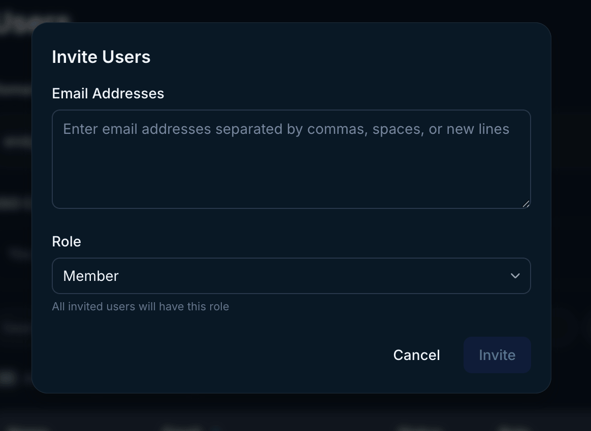

Endgame uses WorkOS to power our authentication flow.

## Manage new users

To manage who can log into Endgame from your organization, go to the [user management](https://app.endgame.io/settings/users) page in settings. Only Admins have access to this page.

You have multiple options for user authentication that can be enabled or configured from this page.

### Invite users

Click Invite User at the top right of the user table and enter the email(s) for users you wish to send an invitation. Set the [role](/user-management#user-roles) for the user(s) you are inviting. You can only send invitations for one role at a time, so if you want to invite a mix of members and admins, you must do this in two separate actions. You will be able to monitor which users have accepted invitations in this view.

<Frame caption="User invite modal">
  
</Frame>

### Add verified domains

<Info>
  Admins can prove domain ownership through the creation of DNS TXT records.
</Info>

You have the option to add verified domains, which will allow any user with a matching email domain to access Endgame. For example, if you verify acme.com and sarah@acme.com attempts to log in to Endgame, she will be automatically provisioned as a user for your organization and allowed to authenticate.

Click on Add Domain to get started. You will be redirected to the WorkOS interface and guided through the process to add your domain(s).

<Frame caption="User management configuration">
  
</Frame>

<Frame caption="Domain verification in WorkOS">
  
</Frame>

### Single sign-on (SSO)

<Warning>
  SSO is not available to all organizations. If you are interested in enabling
  SSO for your organization, contact
  [support@endgame.io](mailto:support@endgame.io).
</Warning>

Some organizations have the ability to enable SSO for their organization. **You must first verify your organization domains to complete SSO configuration.** Enabling SSO allows users to authenticate and be provisioned automatically based on your configured domains. You will be offered the option to choose your preferred SSO provider during the setup process.

Click on Set up SSO to get started. You will be redirected to the WorkOS interface and guided through the process to set up SSO.

<Frame caption="User management configuration">
  
</Frame>

<Frame caption="SSO setup in WorkOS">
  
</Frame>

Visit our [user management](/user-management) page for more details.

## Need Help?

If you're having trouble logging in or need assistance with account access, please contact our [support team](mailto:support@endgame.io).
