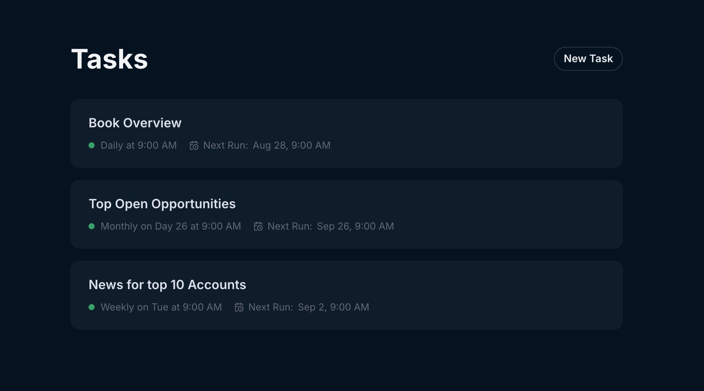

## September 19, 2025
  
### Multi-account chat
In addition to asking singular account questions in the account detail pages, you can now ask questions that span multiple accounts from the Endgame homepage. This feature allows you to explore prompts that cover the entire breadth of the accounts in your organization. Ask questions that target your book of accounts, explore organizational trends, provide insights about your team’s sales strategies, and more! More information on using chat [here](/mintlify/endgame-chat-101).

<Frame>
  
</Frame>

### Templates
Admins can now add tags and scopes (single or multi-account) to global templates, and all users can create their own templates to add to their library. Users can search and filter by tag capabilities to more easily navigate their template library. More information on using templates [here](/mintlify/features/templates).

<Frame>
  
</Frame>

### Tasks (Digests)
You can now schedule daily, weekly, or monthly email digests that act in the same way as firing a prompt off in the app. Curate your tasks to keep you up to date at the start of your day or week with whatever cross account information is most helpful to you. You can generate a task preview and tune before scheduling the email. More information on using templates [here](/mintlify/features/tasks).

<Frame>
  
</Frame>

### Knowledge
Upload files from your computer, sync with google drive, or link to public urls to add additional, personalized context to your chat responses — think competitive battlecards, process documents, case studies, etc. 

- Files uploaded/synced at the organization level will impact all chats, while those uploaded at an account level will only affect chats in that account.
- Only Admins are able to upload at the organization level; individual users can connect files at the  account level.
  
More information on using knowledge [here](/mintlify/features/file-upload).

<Frame>
  
</Frame>

### Updated account list view
We’ve given our account list view an overhaul to make easier to navigate and find the accounts you need. You’ll now see accounts in a more accessible gird format with clearer options for filtering and sorting. 

<Frame>
  
</Frame>

### Export directly to Google Drive
Users can now export thread content and thread tables directly to google drive. Once a user has authenticated to google via Endgame, this action can be done with a single click. 

<Frame>
  
</Frame>
 
<Frame>
  
</Frame>