## October 27, 2025

## Endgame Threads Now Available in Slack
Organizations can now leverage Endgame's chat capabilities directly within their Slack workspace. Once properly configured, team members without direct Endgame access can still utilize the platform's comprehensive knowledge base through Slack's familiar chat interface. Users can initiate threads that align with their channel's designated configuration whether for individual account queries or multi-account analysis, ensuring seamless access to Endgame's insights within existing workflows.

<Frame caption="Endgame thread in Slack">
  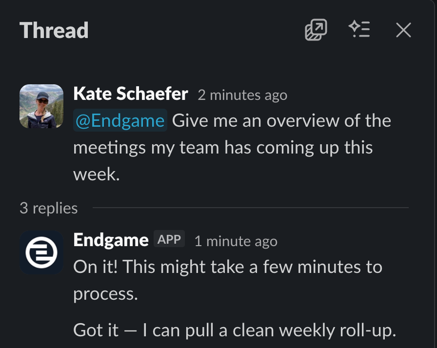
</Frame>

To get started with Endgame in Slack, set up your organization's [Slack integration](https://docs.endgame.io/integrations/slack) and follow these [instructions](https://docs.endgame.io/features/slack). 

Organizations who intitially integrated with Slack before Oct 10, 2025 will need to [update their connection](https://docs.endgame.io/integrations/slack#updating-an-existing-connection-to-the-new-endgame-slack-app). 

### Thread table viewer
Tables within threads can now be viewed in a dedicated table viewer. Hover over any table and click the expand icon to open an expanded view for easier reading.

<Frame caption="Thread Table Viewer">
  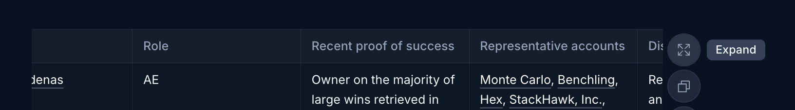
</Frame>

## October 24, 2025

## Enhanced Chat Responses with Extended Ownership
Users will now experience chat responses powered by extended ownership queries. This enhancement is particularly valuable for users who are not direct account owners, but work in sales support roles on accounts and opportunities, or who manage teams. Prompts such as "Tell me what happened on my accounts last week" will now deliver improved results based on each user's extended ownership relationships, providing more comprehensive and relevant insights across their areas of responsibility. Account list filtering will also reflect the extended ownership model.

<Frame caption="Ownership filter">
  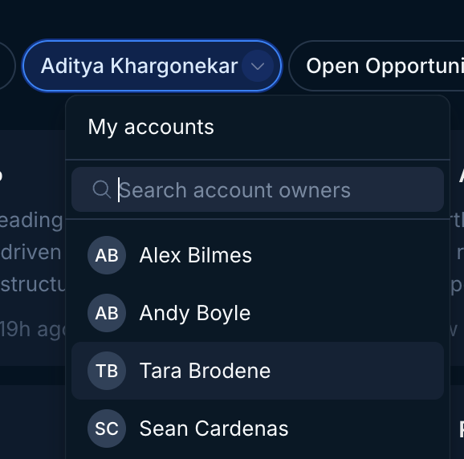
</Frame>

This feature uses sensible defaults under the hood, but it may not work for every organization’s unique salesforce structure. If you would like to opt out of extended ownership please contact [support@endgame.io](mailto:support@endgame.io).

## October 23, 2025 

## Introducing Mode Selection for Chat
Choose Search Mode for rapid responses to straightforward queries, or Research Mode for comprehensive, thoroughly researched answers to complex questions. This performance enhancement gives you greater control over your research workflow. We look forward to your feedback on this new capability!

<Frame>
  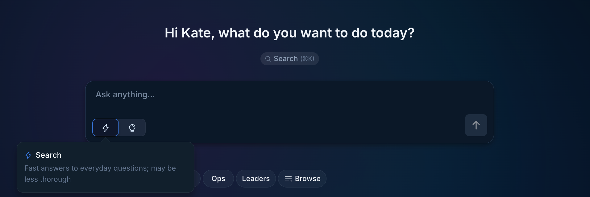
</Frame>
 
<Frame>
  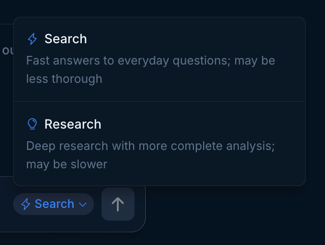
</Frame>

### Enhanced Thread Citations and Sources 
We've completely rebuilt our thread citations and sources infrastructure, delivering significantly improved quality and quantity of references. You'll notice enhanced depth and richness in sourcing, including multiple relevant quotations from emails, calls, and Slack conversations that provide fuller context for your research.

<Frame>
  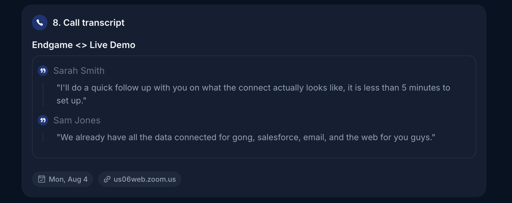
</Frame>

### Account Links in Threads 
Most account names within threads now feature direct navigation links to their corresponding detail pages, streamlining your research workflow. Simply hover over these links to access key account information including owner details, account type, and current opportunities. 

<Frame>
  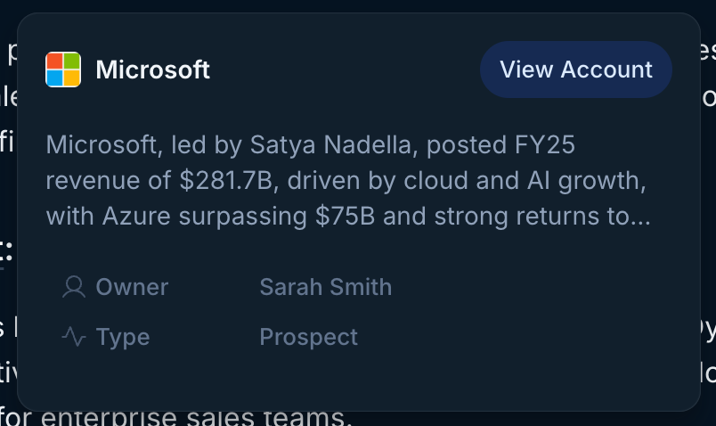
</Frame>

## October 21, 2025

## Claude Desktop with Endgame MCP
We're excited to announce that you can now connect Claude Desktop to Endgame via our MCP server. This integration allows you to query Endgame directly through Claude and receive the same high-quality responses you're accustomed to getting in Endgame. Simply [set up the MCP server connection](https://docs.endgame.io/endgame-mcp-server) in Claude Desktop to start leveraging Endgame's capabilities right from your Claude conversations, without leaving your workflow.

<Frame>
  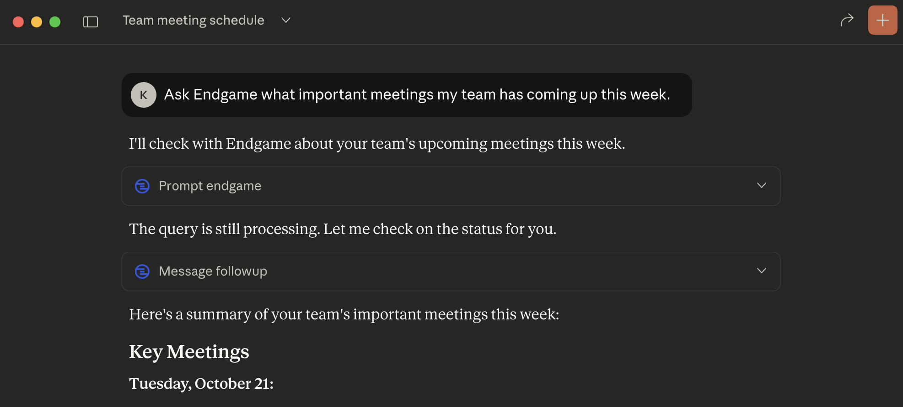
</Frame>

## October 7, 2025

## Enhanced Template Management for Administrators
Admin users now have access to improved template management capabilities. The enhanced interface includes search functionality, filtering options, and sorting capabilities. Admins can efficiently filter templates by scope or tag classification, and organize content chronologically by last updated date.
These enhancements improve the Admin user experience by enabling them to quickly locate and manage their team's templates.

<Frame>
  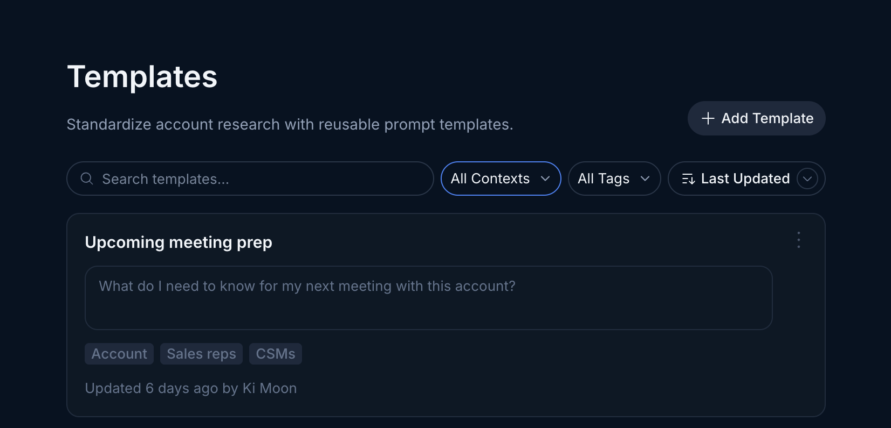
</Frame>

## October 3, 2025

## Expanded Email Distribution for Tasks
Users can now include additional recipients when sending task emails. Choose from users within your organization or add any valid email address to the recipient list. All recipients will receive the email as BCC recipients, so each person receives identical email content.

<Frame>
  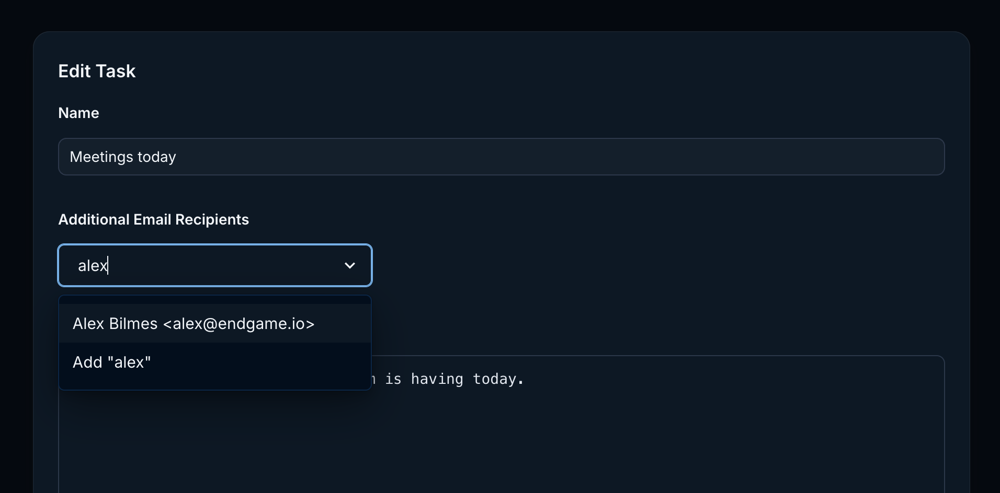
</Frame>

### Knowledge Document Upload Visibility
The user who uploaded a knowledge document is now displayed on files at both the account level and organization level. This enhancement improves accountability and streamlines document management by allowing administrators to quickly identify the source of uploaded content. 

<Frame>
  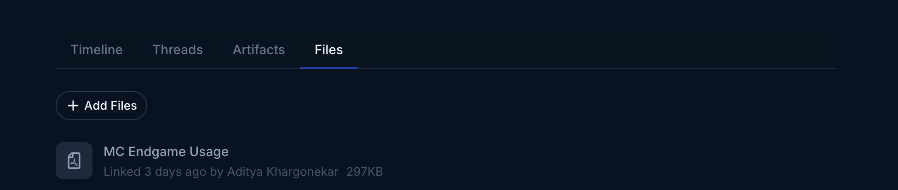
</Frame>
 
<Frame>
  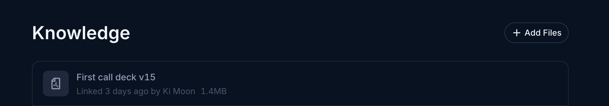
</Frame>

### Instant Knowledge Document Processing
Knowledge document uploads are now processed immediately upon file upload. Documents are available in your chat responses within minutes, eliminating previous wait times of 30 minutes or more.

## September 26, 2025

## Enhanced Task Feature with Default Templates
The tasks feature now includes pre-configured templates to streamline your task creation process. You will find three additional suggested task options that can be enabled and customized to facilitate your initial task implementation. More information on using tasks [here](/features/tasks).

<Frame>
  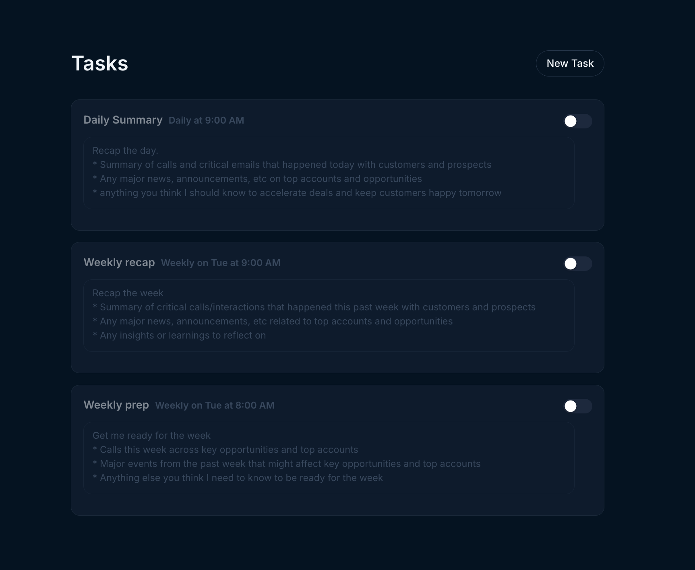
</Frame>

### CSV Document Support Added to Knowledge File Upload
CSV files have been incorporated into the approved document types for knowledge file uploads. You may now upload CSV documents at both the account and organization levels to provide additional contextual information for chat responses. Please note that organization-level uploads are restricted to administrators only. More information on using file upload [here](/features/file-upload)

### Updated URL
We've updated our URL—Endgame now lives at [app.endgame.io](https://app.endgame.io/). Our previous URL will automatically redirect to this new address, but please update your bookmarks accordingly.

## September 24, 2025

### User Settings Enhancements

Users now have access to a dedicated user settings view accessible through the user menu. This view currently includes the ability to connect or disconnect your Google account, which is used for linking [knowledge documents](/features/file-upload) and exporting [directly to Drive](/features/export-endgame-content). We'll continue to expand this section with new features in the coming months, so stay tuned for updates.

<Frame>
  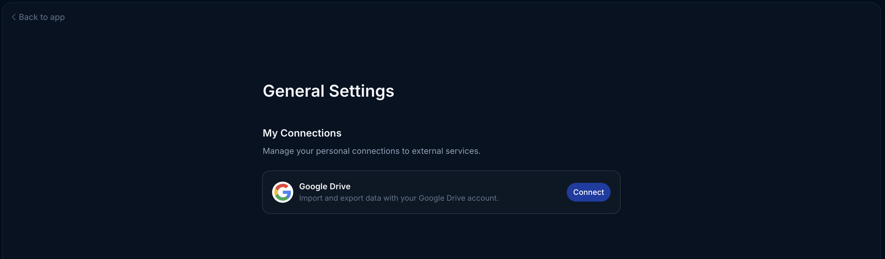
</Frame>

Users can now access our Help Center and documentation directly through the user menu, providing comprehensive resources to enhance your Endgame experience.

<Frame>
  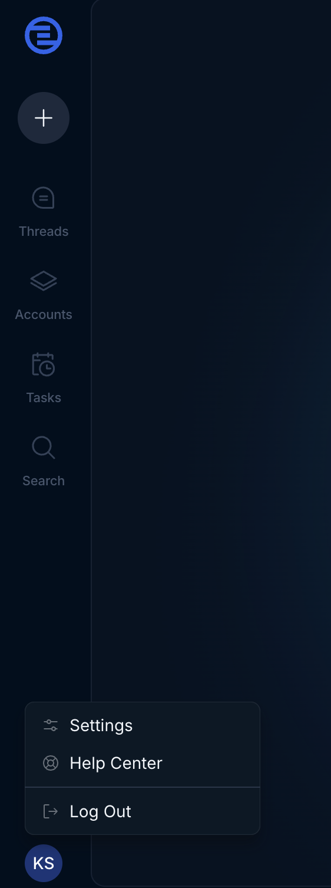
</Frame>

## September 19, 2025

### Tasks (Digests)

You can now schedule daily, weekly, or monthly email digests that act in the same way as firing a prompt off in the app. Curate your tasks to keep you up to date at the start of your day or week with whatever cross account information is most helpful to you. You can generate a task preview and tune before scheduling the email. More information on using tasks [here](/features/tasks).

<Frame>
  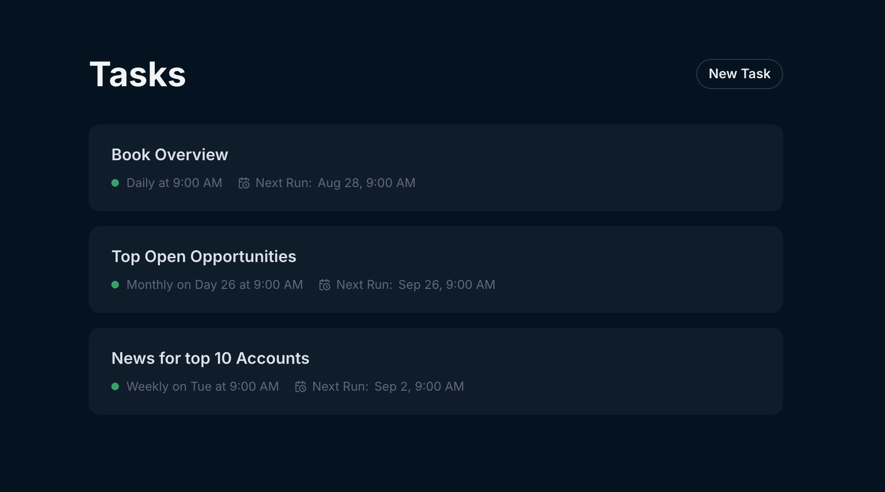
</Frame>

### Export directly to Google Drive

Users can now export thread content and thread tables directly to Google Drive. Once a user has authenticated to Google via Endgame, this action can be done with a single click.

<Frame>
  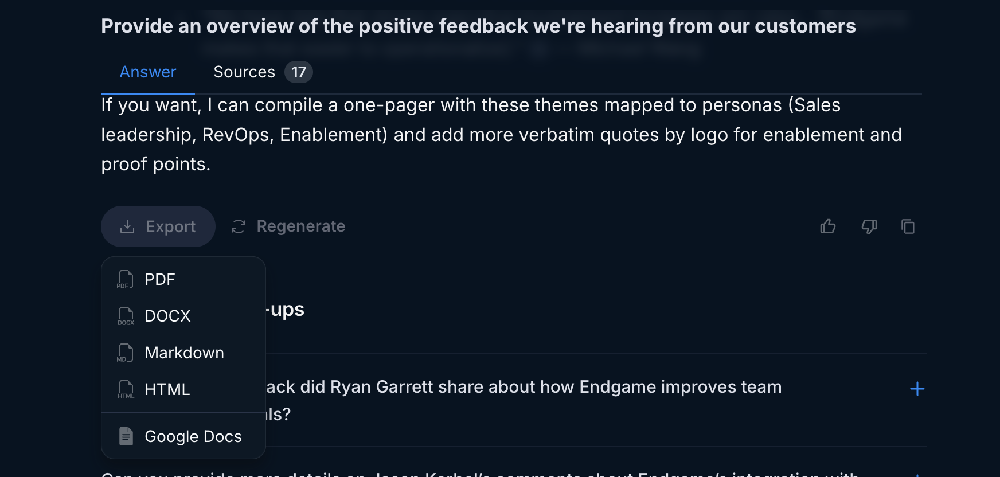
</Frame>
 
<Frame>
  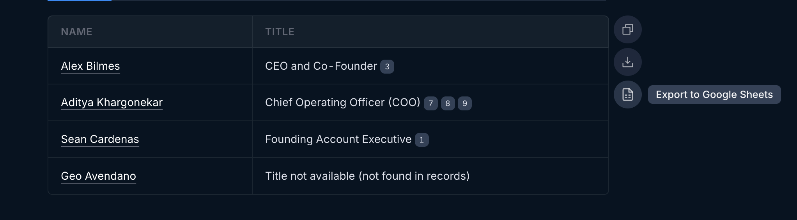
</Frame>

## September 9, 2025

### Multi-account chat

In addition to asking singular account questions in the account detail pages, you can now ask questions that span multiple accounts from the Endgame homepage. This feature allows you to explore prompts that cover the entire breadth of the accounts in your organization. Ask questions that target your book of accounts, explore organizational trends, provide insights about your team’s sales strategies, and more! More information on using chat [here](/endgame-chat-101).

<Frame>
  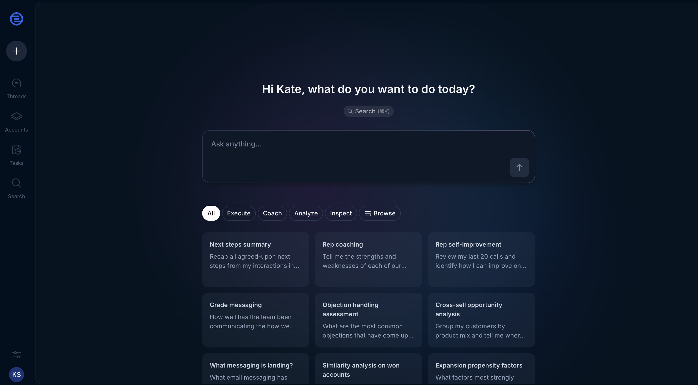
</Frame>

### Templates

Admins can now add tags and scopes (single or multi-account) to global templates, and all users can create their own templates to add to their library. Users can search and filter by tag capabilities to more easily navigate their template library. More information on using templates [here](/features/templates).

<Frame>
  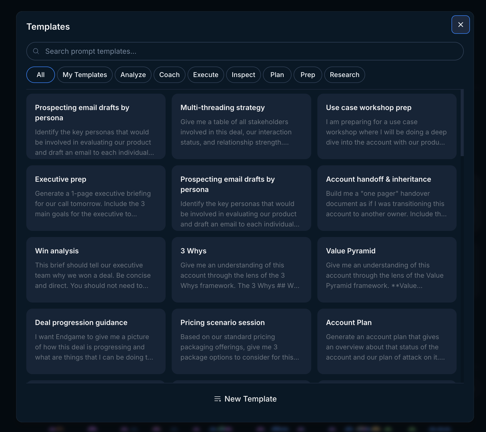
</Frame>

## September 3, 2025

### Knowledge

Upload files from your computer, sync with google drive, or link to public urls to add additional, personalized context to your chat responses — think competitive battlecards, process documents, case studies, etc.

- Files uploaded/synced at the organization level will impact all chats, while those uploaded at an account level will only affect chats in that account.
- Only Admins are able to upload at the organization level; individual users can connect files at the account level.

More information on using knowledge [here](/features/file-upload).

<Frame>
  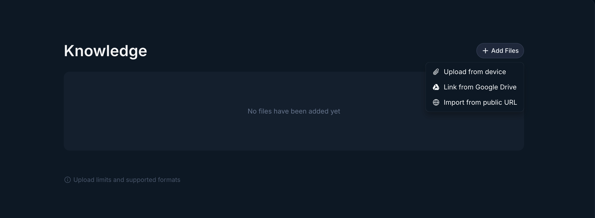
</Frame>

### Updated account list view

We’ve given our account list view an overhaul to make it easier to navigate and find the accounts you need. You’ll now see accounts in a more accessible grid format with clearer options for filtering and sorting.

<Frame>
  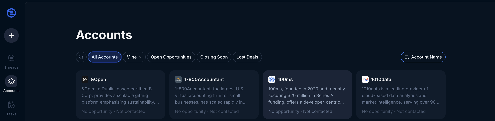
</Frame>
