## January 22, 2006

### Connect your Looker data to Endgame

We've added Looker to our growing list of integrations. Bring your business intelligence and analytics into Endgame to power more data informed responses. Simply connect your Looker instance through the [integrations page](https://app.endgame.io/settings/integrations), grant Endgame access to specific queries, and Endgame will ingest the query data it has access to. Once ingested, your Looker data will be available to chat responses.

<Frame caption="Looker connection">
  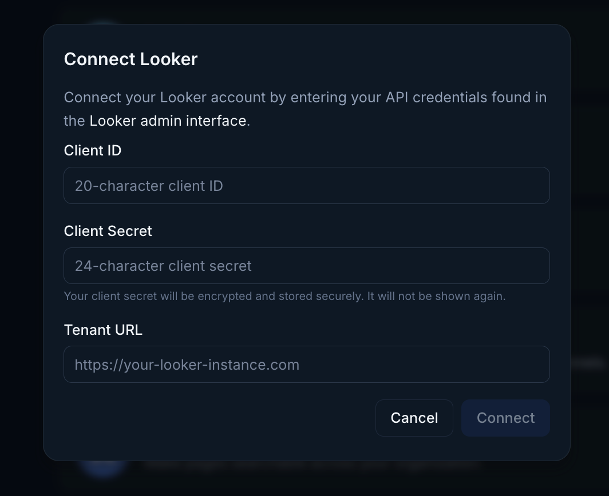
</Frame>

<Frame caption="Looker query connection">
  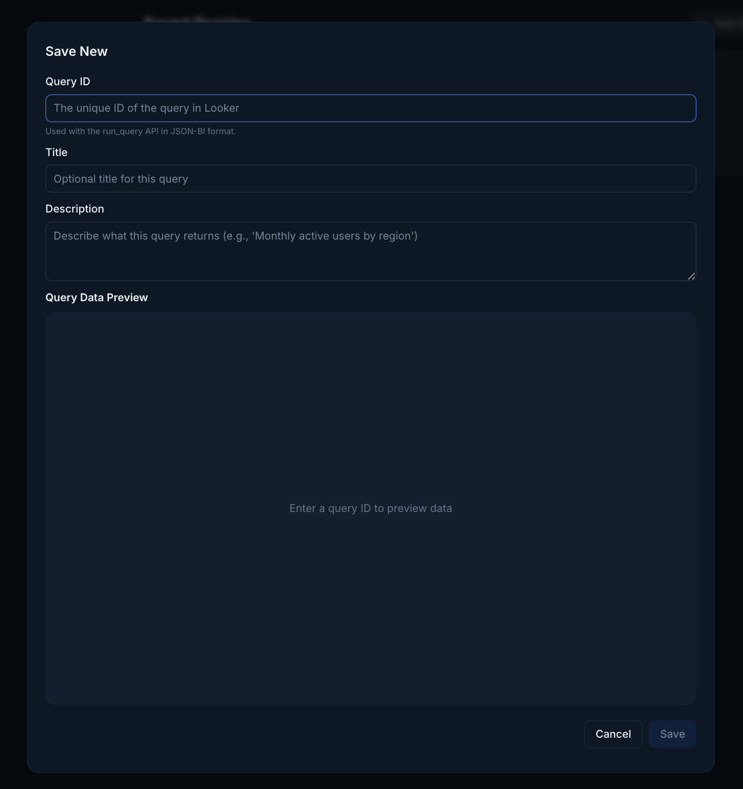
</Frame>

## January 20, 2026

### Memory management enhanced

Managing your Endgame memories is now more transparent. You can now quickly see when a chat prompt generates memories directly within the chat response. New memories are listed with a convenient link to memory management, making it simple to review or delete them as needed.

From memory management in Personalization settings, you can now jump directly to the source thread to validate each memory's context. Endgame uses these memories to provide a tailored experience based on your preferences and specifications. Check out the docs for more details on [User Preferences](https://docs.endgame.io/features/user-preferences).

<Frame caption="Memory updated">
  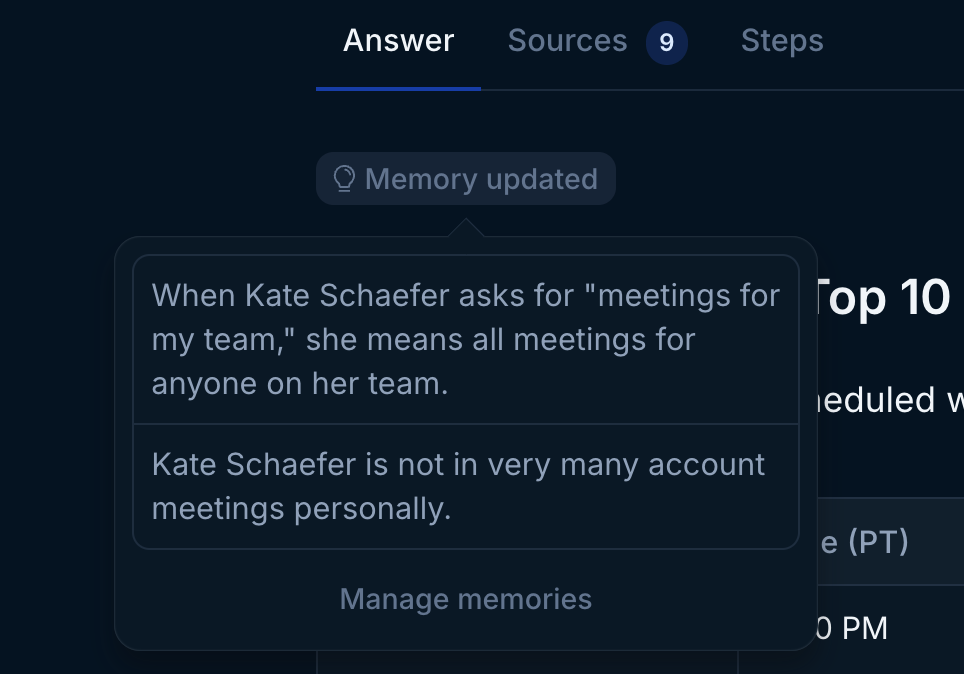
</Frame>

## January 12, 2026

### Smarter, faster chat responses

Using Endgame to its full potential just got a whole lot easier and better.

Endgame is now faster and smarter by default. We've unified our original Search and Research modes into one streamlined experience powered by the latest frontier LLMs, giving you faster, better composed responses every time. Think of it as getting the best of both worlds without having to choose. Endgame's baseline is now much more powerful, but you can still turn on Research Mode when you need that extra boost

<Frame caption="Home page chat">
  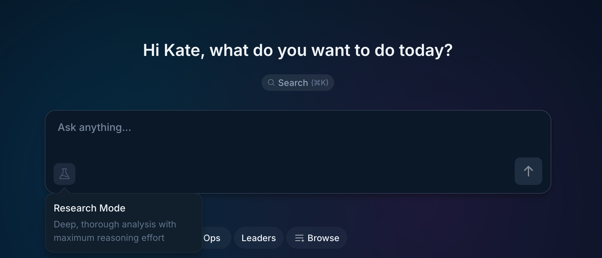
</Frame>

## January 9, 2026

### Train Endgame on your writing style

Now you can train Endgame to match your unique voice across all outputs including emails, messages, proposals, and more. Simply add up to 3 writing samples in Preferences, and Endgame will analyze your style to generate content that sounds authentically like you.

For example, if you add past emails, Endgame will mirror your tone, structure, and phrasing in future email drafts. The same applies to any content Endgame creates on your behalf.

Find the writing sample upload feature in [Preferences](https://app.endgame.io/settings) to get started.

<Frame caption="Writing samples">
  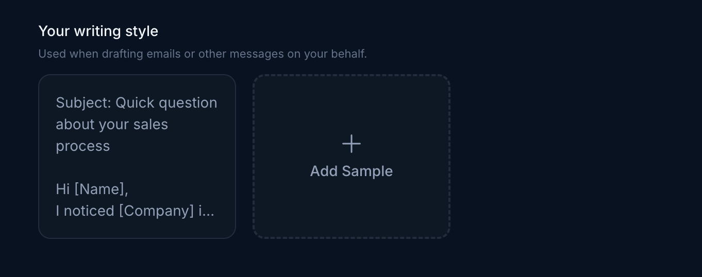
</Frame>

## January 7, 2026

### Chorus integration now available for richer meeting insights

Chorus is the latest addition to our integrations lineup. Enrich your Endgame chat responses with valuable call data from Chorus. [Setup is simple](/integrations/chorus): just add your Chorus API key in the integrations section and Endgame will start ingesting your call data. You can even use Chorus alongside other call recording services like Gong or Zoom for comprehensive conversation coverage.

<Frame caption="Chorus integration">
  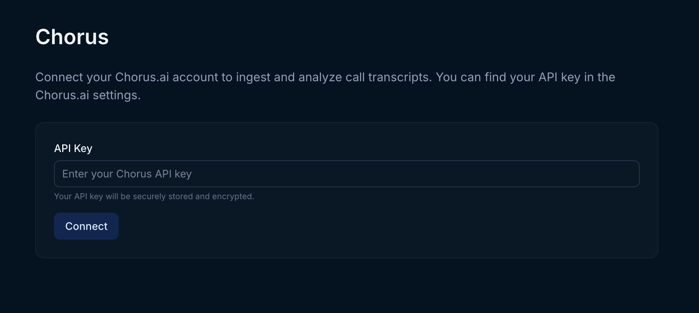
</Frame>

## January 5, 2026

### Unlock your confluence knowledge in endgame

Confluence has joined the Endgame integration offerings. Sync content from your selected Spaces to enhance Endgame chat responses with your company content. With just a couple of clicks, your entire space is ingested into Endgame, automatically associated with the right accounts or stored as organization scoped documents.

Detailed instructions for connecting to Confluence [here](/integrations/confluence)

## December 22, 2025

### Configuring user preferences for more relevant responses

Users can now customize their Endgame chat experience through the Personalization section in [General Settings](https://app.endgame.io/settings). The Role and Custom Instructions fields allows users to provide information about their position and chat preferences to help Endgame deliver more relevant responses.

In the Role field, users can include details about their responsibilities, level within their organization's hierarchy, types of activities they engage in, and any other data relevant to their work. This context enables Endgame to provide more accurate and meaningful responses tailored to their specific needs.

The Custom Instructions field offers additional flexibility, allowing users to specify preferences such as response formatting, tone, or any other guidelines that will enhance their chat experience.

<Frame caption="User preferences">
  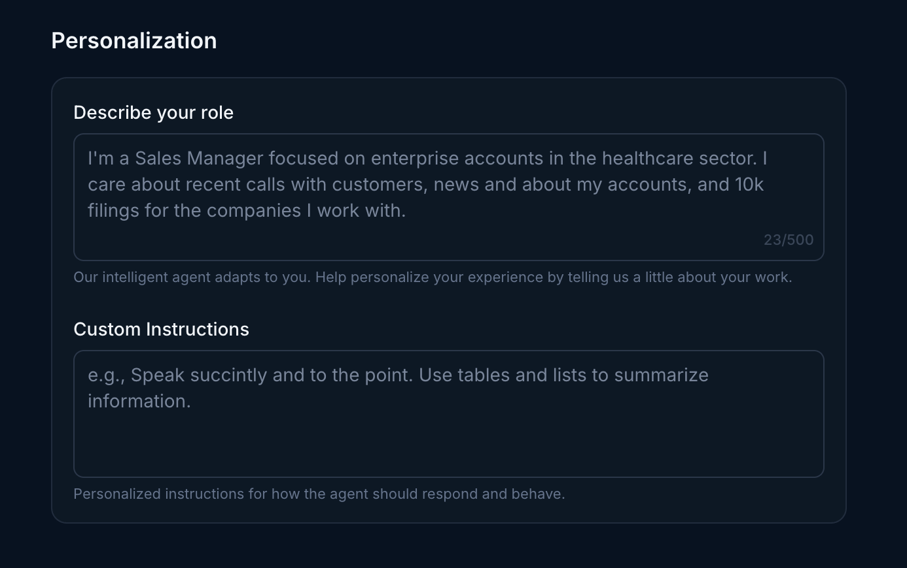
</Frame>

## December 17, 2025

### Greater control over Salesforce object configuration

Endgame Admins now have greater control over which [Salesforce objects](https://app.endgame.io/settings/integrations/salesforce) Endgame can access when composing chat responses. We've enhanced the user experience for selecting custom fields on Endgame required Salesforce objects and added the ability to include additional non-required objects as well.

<Frame caption="Required object configuration">
  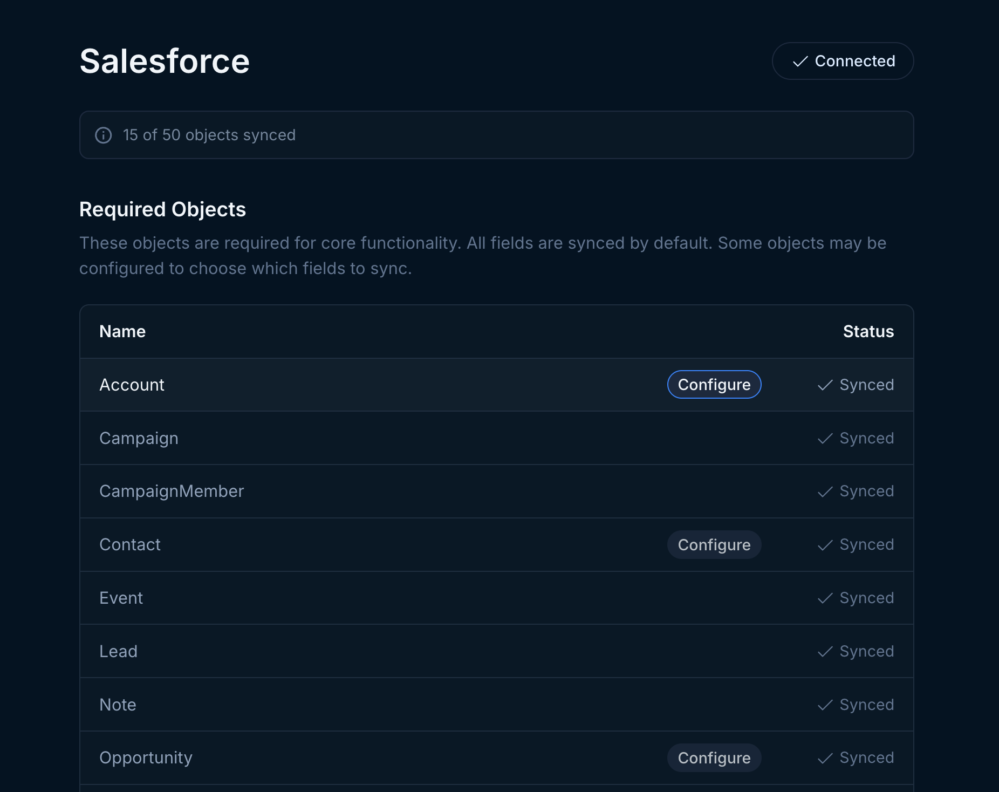
</Frame>

Because Endgame references only a handful of required Salesforce objects in chat by default, selectively adding more objects can make chat responses more complete and useful, ensuring Endgame includes all the Salesforce data your team finds valuable.

<Frame caption="Additonal Salesforce objects">
  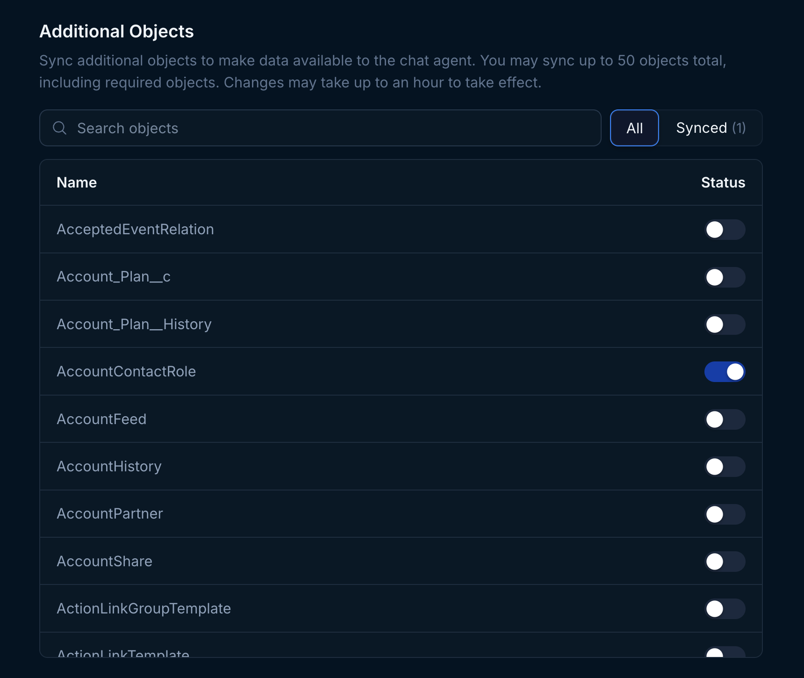
</Frame>

## December 15, 2025

### Upgraded CSV and Excel Document Processing

Endgame has enhanced how we handle your newly uploaded CSV and Excel knowledge documents. You can now query data from these documents more effectively, performing aggregate, comparison, and filtering operations on tabular data with greater accuracy and reliability.

For CSV and Excel knowledge documents you previously uploaded, we recommend removing and reuploading them to take advantage of this improved experience. Only newly uploaded or synced documents will have these enhanced capabilities.

Learn more about how you can enhance your Endgame experience through knowledge documents [here](https://docs.endgame.io/features/file-upload).

## December 5, 2025

### Save preferences with user memory

[User memory](https://docs.endgame.io/features/user-preferences) automatically captures and applies your preferences across all conversations. Simply chat naturally, stating preferences like "I prefer concise answers" or "My fiscal year ends January 31," and Endgame will remember and incorporate these details into future responses without you needing to repeat yourself.

Memories are detected automatically as you chat, making interactions more personalized over time. You can review all saved memories in your settings, delete any you don't want to keep, and toggle the feature on or off at any time. This means less repetition and more relevant responses over time.

<Frame caption="User memory setting">
  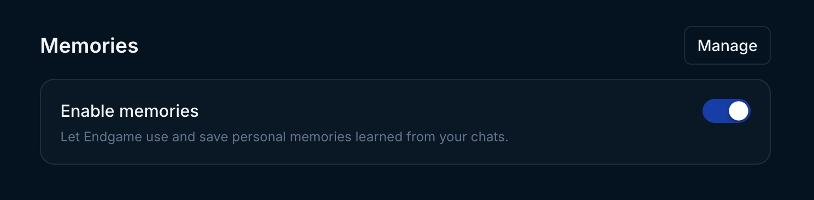
</Frame>

<Frame caption="User memory management">
  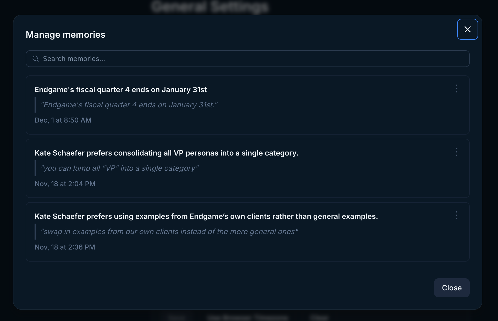
</Frame>

## November 19, 2025

### Enhanced Knowledge Management for Admins

Admin users now have comprehensive visibility into their entire team's knowledge documents with an improved knowledge view. The new interface allows you to navigate through folders and view both organization-level and account-level content in a unified view. When uploading content through the Admin knowledge view, the system automatically categorizes documents as organization or account content and intelligently detects account associations. Admins retain control of the content with the ability to edit inferred account associations manually. All existing syncing and unsyncing capabilities remain available.

<Frame caption="Admin knowledge view">
  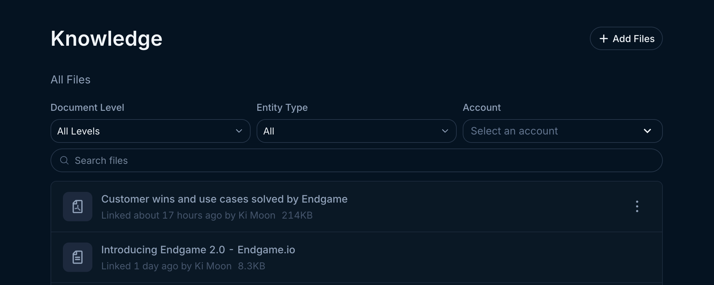
</Frame>

 

<Frame caption="Edit knowledge document">
  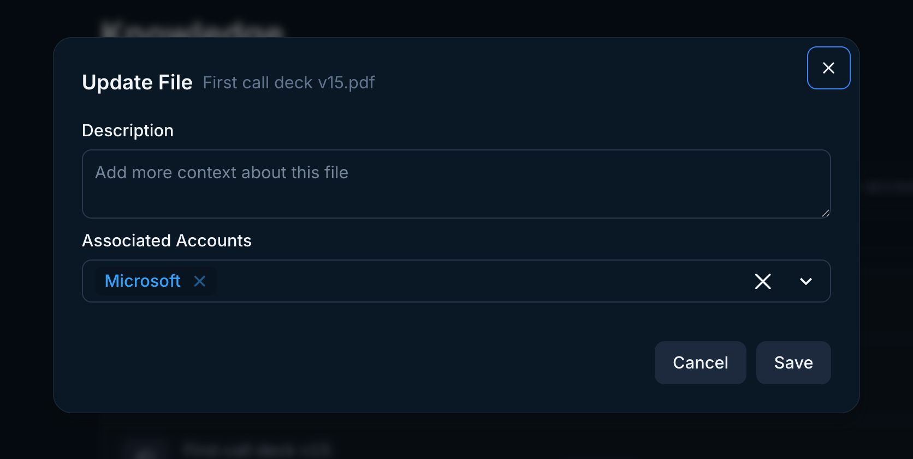
</Frame>

## November 14, 2025

### Review Thread Research Steps

Thread research steps are now accessible after thread generation is complete. This feature enables you to review the underlying research process used to develop your thread content, providing full transparency into the sources and methodology behind the generated output.

<Frame caption="Thread steps">
  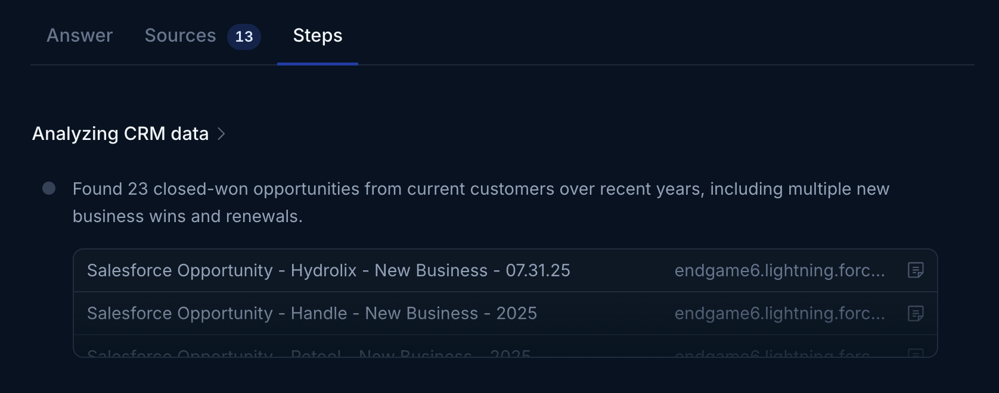
</Frame>

## November 4, 2025

### Light and Dark Mode Now Available

We're excited to introduce light and dark mode options to enhance your Endgame viewing experience. You can now switch between themes based on your preference. To change your display mode, simply open the user settings in the bottom of the left side navigation and under Appearance toggle between light and dark modes. Your choice will be saved and applied across all your sessions.

<Frame caption="Dark mode">
  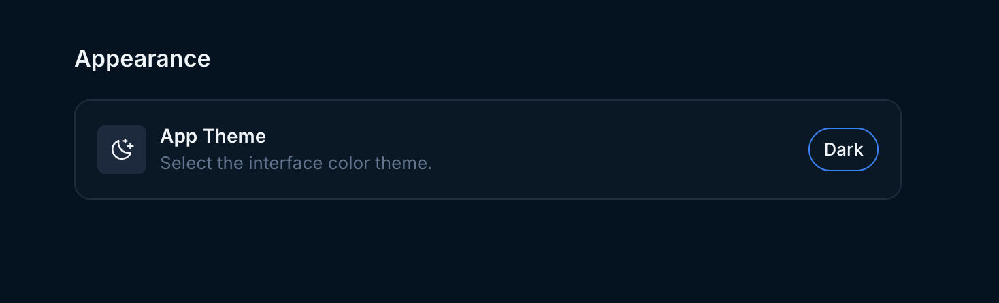
</Frame>

<Frame caption="Light mode">
  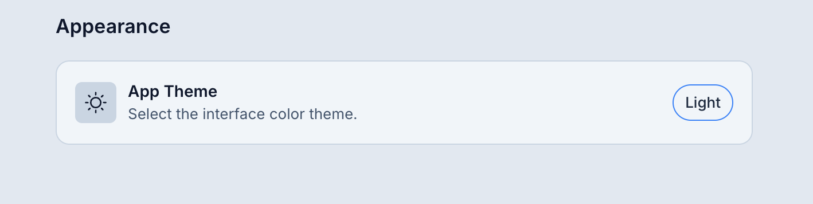
</Frame>

## October 29, 2025

### More info while you wait

When waiting for a thread to load, users will now see detailed information about how Endgame is researching and preparing their responses. The enhanced view includes sources for each research step, so users can explore the data powering their answer in real-time. Instead of staring at a loading spinner, users can now follow along with Endgame's research process, seeing which sources it's consulting and understanding how their response is being built. This transparency turns wait time into insight time.

<Frame caption="Thread research steps">
  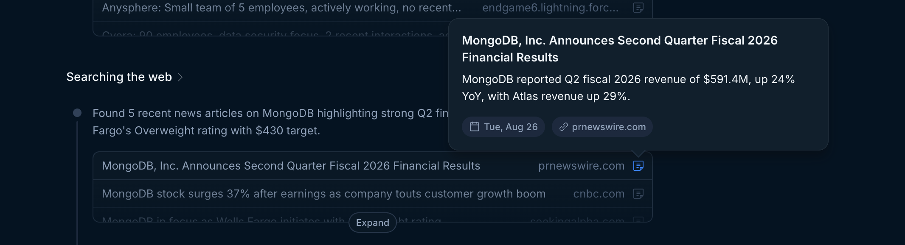
</Frame>

### Google application approval

Endgame is now officially verified by Google. This verification grants the permissions required to sync entire folders of content from Google Drive to Endgame and export your thread results directly to Google Sheets and Docs with just a click.

Review our [export](https://docs.endgame.io/features/export-thread-content) and [knowledge](https://docs.endgame.io/features/file-upload#link-files-from-google-drive) features for more information.

## October 27, 2025

### Endgame threads now available in slack

Organizations can now leverage Endgame's chat capabilities directly within their Slack workspace. Once properly configured, team members without direct Endgame access can still utilize the platform's comprehensive knowledge base through Slack's familiar chat interface. Users can initiate threads that align with their channel's designated configuration whether for individual account queries or multi-account analysis, ensuring seamless access to Endgame's insights within existing workflows.

<Frame caption="Endgame thread in Slack">
  
</Frame>

To get started with Endgame in Slack, set up your organization's [Slack integration](https://docs.endgame.io/integrations/slack) and follow these [instructions](https://docs.endgame.io/features/slack).

Organizations who intitially integrated with Slack before Oct 10, 2025 will need to [update their connection](https://docs.endgame.io/integrations/slack#updating-an-existing-connection-to-the-new-endgame-slack-app).

### Thread table viewer

Tables within threads can now be viewed in a dedicated table viewer. Hover over any table and click the expand icon to open an expanded view for easier reading.

<Frame caption="Thread Table Viewer">
  
</Frame>

## October 24, 2025

### Enhanced chat responses with extended ownership

Users will now experience chat responses powered by extended ownership queries. This enhancement is particularly valuable for users who are not direct account owners, but work in sales support roles on accounts and opportunities, or who manage teams. Prompts such as "Tell me what happened on my accounts last week" will now deliver improved results based on each user's extended ownership relationships, providing more comprehensive and relevant insights across their areas of responsibility. Account list filtering will also reflect the extended ownership model.

<Frame caption="Ownership filter">
  
</Frame>

This feature uses sensible defaults under the hood, but it may not work for every organization’s unique salesforce structure. If you would like to opt out of extended ownership please contact [support@endgame.io](mailto:support@endgame.io).

## October 23, 2025

### Introducing mode selection for chat

Choose Search Mode for rapid responses to straightforward queries, or Research Mode for comprehensive, thoroughly researched answers to complex questions. This performance enhancement gives you greater control over your research workflow. We look forward to your feedback on this new capability!

<Frame caption="Chat mode selection">
  
</Frame>

<Frame caption="Chat mode selection">
  
</Frame>

### Enhanced thread citations and sources

We've completely rebuilt our thread citations and sources infrastructure, delivering significantly improved quality and quantity of references. You'll notice enhanced depth and richness in sourcing, including multiple relevant quotations from emails, calls, and Slack conversations that provide fuller context for your research.

<Frame caption="Call transcript sources">
  
</Frame>

### Account links in threads

Most account names within threads now feature direct navigation links to their corresponding detail pages, streamlining your research workflow. Simply hover over these links to access key account information including owner details, account type, and current opportunities.

<Frame caption="Account links in thread responses">
  
</Frame>

## October 21, 2025

### Claude desktop with endgame MCP

We're excited to announce that you can now connect Claude Desktop to Endgame via our MCP server. This integration allows you to query Endgame directly through Claude and receive the same high-quality responses you're accustomed to getting in Endgame. Simply [set up the MCP server connection](https://docs.endgame.io/endgame-mcp-server) in Claude Desktop to start leveraging Endgame's capabilities right from your Claude conversations, without leaving your workflow.

<Frame caption="MCP responses in Claud Desktop">
  
</Frame>

## October 7, 2025

### Enhanced template management for administrators

Admin users now have access to improved template management capabilities. The enhanced interface includes search functionality, filtering options, and sorting capabilities. Admins can efficiently filter templates by scope or tag classification, and organize content chronologically by last updated date. These enhancements improve the Admin user experience by enabling them to quickly locate and manage their team's templates.

<Frame caption="Template management">
  
</Frame>

## October 3, 2025

### Expanded email distribution for tasks

Users can now include additional recipients when sending task emails. Choose from users within your organization or add any valid email address to the recipient list. All recipients will receive the email as BCC recipients, so each person receives identical email content.

<Frame caption="BCC recipients for Tasks">
  
</Frame>

### Knowledge document upload visibility

The user who uploaded a knowledge document is now displayed on files at both the account level and organization level. This enhancement improves accountability and streamlines document management by allowing administrators to quickly identify the source of uploaded content.

<Frame caption="Document upload visibility">
  
</Frame>

<Frame caption="Document upload visibility">
  
</Frame>

### Instant knowledge document processing

Knowledge document uploads are now processed immediately upon file upload. Documents are available in your chat responses within minutes, eliminating previous wait times of 30 minutes or more.

## September 26, 2025

### Enhanced task feature with default templates

The tasks feature now includes pre-configured templates to streamline your task creation process. You will find three additional suggested task options that can be enabled and customized to facilitate your initial task implementation. More information on using tasks [here](/features/tasks).

<Frame caption="Task templates">
  
</Frame>

### CSV document support added to knowledge file upload

CSV files have been incorporated into the approved document types for knowledge file uploads. You may now upload CSV documents at both the account and organization levels to provide additional contextual information for chat responses. Please note that organization-level uploads are restricted to administrators only. More information on using file upload [here](/features/file-upload)

### Updated URL

We've updated our URL—Endgame now lives at [app.endgame.io](https://app.endgame.io/). Our previous URL will automatically redirect to this new address, but please update your bookmarks accordingly.

## September 24, 2025

### User settings enhancements

Users now have access to a dedicated user settings view accessible through the user menu. This view currently includes the ability to connect or disconnect your Google account, which is used for linking [knowledge documents](/features/file-upload) and exporting [directly to Drive](/features/export-thread-content). We'll continue to expand this section with new features in the coming months, so stay tuned for updates.

<Frame caption="General settings view">
  
</Frame>

Users can now access our Help Center and documentation directly through the user menu, providing comprehensive resources to enhance your Endgame experience.

<Frame caption="User menu">
  
</Frame>

## September 19, 2025

### Tasks (Digests)

You can now schedule daily, weekly, or monthly email digests that act in the same way as firing a prompt off in the app. Curate your tasks to keep you up to date at the start of your day or week with whatever cross account information is most helpful to you. You can generate a task preview and tune before scheduling the email. More information on using tasks [here](/features/tasks).

<Frame caption="Tasks view">
  
</Frame>

### Export directly to Google Drive

Users can now export thread content and thread tables directly to Google Drive. Once a user has authenticated to Google via Endgame, this action can be done with a single click.

<Frame caption="Export as Doc">
  
</Frame>

<Frame caption="Export as Sheet">
  
</Frame>

## September 9, 2025

### Multi-account chat

In addition to asking singular account questions in the account detail pages, you can now ask questions that span multiple accounts from the Endgame homepage. This feature allows you to explore prompts that cover the entire breadth of the accounts in your organization. Ask questions that target your book of accounts, explore organizational trends, provide insights about your team’s sales strategies, and more! More information on using chat [here](/your-first-10-minutes).

<Frame caption="Endgame app homepage">
  
</Frame>

### Templates

Admins can now add tags and scopes (single or multi-account) to global templates, and all users can create their own templates to add to their library. Users can search and filter by tag capabilities to more easily navigate their template library. More information on using templates [here](/features/templates).

<Frame caption="Templates modal">
  
</Frame>

## September 3, 2025

### Knowledge

Upload files from your computer, sync with google drive, or link to public urls to add additional, personalized context to your chat responses — think competitive battlecards, process documents, case studies, etc.

- Files uploaded/synced at the organization level will impact all chats, while those uploaded at an account level will only affect chats in that account.
- Only Admins are able to upload at the organization level; individual users can connect files at the account level.

More information on using knowledge [here](/features/file-upload).

<Frame caption="Knowledge view for admins">
  
</Frame>

### Updated account list view

We’ve given our account list view an overhaul to make it easier to navigate and find the accounts you need. You’ll now see accounts in a more accessible grid format with clearer options for filtering and sorting.

<Frame caption="Accounts page">
  
</Frame>