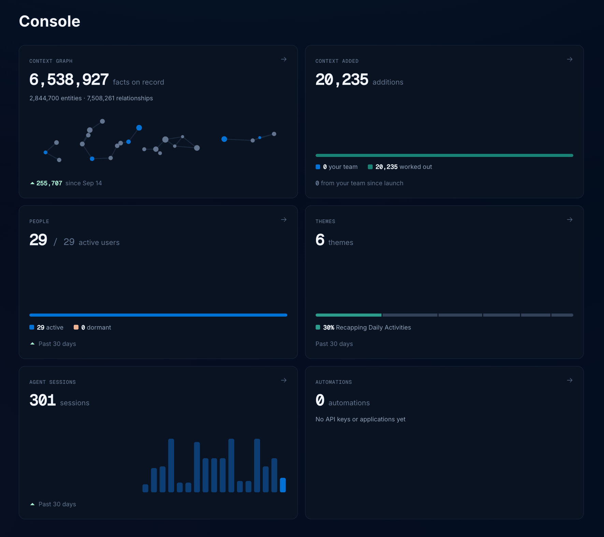
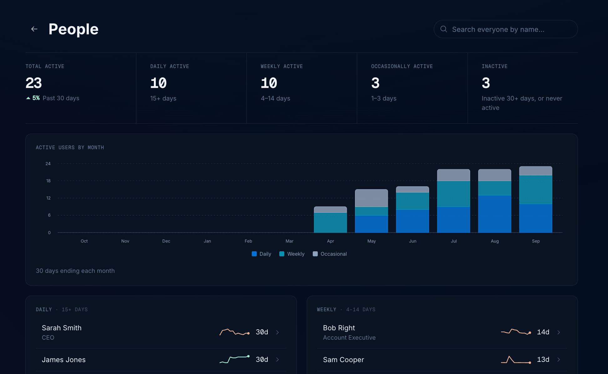
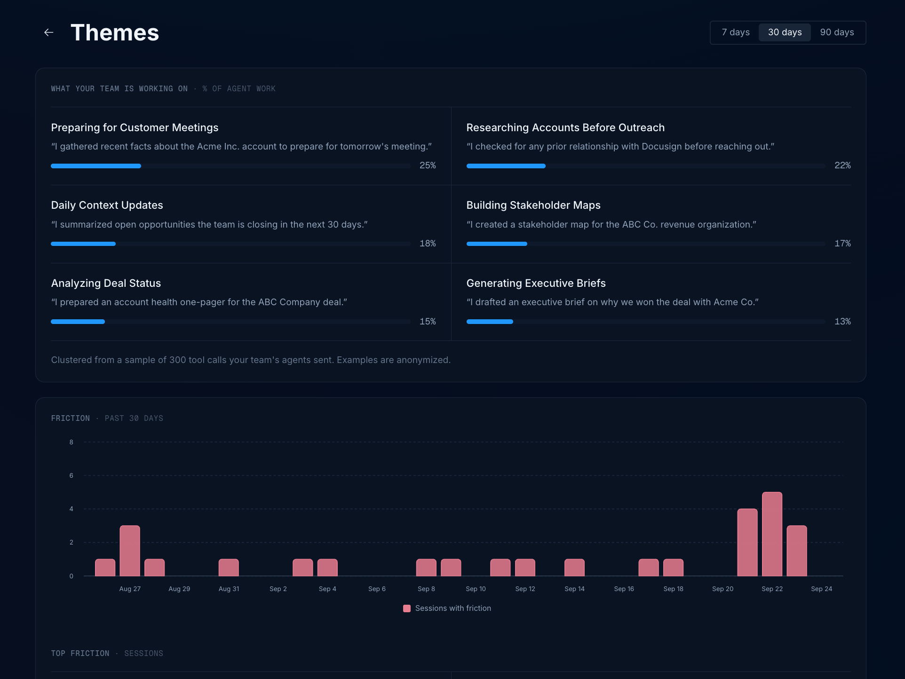
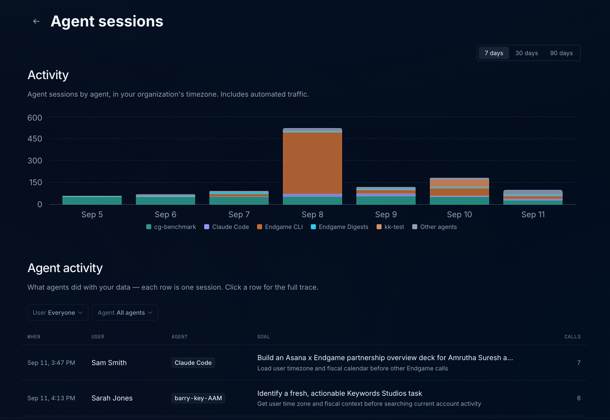
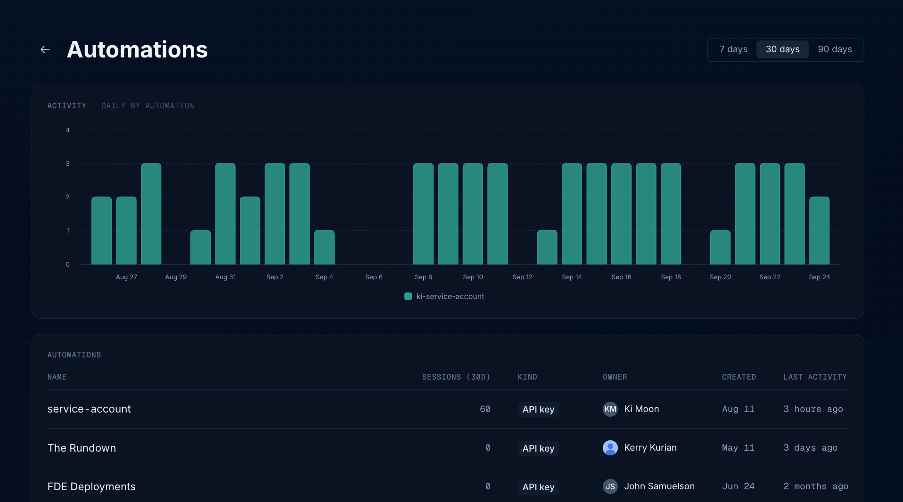

Admins can see how their team and connected agents are using Endgame from the **Console**. Open it from the side nav of the [homepage](https://app.endgame.io/observe). The Console is only visible to Admins.

## Console

The **Console** opens on an overview of your organization: what Endgame knows, what your team has added to it, who is using Endgame, what your team is working on, what connected agents are doing, and which automations are running. Click on a card to open its full view.

- **Context graph** — facts on record, the entities and relationships behind them, and how much the graph has grown recently
- **Context added** — what your team has contributed back to the graph
- **People** — users split between active and dormant
- **Themes** — the kinds of work your team uses Endgame for, with the top theme over the past 30 days
- **Agent sessions** — sessions run by your team and by any automations running alongside them
- **Automations** — API keys and applications running against Endgame

<Frame caption="Console overview">
  
</Frame>

## People

The **People** view shows who is actually using Endgame. The totals at the top show how many people were active in the last 30 days, split by how many days they showed up: **Daily active** (15+ days), **Weekly active** (4–14 days), and **Occasionally active** (1–3 days). **Inactive** counts people who have not used Endgame in 30+ days, or have never been active.

**Active users by month** tracks how your team's adoption has grown, with each month broken down into daily, weekly, and occasional users. Below the chart, people are listed by how often they show up, along with a trend of their recent activity and the number of days they were active. Use the search bar to find anyone by name.

<Frame caption="People view in the Console">
  
</Frame>

Click anyone in the list to open their detail view. It shows their sessions, days active, and last active over the last 30 days, an activity heatmap covering the past year, which surfaces they work through, and their latest sessions with the tool calls each one made.

<Frame caption="Person detail view in the Console">
  
</Frame>

## Themes

The **Themes** view shows what your team is using Endgame for over the last 7, 30, or 90 days. Endgame clusters a sample of the tool calls your team's agents sent into themes, such as preparing for customer meetings, researching accounts before outreach, or building stakeholder maps. Each theme shows its share of agent work along with an anonymized example of a request that falls under it.

<Frame caption="Themes view in the Console">
  
</Frame>

## Context added

The **Context added** view tracks what your team has written back to the context graph. Endgame learns from these contributions and directly makes updates to the graph, so this view is a read on how closely your team is engaging with what Endgame tells them.

- **Corrections** — a field was wrong or missing
- **Relationships** — a link between people or companies, added or disputed
- **New facts** — something true that fits no field anywhere
- **New entities** — a person or company Endgame did not know at all

**Who is correcting the most** ranks the people contributing these updates. Treat it as a health signal rather than a leaderboard: zero corrections usually means the team stopped checking Endgame's work, and a rising count reads as engagement.

<Frame caption="Context added view in the Console">
  
</Frame>

## Agent sessions

The **Agent sessions** view summarizes how your team and its connected agents are using Endgame over the last 7, 30, or 90 days:

- **Active users** — how many people used Endgame during the selected window
- **Agent sessions** — how many sessions connected agents ran
- **Tool calls** — how many individual tool calls those sessions made

Below the totals, the **Activity** chart breaks agent sessions down by agent for each day, in your organization's timezone, so you can see which surfaces your team relies on — Claude, ChatGPT, the Endgame CLI, Digests, and more. Automated traffic is included in these numbers.

The **Agent activity** table below records what agents did with your data, with one row per session. Each row shows when the session ran, the user it belonged to, the agent it came from, the goal the agent was pursuing, and how many tool calls it made. Use the **User** and **Agent** filters to narrow the list, and click any row to open the full trace for that session.

<Frame caption="Agent sessions view in the Console">
  
</Frame>

## Automations

The **Automations** view shows the API keys and applications running against Endgame on your organization's behalf, over the last 7, 30, or 90 days. The **Activity** chart breaks sessions down by automation for each day, so you can see which automations are running and how often.

The **Automations** table lists each automation with its sessions over the last 30 days, its kind (such as API key), the person who owns it, when it was created, and when it was last active. Use it to find automations that are no longer running, or to see who to contact about one.

<Frame caption="Automations view in the Console">
  
</Frame>
