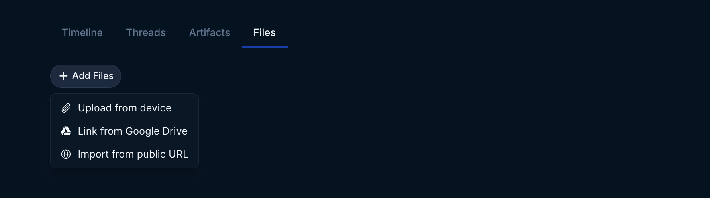
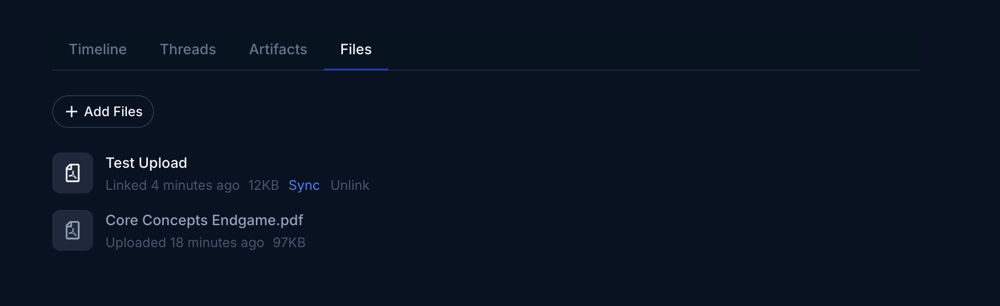
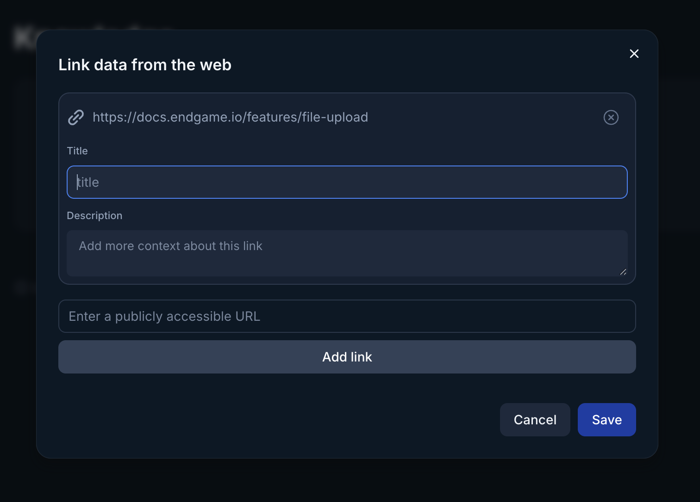
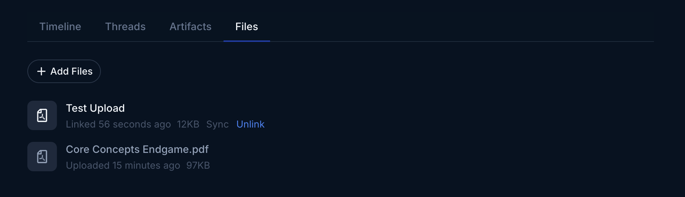

Individual users have the ability to upload documents to enhance the context provided to Endgame for singular account chat responses. Some types of documents that could be useful are account plans, meetings notes, or partnership decks. Anything that isn't already captured in the mediums Endgame already ingests can be added here.

## Upload files from your device

In a account detail page, open the Files tab toward the bottom of the page. Click Add Files and select Upload from device.

<Frame caption="File Upload">
  
</Frame>

Go through the flow to select up to 100 files at a time from your device. You can edit the titles and descriptions for the files before clicking to Upload Files.

<Frame caption="File Upload Flow">
  
</Frame>

## Link files from Google Drive

In a account detail page, open the Files tab toward the bottom of the page. Click Add Files and select Link from Google Drive.

<Frame caption="File Upload">
  
</Frame>

Go through the Google authentication process. Select all permissions requested (we only requst [drive.file](https://developers.google.com/workspace/drive/api/guides/api-specific-auth) and [drive.readonly](https://developers.google.com/workspace/drive/api/guides/api-specific-auth)) for the best Endgame experience. Once authenticated, select up to 100 files at a time to sync with Endgame. You can edit the description for the files before clicking to Select Files.

<Frame caption="Google File Select">
  
</Frame>

 

<Accordion title="Google Drive Security FAQs">
  - **What permissions does Endgame request?** Endgame requests [drive.file](https://developers.google.com/workspace/drive/api/guides/api-specific-auth) and [drive.readonly](https://developers.google.com/workspace/drive/api/guides/api-specific-auth) permissions.
  - **Why do individual users need to authenticate to Google?** Individual user authentication is required to sync files to accounts. It's also necessary if a user wants to download content directly to [Google Sheets](https://docs.endgame.io/features/export-thread-content#export-table-to-google-sheets) or [Goolge Docs](https://docs.endgame.io/features/export-thread-content#export-to-google-docs). Users who don't need these features are not required to authenticate to Google.
  - **Does Endgame sync my entire Drive once I've connected?** No, Endgame only syncs folders or files that you explicitly select.
  - **Does Endgame keep a copy of the files it syncs from Drive?** Yes, we create a copy of the file to process it for use in your chat responses. When you unsync a file, we delete the source content from our database.
  - **Can Endgame Admins delete the files linked on behalf of users or does the originating user have to delete it?** Admins can delete or unlink any files that any user has added.
  - **If a person leaves the company, how does this impact any files being referenced in their personal Drives?** If a person leaves the company and their Google credentials are invalidated, Endgame will no longer be able to keep their linked files up to date.
  - **How are Drive files used in chat responses, are files uploaded by an individual only available to them, in their chats?** Any files associated with the organization or accounts are available to all users via chat. We cannot restrict data surfaced in chat based on Drive permissions of the source content. Context is shared across all users.
</Accordion>

### Updating linked files

Your Google Drive and URL files are automatically synced once per day, but you can trigger a manual sync anytime by hovering over the item and then clicking Sync.

<Frame caption="Sync Google Drive and URL Files">
  
</Frame>

## Import files from a public URL

In a account detail page, open the Files tab toward the bottom of the page. Click Import from public URL.

<Frame caption="File Upload">
  
</Frame>

Copy and paste a link to a public document or webpage. After you click Add Link, you will be able to add a title and a description for the URL. Continue to add additional URLs and click Save once completed. Your document will now be added to your list of Knowledge documents.

<Frame caption="Import from public URL">
  
</Frame>

## Remove files

Once your files are uploaded or linked, you can delete or unlink them anytime by hovering over the item and then clicking Delete or Unlink. By deleting or unlinking the file you ensure that information associated with that file will no longer be present in new chat responses.

<Info>
  Application Admins have the ability to delete or unlink _any_ folder or file regarless of ownership
</Info>

<Frame caption="Delete or Unlink Files">
  
</Frame>