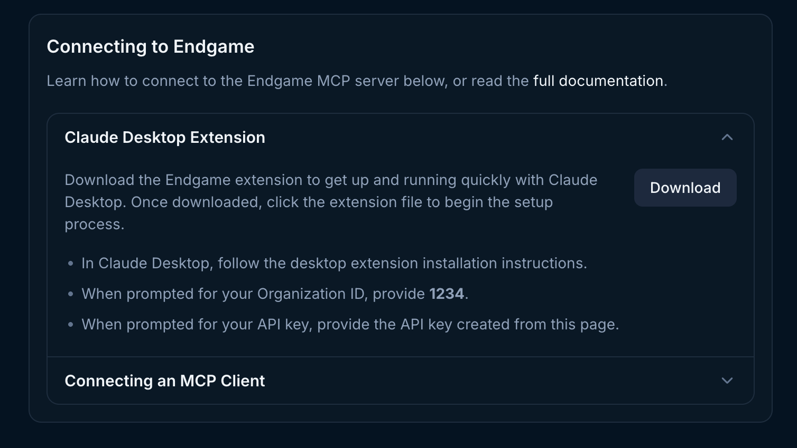
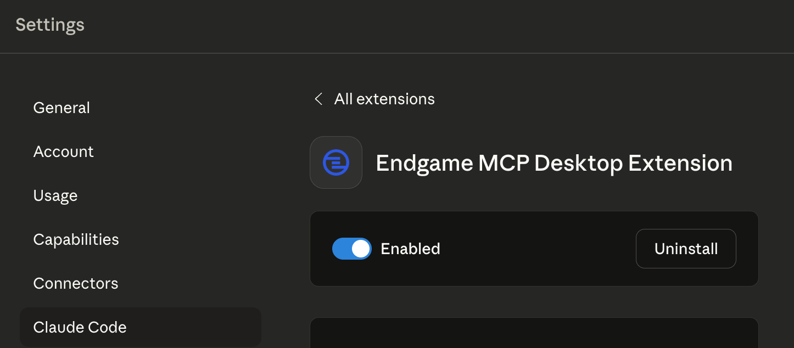
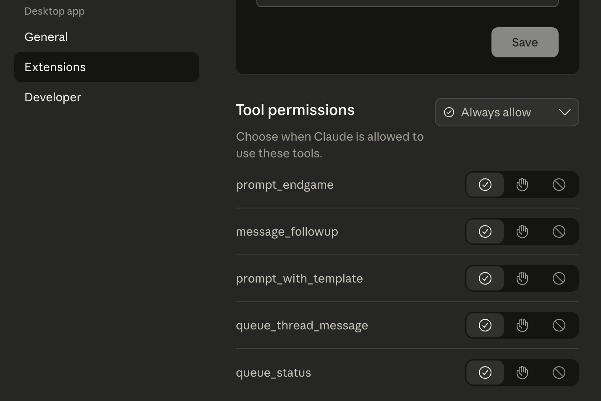

## What is the Endgame MCP Server?

The Endgame MCP (Model Context Protocol) Server allows AI assistants like Claude Desktop to directly communicate with Endgame. Once connected, you can prompt Endgame to get insights, search conversations, and access customer information without leaving your AI assistant.

Think of it as giving your AI assistant the ability to "Ask Endgame" questions, just like starting a new thread in the Endgame platform.

## What You Can Do

With the Endgame MCP Server connected to Claude Desktop, you can:

- **Ask about accounts**: "Ask Endgame what the big accounts are"
- **Get customer insights**: "Ask Endgame about recent customer feedback on pricing"
- **Search conversations**: "Ask Endgame for enterprise deal insights"
- **Query any information**: "Ask Endgame what challenges customers are facing"

The MCP server essentially gives your AI assistant a direct line to Endgame's knowledge base.

## Getting Started

### Step 1: Get Your API Key

1. Log in to Endgame
2. Navigate to **Settings** → **API Keys** - you will only be able to view your api keys, you won't see the other keys generated by people on your team
3. Create a new API key
4. Copy and save your token securely (you won't be able to see it again!)
5. Provide the Organization ID available in the connection instructions when prompted

Admins can create API keys for members of their organization at their discretion. We recommend using descriptive names like "sarah-endgame-key" to make it easy to identify and revoke keys when needed. Admins will need to copy the key and share it manually with the end user. Keys are tied to the creator, so queries that reference "me" or "my" will return results specific to the key creator. For example, "What is new on my accounts this week?" would reflect the admin's accounts, not the end user's.

<Note>
  You must be an admin to create API keys.
</Note>

### Step 2: Configure Claude Desktop

Open the Claude Desktop instructions below your api keys. Click on Download to start the installation process.

<Frame caption="Claude Desktop Instructions">
  
</Frame>

- In Claude Desktop, follow the desktop extension installation instructions.
- When prompted for your organization ID, locate the number starting with a '5' or '6' at the top of the **API Keys** page.
- When asked for your API key, provide the API key you created.

## How to Use It

Simply ask Claude to "Ask Endgame" followed by your question:

- "Ask Endgame what our top enterprise accounts are focused on"
- "Ask Endgame about recent pricing objections"
- "Ask Endgame for customer feedback from the last quarter"
- "Ask Endgame what competitors are being mentioned"

Claude will use the `prompt-endgame` tool to create a thread in Endgame and return the response directly in your conversation.

## Available Tools

| Tool name            | Description                                                                                                                                                                                                                                                                                                                                                    | Parameters                                                                                                                   | Parameter Description                                                                                                                                                                                                                                                                                                                                                                                                            |
| -------------------- | -------------------------------------------------------------------------------------------------------------------------------------------------------------------------------------------------------------------------------------------------------------------------------------------------------------------------------------------------------------- | ---------------------------------------------------------------------------------------------------------------------------- | -------------------------------------------------------------------------------------------------------------------------------------------------------------------------------------------------------------------------------------------------------------------------------------------------------------------------------------------------------------------------------------------------------------------------------- |
| prompt_endgame       | This tool is the primary method by which other LLM tools communicate with Endgame. This tool is used to prompt Endgame to get an answer to a question. If a response is taking too long to return, it will return the necessary information needed to follow up with the in progress request.                                                                  | prompt string REQUIRED  threadId string                                                             | The prompt to be sent to endgame   The thread ID to append the thread message to (will create a new thread if not provided)                                                                                                                                                                                                                                                                                       |
| message_followup     | This tool is the primary method by which other LLM tools can follow up with a posted thread message. If a message takes too long to generate, the necessary IDs to continue listening for a response are provided from the prompt_endgame tool. LLMs will be instructed to call this tool to collect the status of the message they posted.                    | operation_id string REQUIRED                                                                                       | The unique identifier of the message the LLM should follow up on.                                                                                                                                                                                                                                                                                                                                                                |
| queue_thread_message | Similar to prompt_endgame, this tool can be used to send a prompt to Endgame. Instead of waiting for a response, it will immediately return the IDs of the newly created message and thread that correspond with the new thread message. This can be useful for programmatic environments, where a response is needed immediately.                             | prompt string REQUIRED  url string        state string | The prompt to be sent to endgame   This tool can also post the resulting message to a webhook, if a URL is provided. Once a message is successfully created or experiences an error, the resulting message will be sent to the provided URL.  A URL state option that will be forwarded to the webhook upon completion. This can be used to guarantee authenticity of requests sent to the webhook URL. |
| queue_status         | This tool can be used to check on the status of a thread message enqueued with the queue_thread_message tool. This tool will return the state of the originally posted message and will report if it's still in progress, has experienced an error, or complete. If complete, will include the Endgame thread message content. | messageId string REQUIRED     threadId string REQUIRED                          | The ID of the message to check the status of. This will be returned from the queue_thread_message tool.  The ID of the thread the message belongs in. This will be returned from the queue_thread_message tool.                                                                                                                                      |

## Important Notes

- **Response Time**: Complex queries can take 4-6 minutes to complete
- **Rate Limits**: Each API token has a daily usage limit of 100 requests / 24 hours
- **Security**: Keep your API token secure - anyone with the token can access your Endgame data

## Troubleshooting

**MCP server not appearing in Claude Desktop?**

- Verify your API token is correct
- Check the endpoint URL matches your organization
- Make sure you restarted Claude Desktop

**Claude says it doesn't have access to Endgame**

- Open the Settings menu under your user profile in the bottom left corner of the app. Click into Extensions under Desktop App.
- Ensure you have the Endgame MCP Desktop Extension toggled on.

<Frame caption="Toggle Endgame MCP">
  
</Frame>

- Ensure you have Tool Permissions set to Always Allow and that you have all the tools set to Always Allow.

<Frame caption="Toggle Endgame Connector">
  
</Frame>

**Getting authentication errors?**

- Your API token may be invalid or expired
- Create a new token in Settings → API Keys

**Hitting rate limits?**

- You've exceeded your daily limit
- Wait until tomorrow or contact your administrator

## Need Help?

For issues or questions about the Endgame MCP Server, contact your Endgame administrator or reach out to [support@endgame.io](mailto:support@endgame.io).