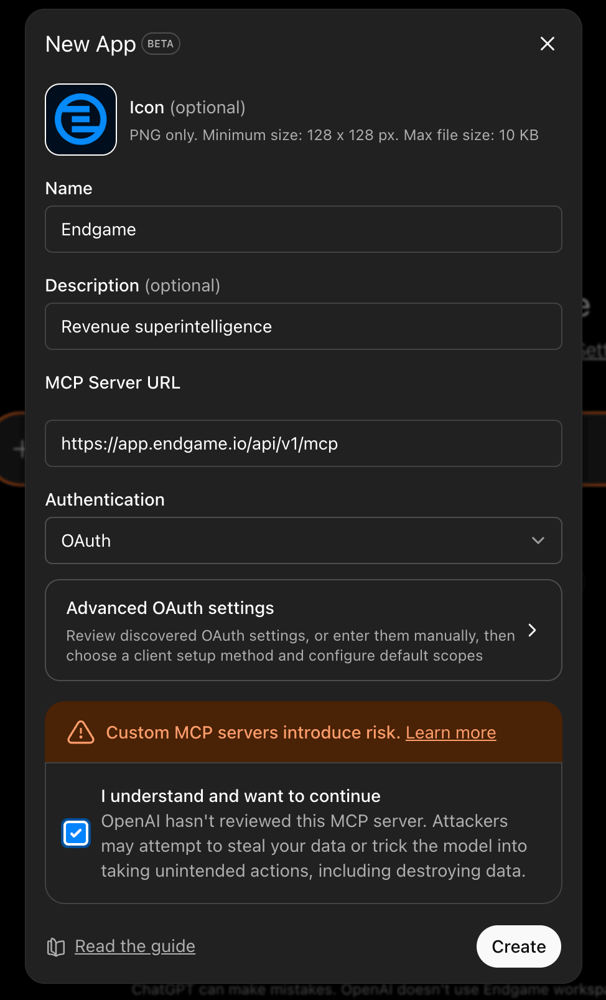
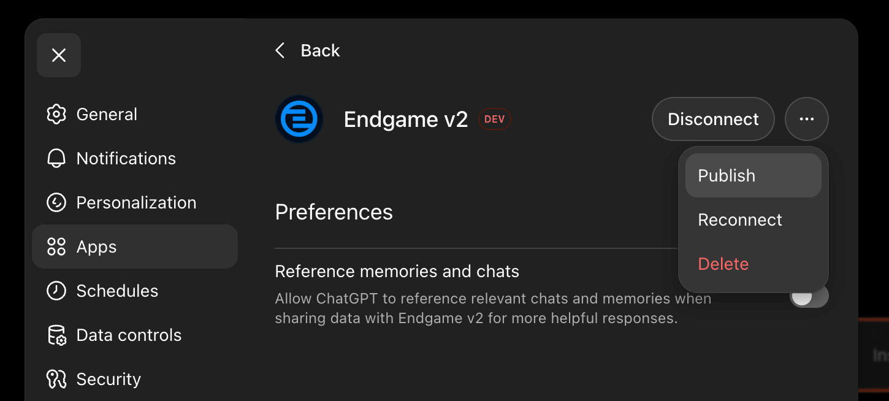
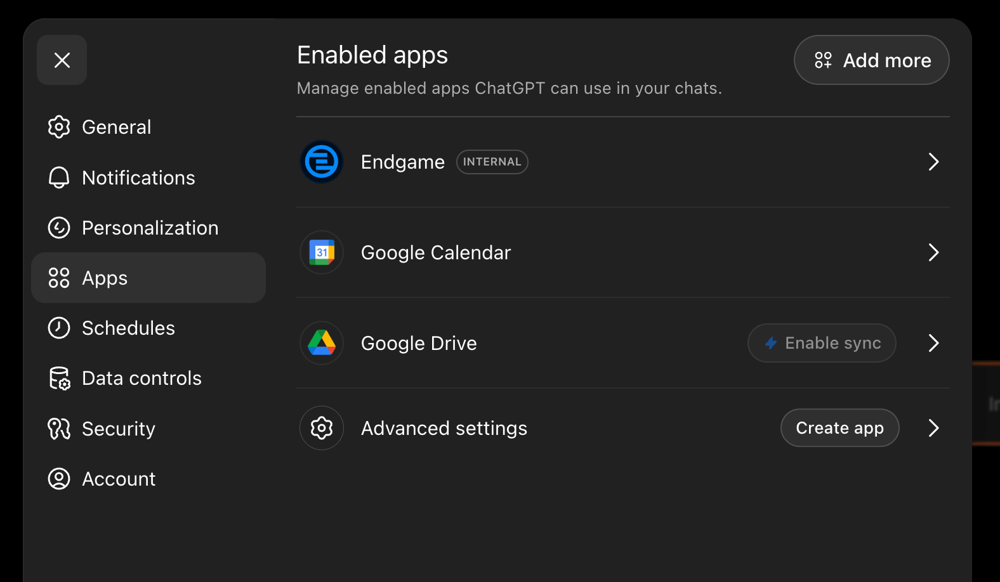
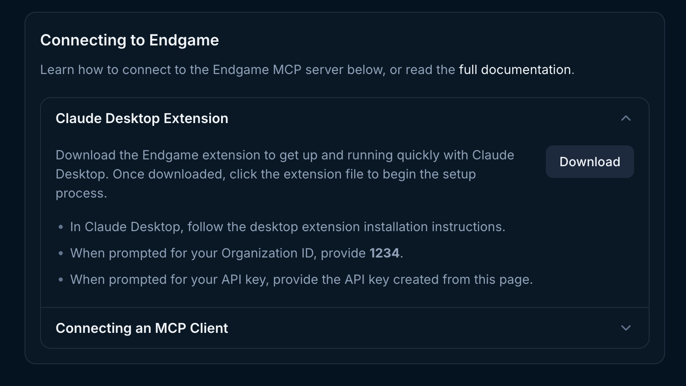

<Warning>
  **Beta:** The updated MCP Server is in beta and is not available to all users.
  Contact your Endgame Administrator to discuss access.
</Warning>

The Endgame MCP (Model Context Protocol) Server gives AI assistants like Claude or ChatGPT direct access to your organization's revenue intelligence -- CRM records, meeting transcripts, emails, Slack conversations, uploaded documents, and more. Once connected, your assistant can search interaction history, look up accounts, find stakeholders, query your data warehouse, and surface insights without leaving the conversation.

Think of it as giving your AI assistant a direct line to everything Endgame knows about your business.

## Getting Started

We recommend connecting Endgame through either **Claude's custom connector** or the **ChatGPT app**. Both options give your AI assistant direct access to all Endgame tools.

### Connect via Claude

Claude's custom connector is the recommended way to connect Endgame for Claude users. This gives Claude direct access to all Endgame tools.

<Steps>
  <Step title="Admin: Add the Endgame connector">
    An admin needs to add Endgame as a custom connector before anyone on the team can use it.

    1. In Claude, go to **Customize** &rarr; **Connectors**
    2. Click **Add custom connector** in the "+" menu
    3. Enter a name (e.g., "Endgame")
    4. Enter the URL: `https://app.endgame.io/api/v1/mcp`
    5. Click **Add** and follow the prompts to authenticate with Endgame

  </Step>
  <Step title="Individual: Connect to Endgame">
    Once the admin has added the connector at the organization level, each team member can connect:

    1. Go to **Customize** &rarr; **Connectors** in Claude
    2. Find the Endgame connector and click **Connect**
    3. Follow the authentication prompts

  </Step>
  <Step title="Start asking questions">
    Once connected, just ask Claude anything about your accounts, pipeline, meetings, or conversations. Claude will automatically use the right Endgame tools to find your answer.
  </Step>
</Steps>

<Note>
  If you previously installed the legacy Endgame MCP extension, you may need to
  remove it before connecting the new connector, or give the new one a different
  name to avoid conflicts.
</Note>

### Connect via ChatGPT

You can connect Endgame to ChatGPT by adding it as a custom app. An admin must publish the app before team members can enable it.

<Steps>
  <Step title="Admin: Add the Endgame custom app">
    1. In ChatGPT, open **Settings** and navigate to the **Apps** section
    2. Click **Create app**
    3. Enter a name (e.g., "Endgame") and the URL: `https://app.endgame.io/api/v1/mcp`
    4. After clicking **Create**, complete the authentication prompts to link your Endgame account

    <Frame caption="Adding a custom app in ChatGPT">
      
    </Frame>

  </Step>
  <Step title="Admin: Publish the app to your organization">
    Once the app is configured, publish it so team members can access it.
    1. Within Apps, find your Draft app and open it. 
    2. From the overflow menu, select **Publish**

    <Frame caption="Publishing the Endgame app in ChatGPT">
      
    </Frame>

  </Step>
  <Step title="Individual: Enable the Endgame app">
    After the admin has published the app, each team member can enable it:

    1. Go to **Settings** &rarr; **Apps** in ChatGPT
    2. Click **Add more**, find the Endgame app and connect
    3. Follow the authentication prompts

    <Frame caption="Enabled apps in ChatGPT">
      
    </Frame>

  </Step>
  <Step title="Start asking questions">
    Once enabled, just ask ChatGPT anything about your accounts, pipeline, meetings, or conversations. ChatGPT will automatically use the right Endgame tools to find your answer.
  </Step>
</Steps>

## How to Use It

Once connected, simply ask your AI assistant questions about your business. You don't need to use any special syntax -- your assistant will automatically select the right Endgame tools based on your question.

For complex analyses, your assistant can chain multiple tools together -- for example, finding an account, pulling recent interactions, and querying your data warehouse to build a complete picture.

<CardGroup cols={2}>
  <Card title="Account intelligence" icon="building">
    "What accounts does my team own, and when was the last time we interacted
    with each one?"
  </Card>
  <Card title="Conversation insights" icon="message-square">
    "What did customers bring up as pain points or risks across our last 20
    sales calls?"
  </Card>
  <Card title="Public intelligence" icon="newspaper">
    "What did Salesforce's CFO say about their AI strategy on the most recent
    earnings call?"
  </Card>
  <Card title="Pipeline analytics" icon="chart-line">
    "Show me all open opportunities over $500K that haven't had any activity in
    the last 45 days."
  </Card>
  <Card title="Internal communications" icon="hash">
    "What are we saying internally on Slack about the upcoming renewal with Acme
    Corp?"
  </Card>
  <Card title="People research" icon="user-search">
    "Who are the key executives at this account, and can anyone on our team make
    an introduction?"
  </Card>
</CardGroup>

## Available Tools

When connected via Claude, the following tools are available. Claude selects the right tool automatically based on your question.

### Accounts & CRM

| Tool                      | Description                                                                                                                                                                                    |
| ------------------------- | ---------------------------------------------------------------------------------------------------------------------------------------------------------------------------------------------- |
| `find_accounts`           | Find CRM accounts by owner, team membership, or account ID. Returns account details, interaction recency, open opportunities, and the full sales team roster.                                  |
| `query_data`              | The most powerful data tool -- translates natural-language questions into SQL queries against your organization's full data warehouse (accounts, contacts, opportunities, meetings, and more). |
| `search_salesforce_notes` | Retrieve Salesforce notes and activity history entries recorded against a specific account.                                                                                                    |

### People & Contacts

| Tool                 | Description                                                                                                                                   |
| -------------------- | --------------------------------------------------------------------------------------------------------------------------------------------- |
| `find_person`        | Look up a specific person by name, email, Salesforce ID, LinkedIn profile, or Endgame person ID. Returns ranked candidates with match scores. |
| `get_person_details` | Load a full profile for a person: CRM contact data, LinkedIn history, interaction history, introduction paths, and public news.               |
| `search_people`      | Browse and filter contacts at a company across CRM, LinkedIn, interaction history, public news, and recent hires/departures.                  |

### Meetings & Interactions

| Tool                      | Description                                                                                                                                                                                                             |
| ------------------------- | ----------------------------------------------------------------------------------------------------------------------------------------------------------------------------------------------------------------------- |
| `get_interaction_history` | Retrieve chronological summaries or extracted facts from meeting transcripts and emails for one or more accounts. Filter by date, participant, content type, or topic tags (pain points, deal risks, next steps, etc.). |
| `search_meetings`         | Search for meetings, calls, and emails across the organization. Filter by account, participant, subject, status, and date range.                                                                                        |
| `search_my_meetings`      | Search your own meetings and calendar. Automatically scoped to the logged-in user.                                                                                                                                      |

### Messages & Communications

| Tool                    | Description                                                                                                                       |
| ----------------------- | --------------------------------------------------------------------------------------------------------------------------------- |
| `search_slack_messages` | Fetch Slack messages about a specific account from channels linked to that account. Includes AI-generated conversation summaries. |

### Documents & Knowledge

| Tool                        | Description                                                                                                                             |
| --------------------------- | --------------------------------------------------------------------------------------------------------------------------------------- |
| `fetch_knowledge_documents` | Browse uploaded knowledge documents by account, date, or content type. Returns metadata and previews.                                   |
| `get_document`              | Retrieve the full content of a specific document by ID (transcripts, emails, knowledge docs, earnings calls, Slack messages, or notes). |
| `find_relevant_documents`   | AI-powered search that automatically extracts optimal search terms from a question to find relevant company-wide documents.             |
| `search_vendor_documents`   | Search company-wide reference documents (playbooks, product docs, methodology guides) using semantic and keyword matching.              |
| `search_document_insights`  | Search extracted facts and quotes across all document types -- transcripts, emails, earnings calls, Slack, and notes.                   |
| `search_knowledge_articles` | Search synthesized knowledge articles that provide high-level account overviews built from multiple source documents.                   |

### Datasets

| Tool              | Description                                                                                                              |
| ----------------- | ------------------------------------------------------------------------------------------------------------------------ |
| `search_datasets` | Discover what structured datasets (CSVs, spreadsheets, dashboard exports) are available in your organization.            |
| `query_dataset`   | Query uploaded structured data files using natural language. The tool translates questions into SQL and returns results. |

### External Research

| Tool                       | Description                                                                                                                                                                |
| -------------------------- | -------------------------------------------------------------------------------------------------------------------------------------------------------------------------- |
| `research_company`         | Deep company research with synthesized answers, verbatim quotes, and source URLs. Covers strategic priorities, financials, leadership, and more. Supports SEC filing mode. |
| `summarize_earnings_calls` | Retrieve and summarize public earnings call transcripts with extracted facts and speaker quotes.                                                                           |
| `news_search`              | Search Google News for editorial coverage about companies, events, or industry trends.                                                                                     |
| `web_search`               | General-purpose web search for public information -- documentation, press releases, blog posts, and more.                                                                  |

### Personalization

| Tool                      | Description                                                                                                 |
| ------------------------- | ----------------------------------------------------------------------------------------------------------- |
| `get_user_preferences`    | Load your standing instructions and preferences that you've established across prior Endgame conversations. |
| `search_user_preferences` | Search your broader memory and context from past conversations for situationally relevant preferences.      |

## Rate Limits

Rate limits are configured per organization and may vary depending on your plan. If you encounter rate limit errors, contact your Endgame administrator to review your organization's current limits.

## Important Notes

- **Response time**: Complex queries (especially those using `query_data` or `research_company`) can take up to a few minutes to complete.
- **Data access**: Results are scoped to the data your organization has connected to Endgame (CRM, transcripts, Slack, etc.).

<AccordionGroup>
  <Accordion title="Legacy MCP Setup (API Key Method)">
    If your organization hasn't enabled the Claude custom connector, you can connect using an API key instead. This method uses a smaller set of bridge tools (`prompt_endgame`, `message_followup`, `queue_thread_message`, `queue_status`) that send prompts to Endgame's AI rather than giving Claude direct tool access.

    ### Step 1: Get Your API Key

    1. Log in to Endgame
    2. Navigate to **Settings** &rarr; **API Keys** (you can only view your own keys)
    3. Create a new API key
    4. Copy and save your key securely -- it won't be shown again
    5. Note the Organization ID shown on the API Keys page

    We recommend using descriptive names like "sarah-endgame-key" to make keys easy to identify and revoke. Admins can create keys for team members but must share them manually. Keys are tied to the creator, so queries referencing "me" or "my" return results for the admin, not the end user.

    <Note>
      You must be an admin to create API keys.
    </Note>

    ### Step 2: Configure Claude Desktop

    Open the Claude Desktop instructions below your API keys. Click **Download** to start the installation process.

    <Frame caption="Claude Desktop Instructions">
      
    </Frame>

    - Follow the desktop extension installation instructions in Claude Desktop
    - When prompted for your organization ID, use the number starting with a "5" or "6" at the top of the API Keys page
    - When asked for your API key, provide the key you created

    ### Legacy Tools

    | Tool | Description | Parameters |
    | ---- | ----------- | ---------- |
    | `prompt_endgame` | Send a prompt to Endgame AI. Creates a thread and returns the response. If the response takes too long, returns IDs for follow-up. | `prompt` (required), `threadId` (optional) |
    | `message_followup` | Check on an in-progress message sent via `prompt_endgame`. | `operationId` (required) |
    | `queue_thread_message` | Send a prompt and return immediately with thread/message IDs. Optionally delivers the response to a webhook URL. | `prompt` (required), `url` (optional), `state` (optional) |
    | `queue_status` | Check the status of a message enqueued with `queue_thread_message`. | `messageId` (required), `threadId` (required) |

  </Accordion>
</AccordionGroup>

## Troubleshooting

**Claude doesn't seem to have access to Endgame tools?**

- In Claude, go to **Settings** &rarr; **Extensions** (under Desktop App) and confirm the Endgame connector is toggled on
- Check that tool permissions are set to **Always Allow** for all Endgame tools
- If you previously had the legacy MCP extension, remove it and reconnect using the custom connector

**Getting authentication errors?**

- Your session or API key may have expired -- try reconnecting the connector
- For legacy setups, create a new API key in **Settings** &rarr; **API Keys**

**Hitting rate limits?**

- You've exceeded your organization's request limit
- Limits reset daily. Contact your administrator if you need an adjustment

## Need Help?

For issues or questions about the Endgame MCP Server, contact your Endgame administrator or reach out to [support@endgame.io](mailto:support@endgame.io).
