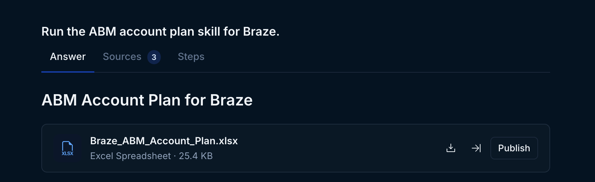
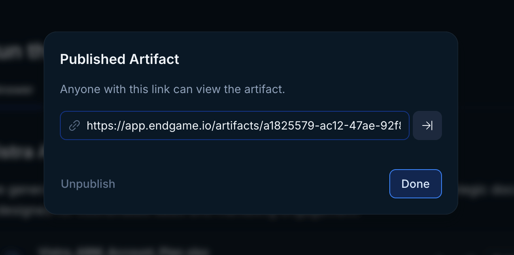
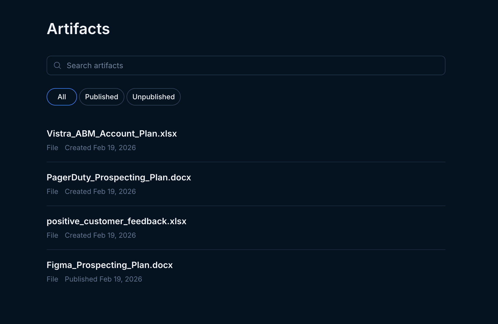
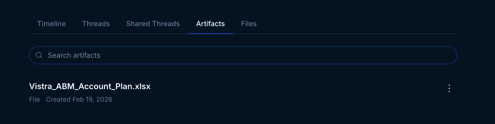
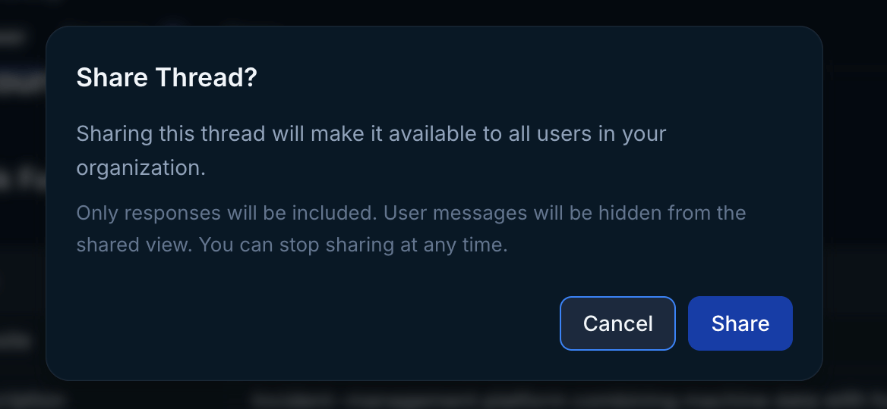

## Skill artifacts

Often using a skill within a thread will generate an "artifact". These artifacts can be slide decks, dashboards, excel spreadsheets, and more. You may want to make these artifacts public to share with your team or external stakeholders.

### Publishing Artifacts

Once you have generated a thread with a skill that outputs an artifact, you will see that artifact within the thread response with options to download or publish. Publishing creates a shareable url that gives _anyone_, including non-Endgame users, with the url access to the artifact. You can unpublish at anytime.

<Frame caption="Artifact within thread">
  
</Frame>

<Frame caption="Published artifact modal">
  
</Frame>

### Viewing Artifacts

To view all the artifacts you have access to, both those you have created and those others have published within your organization, click on the Artifacts option in the left side navigation. This will take you to a list view of artifacts. From here, you can view the threads associated with artifacts, publish/unpublish them, and get the shareable url for an artifact.

<Frame caption="Artifact list">
  
</Frame>

You can also see a filtered artifacts view within any Account Detail page under the Artifacts tab. Here you will find only the artifacts that are associated with that account.

<Frame caption="Artifact account view">
  
</Frame>

## Sharing Threads

As you ask Endgame questions in Threads, you may sometimes want to share the answers you're getting with your colleagues while continuing to work in Endgame. We enable this by allowing you to share a thread.

By sharing your Thread, it will now be available as a link to non-Endgame users as well as be visible to other Endgame users in the Shared Thread tab in the Account Detail page if it is account specific. If the thread is multi-account it will be present in the [threads list](https://app.endgame.io/threads) and show a Shared label.

To share your Thread, open up a thread and click "Share" at the top right corner. Doing so will present you with a modal, asking you to confirm whether you'd like to proceed.

<Frame caption="Confirmation dialog when sharing a Thread">
  
</Frame>

Once you have clicked Share in the modal, you'll see the status changed to Shared in the top right corner. Upon clicking on the Shared button at the top right of the thread, you'll see both the link to share the thread as well as a button that takes you directly to it.

The Shared button on the Thread is also where you can stop sharing, which causes the original share link to stop working, thus removing access for anyone to see that snapshot of the Thread as well as from being visible by other Endgame users in the Account Library.

<Note>
  Any changes, such as additional questions, made to a Shared Thread will be
  reflected in the thread upon a refresh, and thus visible to external viewers
</Note>

<Frame caption="Share options">
  
</Frame>

## Collaborating with Threads

Sharing threads enables enhanced collaboration in two primary ways.

### External Sharing

First, a Thread that has been shared enables you to share it externally with anyone with a link. These shared threads are not editable and only show the generated title summary for each prompt within the Thread and its contents (not the initial prompts).

The Thread owner can continue to chat with the original Thread in Endgame, and additional prompts and outputs will similarly be available in the shared thread.

<Frame caption="Shared thread">
  
</Frame>

### Internal Visibility

Second, while Threads are by default private to the user that created the Thread, once a Thread has been shared, the Thread will now be visible in the Shared Threads tab on account details pages to all Endgame users. Shared multi-account chat threads that are initiated from the homepage will be visible in the [threads list view](https://app.endgame.io/threads)

This allows any Endgame user to identify important Threads that are intended to be consumed by other internal stakeholders, whether it be to inform, coordinate or collaborate with one another.

<Frame caption="Shared Threads tab">
  
</Frame>

<Frame caption="Thread list">
  
</Frame>

## Need help or have feedback?

We'd love to hear from you! You can reach us at [support@endgame.io](mailto:support@endgame.io).
