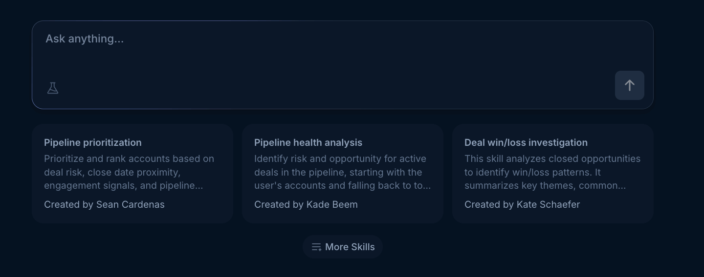
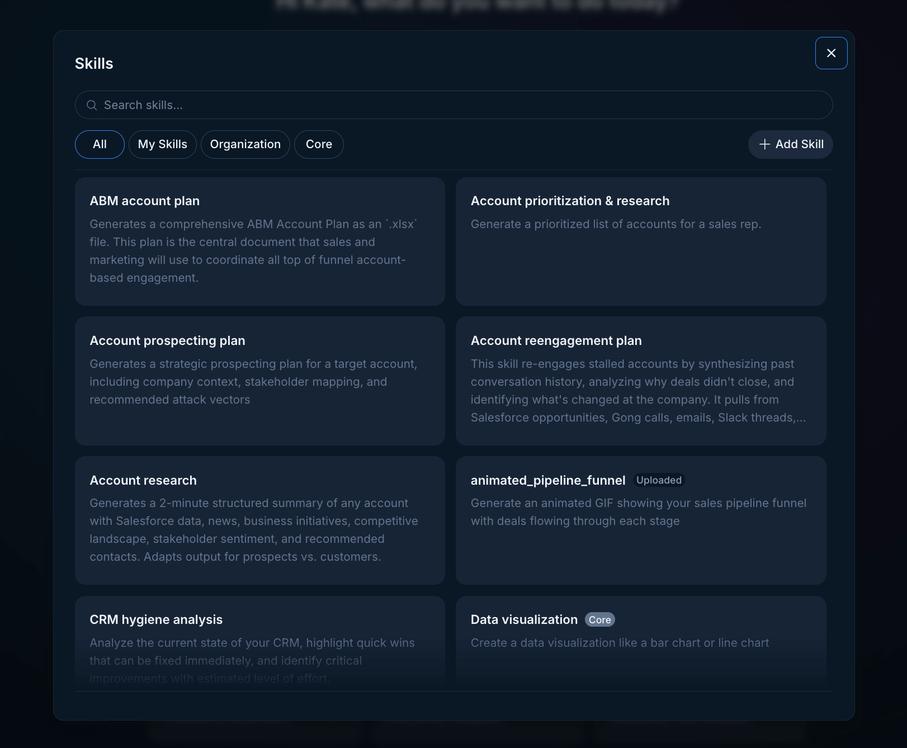
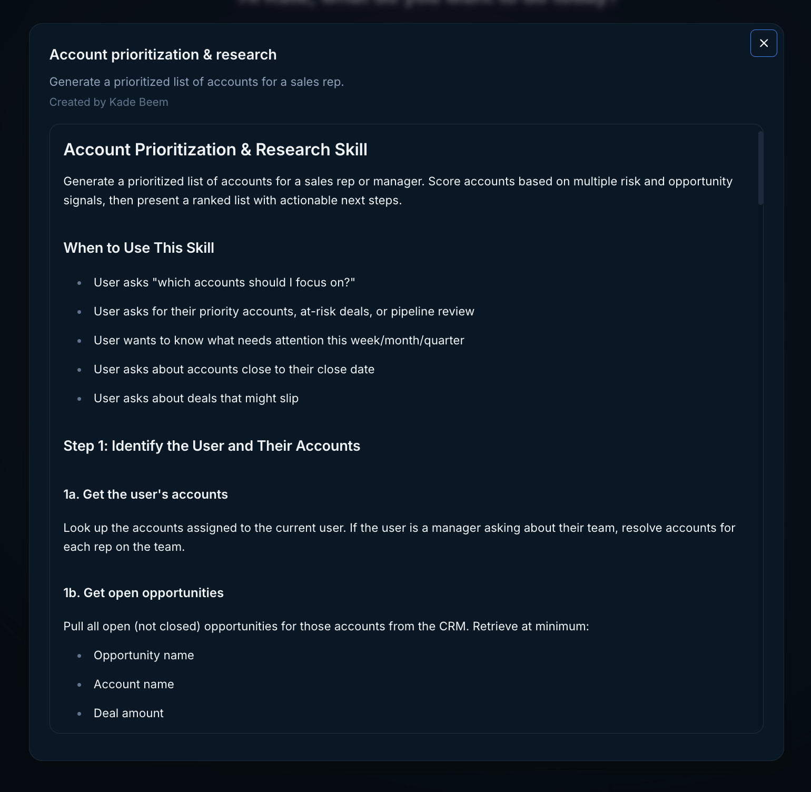

## What are skills

A Skill is a reusable instruction file that instructs Endgame (and the AI) how to handle a specific type of tasks.

Think of it like your team's playbook: instead of re-explaining your process every time, you write it down once in a skill, and the AI follows it automatically whenever that skill is used.

**A Skill can define things like:**

- The goal of the task (e.g., "write a follow-up email after a discovery call")
- The format or structure the output should follow
- Your company's tone, messaging, or value props to always include
- Step-by-step instructions the AI should walk through
- Examples of emails, call scripts, or summaries that have worked well

A simple example:

Your team always follows up after a demo the same way — thank them for their time, recap the top pain points they mentioned, and end with a clear next step. Instead of coaching the AI on this every time, you create a demo-follow-up skill with those instructions baked in. Now anyone on the team gets a consistent, on-brand follow-up in seconds.

**Why use Skills?**

- Save time — stop rewriting the same prompts from scratch
- Get consistent, on-brand output across your whole team
- Onboard new reps faster by sharing proven playbooks
- Build a library of your best messaging and workflows

## Using Skills in threads

To use a skill, click on one of the skill cards under the chat input in the home page or click the More skills button below the skill cards to access your full skills library. You can also access skills from the Account Detail page.

<Frame caption="Skills grid home page">
  
</Frame>

<Frame caption="Skills grid account detail">
  
</Frame>

In the skills modal you can filter and search within your skills.

<Frame caption="Skills modal">
  
</Frame>

Once you click on a skill, a basic prompt will populate the chat input to trigger that skill. All you have to do then is hit Enter to have Endgame start a new thread that utilizes that skill in the response. Before you hit enter, you can also choose to directly make edits and tweaks to the prompt if needed before starting your thread.

You can view more information about the content of a skill by clicking on the info icon in the top right corner of the skill card.

<Frame caption="Skill preview">
  
</Frame>

## Creating Skills

Some skills in your library will be controlled by account admins; you cannot edit or delete these. You can, however, create your own skills by clicking Add Skill within the skills modal. You can filter down to your personal skills using the My Skills tag in the main skill modal view or within the skill grid.

**Anatomy of a Skill:**

- **Title:** The title of your skill, displayed on the skill card.
  _Example:_ `Demo Follow-Up`

- **Description:** Used under the hood to determine when your skill is applicable. The AI references this to decide if the skill should be used when generating a response.
  _Example:_ `Generates a post-demo follow-up email that thanks the prospect, recaps their key pain points, and outlines a clear next step.`

- **Example Prompt:** The prompt that pre-populates in the chat input when this skill is selected from the skill grid.
  _Example:_ `Use the Demo Follow-up skill to write a follow-up email for the demo I just completed.`

- **Context:** The actual instructions that define _what_ your skill does and _how_ it should output content — this is where the real customization lives.
  _Example:_ `Write a concise follow-up email after a sales demo. Open by thanking the prospect for their time. Summarize the 2–3 pain points they mentioned during the call. Close with a single, specific next step (e.g., a follow-up call, trial, or proposal). Keep the tone warm but professional. Do not use filler phrases like "Hope this email finds you well."`

**Skill Artifacts**

Often using a skill within a thread will generate an “artifact”. These artifacts can be slide decks, dashboards, excel spreadsheets, and more. Read [more](/features/publishing-and-sharing#skill-artifacts) about how you can publish these artifacts to share them with your team or external stakeholders.
