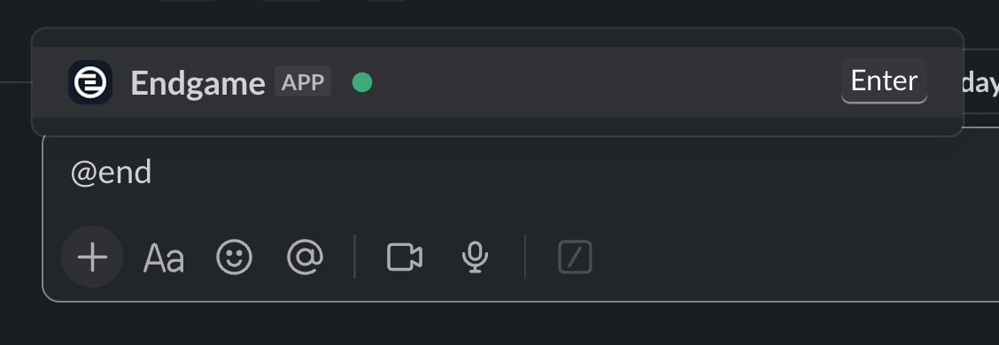
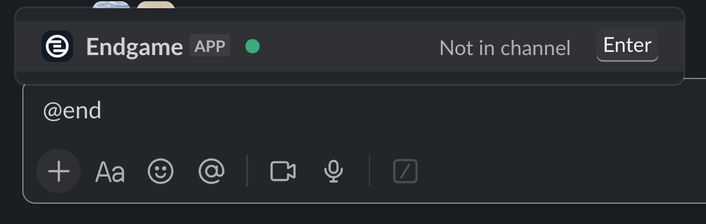
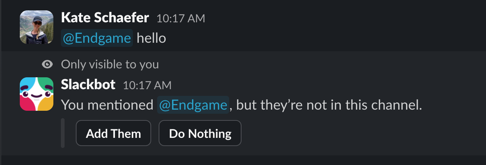
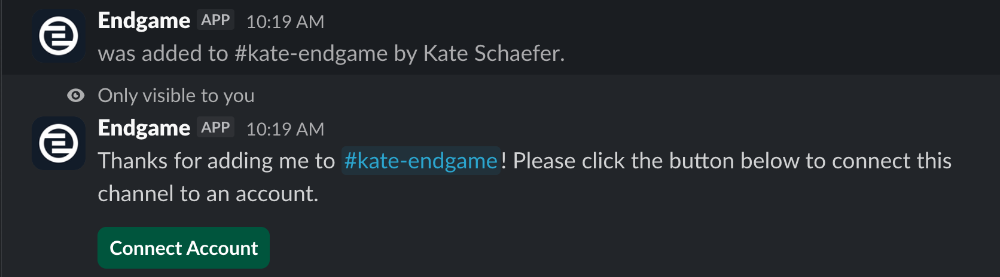
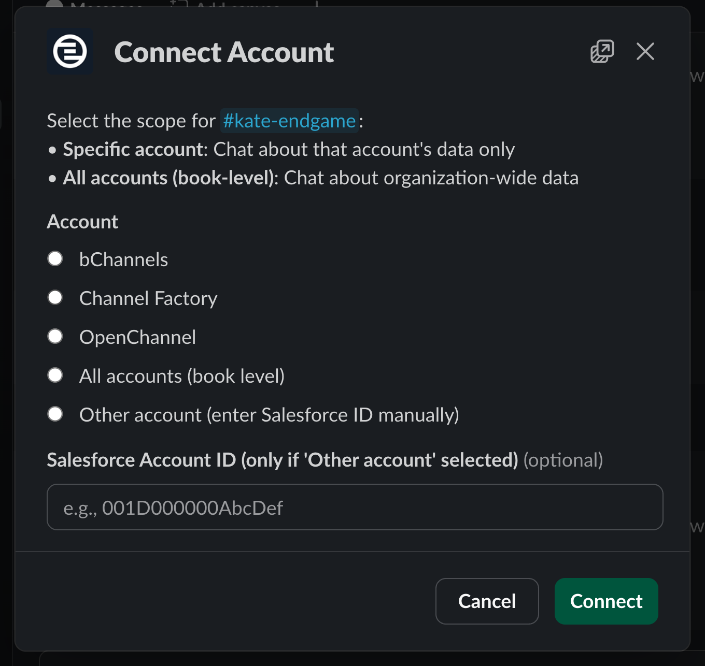
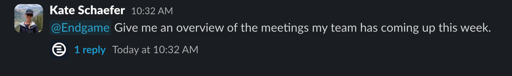

With the [Slack integration](/integrations/slack) configured in Endgame, you can  associate channels with accounts or your organization and launch Endgame threads directly from your Slack workspace.

<Note>
  Endgame threads within Slack are still in Beta - contact [support@endgame.io](mailto:support@endgame.io) to inquire about access
</Note>

### Associate channels for Endgame use

If an administrator from you organization has already connected specific channels with accounts via the Endgame integration page, the Endgame app has already been automatically added to those channels. You can check if the app has been added by typing "@Endgame" into a public channel, if they app has not been added you will see "Not in Channel".

<Frame caption="Endgame in channel">
  
</Frame>

 

<Frame caption="Endgame not in channel">
  
</Frame>

If you need to add the app to a channel, simply type "@Endgame hello" to kick off the flow to connect to a specific account or to give the channel an organization-wide (book level) association. When prompted, click to "Add Them" to the channel.

<Frame caption="Add Endgame app to channel">
  
</Frame>

Once Endgame has been added to the channel, you'll then be prompted to "Connect Account" to make the appropriate associations.

<Frame caption="Connect account">
  
</Frame>

Select the "Connect Account" option to open a configuration modal where you can establish the channel association. Account-level associations will initiate an ingestion of Slack channel data to provide enhanced context for account-specific threads, in addition to enabling account specific threads in those channels.

Organization-wide associations will also ingest channel data, but this data will not be incorporated into individual account threads since it lacks specific account attribution. Instead, organization-wide associations enable multi-account conversations within those channels.

<Frame caption="Connect account modal">
  
</Frame>

### Chat with Endgame in Slack

Now that you have made the needed channel associations, you can start chatting with Endgame in Slack.

Within any channel that you have added the Endgame app and made an account or organization-wide association, simply type "@Endgame \<your prompt\>" and Endgame will spin up a thread to answer your question.

<Info>
  Organization-wide channels are intended for multi-account inquiries, while account-specific channels are intended for questions related to individual accounts.
</Info>

<Frame caption="Endgame prompt in Slack">
  
</Frame>

 

<Frame caption="Endgame thread in Slack">
  
</Frame>

You can continue to interact with the thread, just submit a new question or response once the thread has resolved.