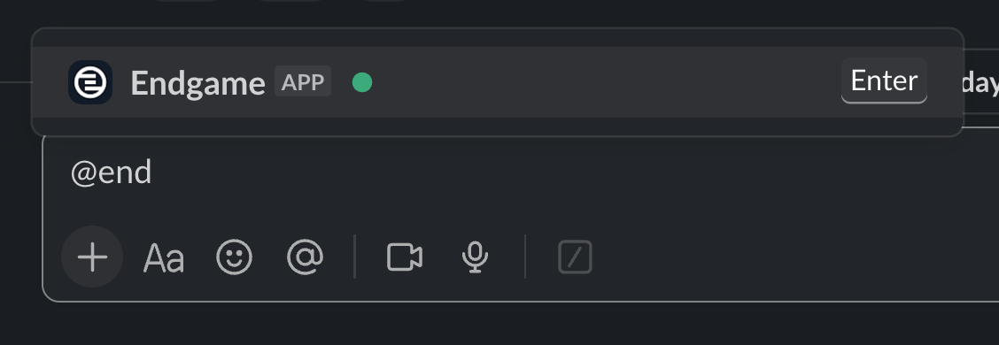
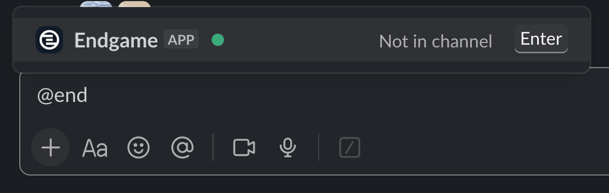
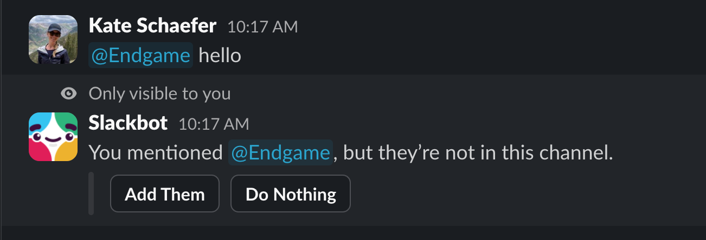
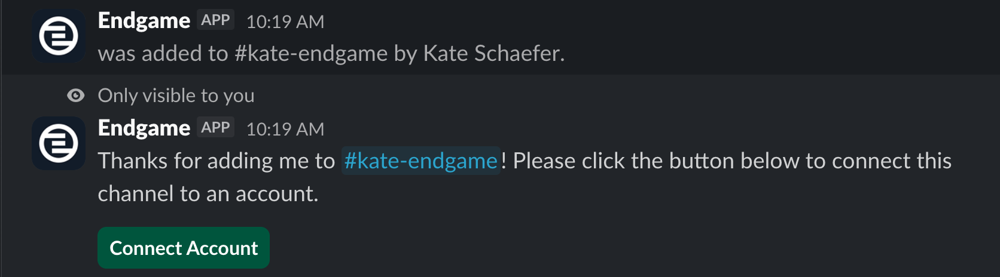
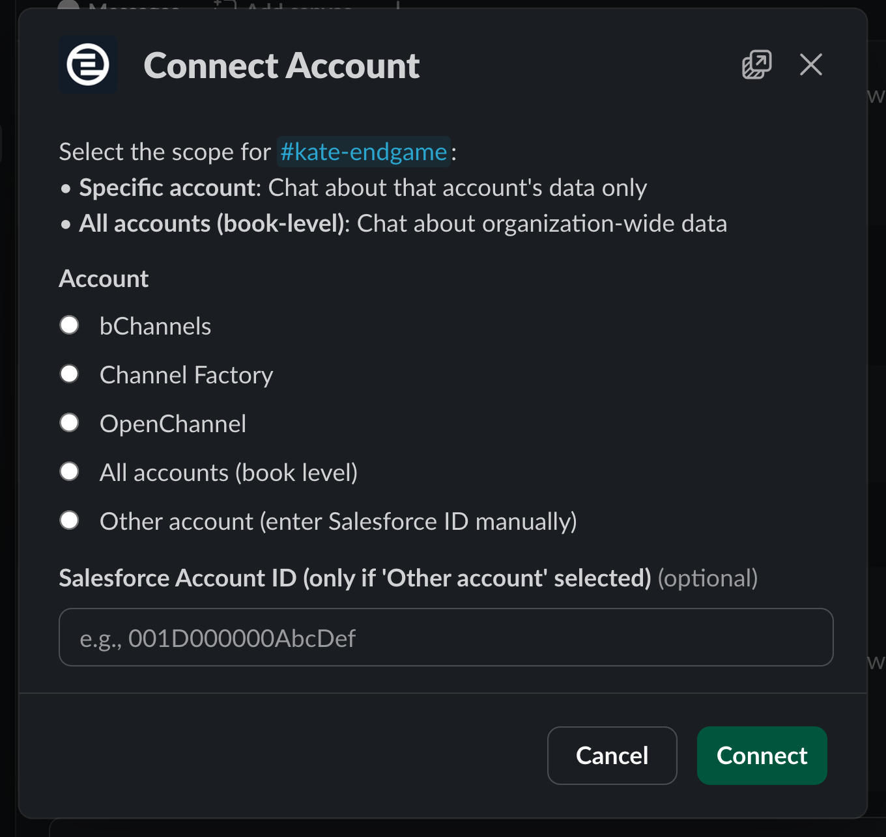
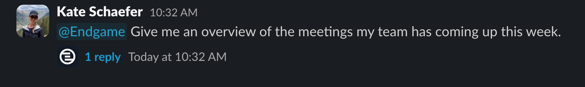
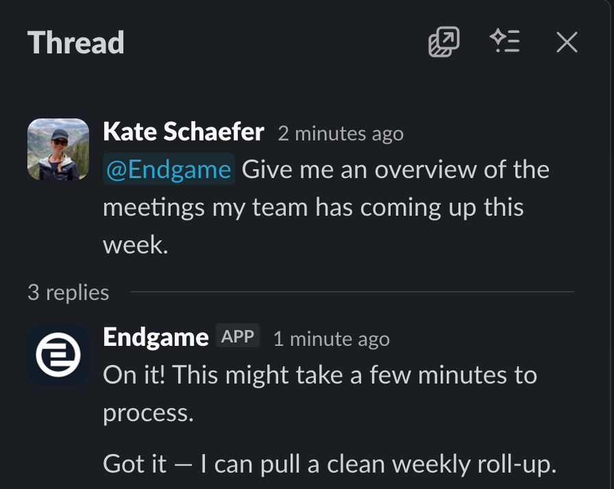

With the [integration for Slack](/integrations/slack) configured in Endgame, you can associate channels with accounts or your organization and launch Endgame threads directly from your Slack workspace.

### Associate channels for Endgame use

If an administrator from your organization has already connected specific channels with accounts via the Endgame integration page, the Endgame app has already been automatically added to those channels. You can check if the app has been added by typing "@Endgame" into a public channel. If the app has not been added, you will see "Not in Channel".

<Frame caption="Endgame in channel">
  
</Frame>

<Frame caption="Endgame not in channel">
  
</Frame>

If you need to add the app to a channel, simply type "@Endgame hello" to kick off the flow to connect to a specific account or to give the channel an organization-wide (book level) association. When prompted, click "Add Them" to add the app to the channel.

<Frame caption="Add Endgame app to channel">
  
</Frame>

Once Endgame has been added to the channel, you'll then be prompted to "Connect Account" to make the appropriate associations.

<Frame caption="Connect account">
  
</Frame>

Select the "Connect Account" option to open a configuration modal where you can establish the channel association. Account-level associations will initiate an ingestion of Slack channel data to provide enhanced context for account-specific threads, in addition to enabling account-specific threads in those channels.

Organization-wide associations will also ingest channel data, and when processed, the resulting facts will be associated with individual accounts. From these channels, you may initiate multi-account conversations.

<Frame caption="Connect account modal">
  
</Frame>

### Chat with Endgame in Slack

Now that you have made the needed channel associations, you can start chatting with Endgame in Slack.

In general, organization-wide channels (e.g., #marketing) are intended for multi-account inquiries, while account-specific channels (e.g., #customer-acme) are intended for questions related to individual accounts.

Within any non-external channel to which you've added the Endgame app and made an association, simply type "@Endgame \<your prompt\>" and Endgame will spin up a thread to answer your question.

<Info>
  Connected external Slack channels are read-only for fact generation. Bot chat
  is disabled to protect internal organization data from external exposure.
</Info>

<Frame caption="Endgame prompt in Slack">
  
</Frame>

<Frame caption="Endgame thread in Slack">
  
</Frame>

You can continue interacting with the thread by typing "@Endgame \<your follow-up prompt\>" once it has resolved.
