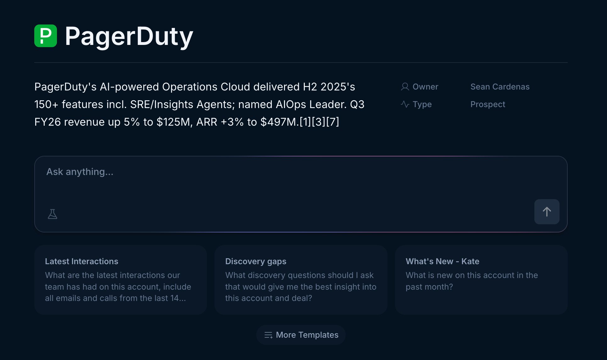
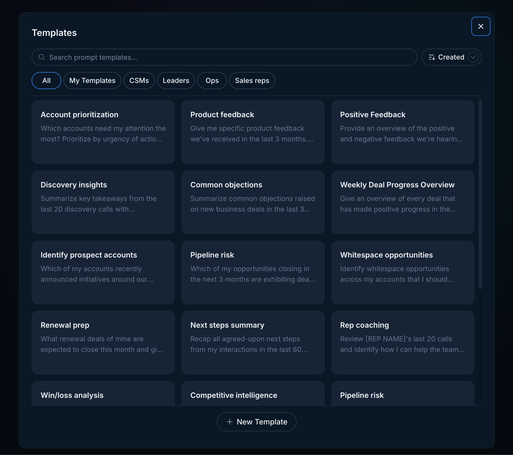
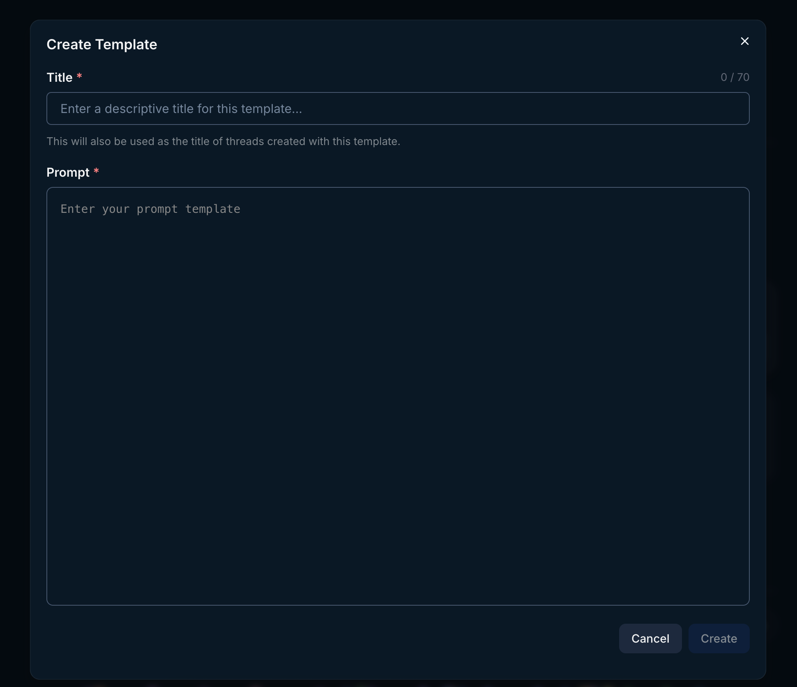
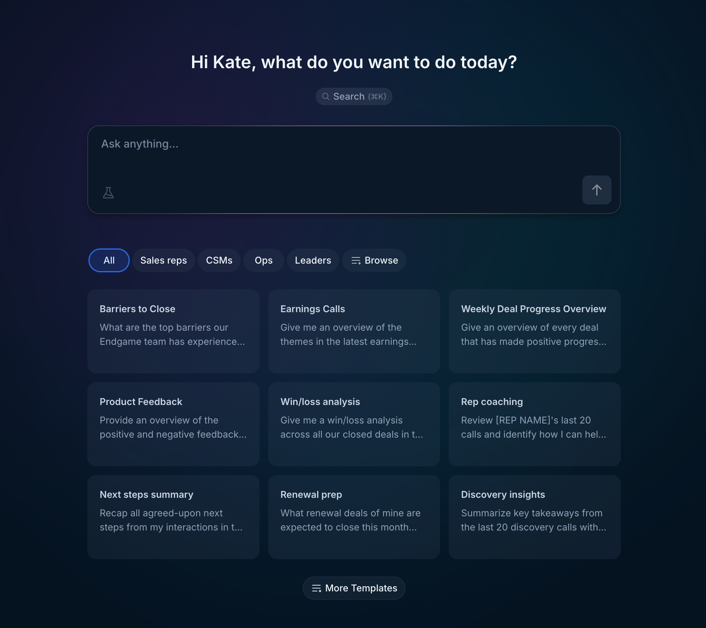

In Endgame, you can ask any question. Templates are used to enhance the chat experience. Learn more about the fundamentals of chat [here](/your-first-10-minutes).

Templated questions serve two specific purposes:

1. **Ask a frequently asked question with the click of a button** instead of having to type the question out for every account every time
2. **Generate the answer in a pre-determined, consistent format** Not only does using templates simplify the process of asking the same question across multiple accounts, but it also serves as a powerful mechanism to standardize processes and cultivate a shared understanding across the revenue org. A common example is asking Endgame to generate an account plan, because your team likely has its own unique methods for formulating and presenting account plans for all of your accounts.

## How to use templates for an account thread

To use a template, navigate to any account and click on one of the template cards under the chat input or click the More templates button below the template cards to access your full template library.

<Frame caption="Account templates">
  
</Frame>

Clicking More Templates opens a modal with your full template library. You can filter your templates by typing into the search input, clicking on the tags, or sorting by Created date. Selecting a template will fill out the prompt input text box. All you have to do then is hit Enter to have Endgame start a new thread with the standardized response. At this time, you can also choose to directly make edits and tweaks to the prompt as desired before starting your thread.

<Frame caption="Template modal">
  
</Frame>

## My templates

Some templates in your library will be controlled by account admins; you cannot edit or delete these. You can, however, create your own templates by clicking New Template at the bottom of the modal. You can filter down to your personal templates using the My Templates tag in the main template modal view.

<Frame caption="Create personal template">
  
</Frame>

## How to use templates for a multiple account thread

You can also use templates for more broadly scoped threads that touch multiple accounts. To ask a question that is not account specific, navigate to the Endgame [homepage](https://app.endgame.io/). These templates and the template modal work the same way as the account specific templates, but you won't see your account templates here or vice versa. And, you can save your own in My Templates at this level as well.

<Frame caption="Multi account templates">
  
</Frame>

<Info>
  If you have a question about a global organization template, please ping your Endgame administrator and we will work with them to support any changes.
</Info>