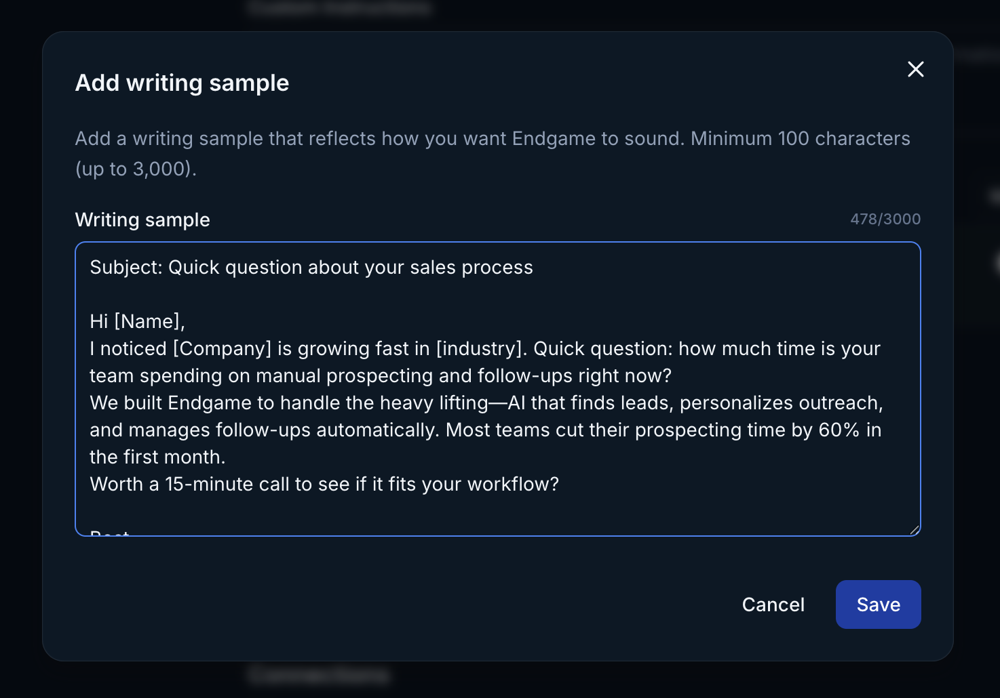
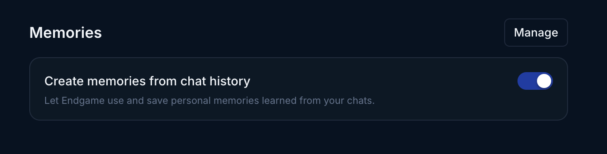
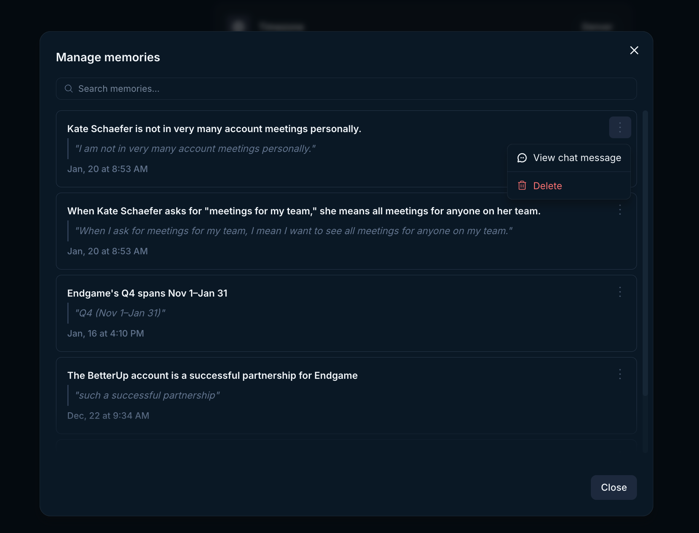

## User configuration

Users can customize their Endgame chat experience through the Personalization section in the [user settings view](https://app.endgame.io/settings). The Role and Custom Instructions fields allow you to provide information about your position and your chat preferences to help Endgame deliver more relevant responses.

In the Describe your role field, include details about your responsibilities, level within your organization's hierarchy, types of activities you engage in, and any other data relevant to your work. This context enables Endgame to provide more accurate and meaningful responses tailored to your specific needs. For example:

- "I'm a Sales Manager overseeing a team of 8 account executives in the Mid-Market segment. I'm responsible for pipeline management, forecasting, and coaching my team on deal strategy. I frequently work with opportunity data, account health metrics, and sales performance reports."
- "I'm a Customer Success Director managing enterprise accounts with ARR over $100K. My focus areas include renewal strategy, expansion opportunities, and customer health monitoring. I regularly analyze usage data, support tickets, and engagement metrics to identify at-risk accounts and growth opportunities."

The Custom Instructions field offers additional flexibility, allowing you to specify preferences such as response formatting, tone, or any other guidelines that will enhance your experience. For example:

- "I prefer concise, direct responses without excessive explanations."
- "I work in sales and need help with objection handling and deal strategy."
- "Focus on actionable advice I can implement immediately."
- "Use conversational language and avoid overly technical jargon."
- "Provide responses with specific examples whenever possible."

<Frame caption="User preferences">
  
</Frame>

## Writing samples

Users can add up to 3 writing samples that Endgame will use to match tone, structure, and phrasing in future responses. This is particularly helpful when using Endgame to craft emails, messages, proposals, and more. 

<Frame caption="Writing samples">
  
</Frame>

Click on Add Sample to open the writing sample modal, enter your content and Save. You can delete or edit a sample anytime within this modal. 

<Frame caption="Writing sample modal">
  
</Frame>

## Memories
Users can add memories through their chat interactions with Endgame. Memories capture preferences and directives that enhance future chat responses. They are automatically detected and saved based on your interactions. For example, memories might include statements like "I prefer answers with tables when possible" or "My fiscal year ends January 31." You will know that Endgame has saved a memory based on your chat interaction if the Memory Updated tag appears at the top of your chat. To see the memories that were generated and saved hover over the tag. You can directly manage the memories by clicking on Manage memories at bottom of the list of memories. 

User memories are incorporated into the system that generates your responses, so you'll experience the results of your memory preferences in subsequent chats.

<Frame caption="Memory updated">
  
</Frame>

## How to create or update a memory

Memories are detected and saved automatically through your chat interactions. You can be explicit to ensure your preferences are captured, for example "I like my answers concise," but Endgame will also detect memories that are less directly stated. You can update a memory by including the change in a subsequent prompt, such as "I only like concise answers when drafting emails" or "I prefer verbose answers."

## Turning memories on/off

This feature is toggled on by default to capture your memories. You can update this setting in the [user settings view](https://app.endgame.io/settings). When Memories is toggled on, your memories from chat are stored and used in your chat responses. When toggled off, new memories are not saved and existing memories, if any, are not used in chat responses.

<Frame caption="User memory setting">
  
</Frame>

## How to view and delete memories

Users can review their memories in the [user settings view](https://app.endgame.io/settings). To navigate to user settings, click on your initials in the lower left sidebar and click on Manage in the Memories section. Here you'll see a list of the memories Endgame has saved for you along with the quote that informed the memory. Open the overflow menu on a memory (3 verical dots on the right), to delete a memory or to navigate to the thread that generated a memory. Because memories are saved automatically, Endgame may occasionally interpret something as a memory that you don't want saved. You can easily review and delete them here.

<Frame caption="User memory management">
  
</Frame>
