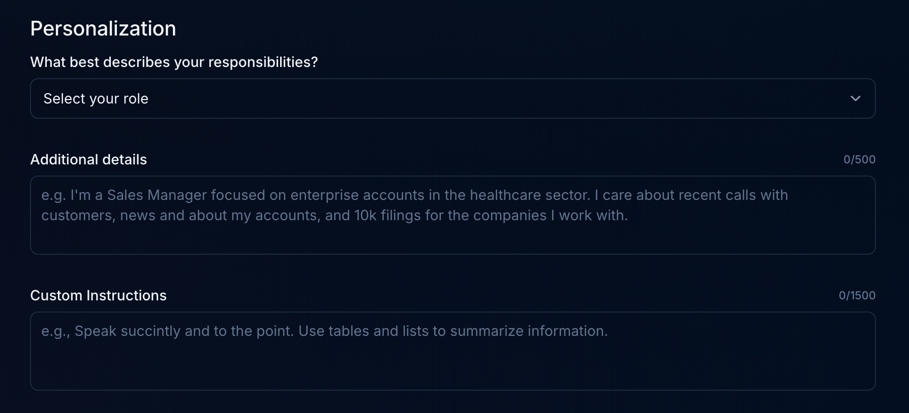
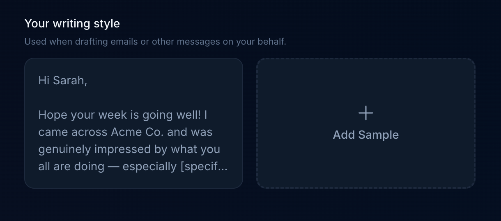
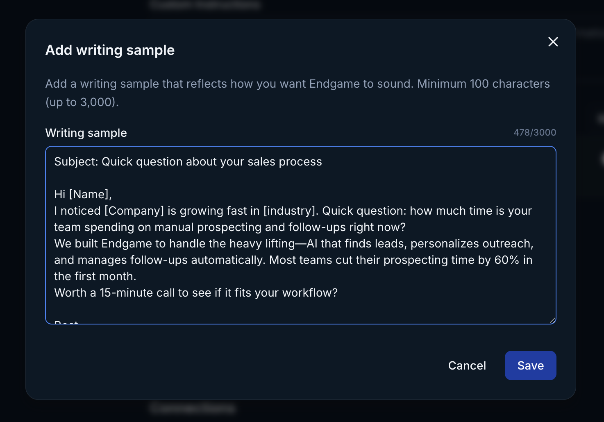

## User configuration

Users can customize their Endgame chat experience through the Personalization section in the [user settings view](https://app.endgame.io/settings). The Role and Custom Instructions fields allow you to provide information about your position and your chat preferences to help Endgame deliver more relevant responses.

In the Describe your role field, include details about your responsibilities, level within your organization's hierarchy, types of activities you engage in, and any other data relevant to your work. This context enables Endgame to provide more accurate and meaningful responses tailored to your specific needs. For example:

- "I'm a Sales Manager overseeing a team of 8 account executives in the Mid-Market segment. I'm responsible for pipeline management, forecasting, and coaching my team on deal strategy. I frequently work with opportunity data, account health metrics, and sales performance reports."
- "I'm a Customer Success Director managing enterprise accounts with ARR over $100K. My focus areas include renewal strategy, expansion opportunities, and customer health monitoring. I regularly analyze usage data, support tickets, and engagement metrics to identify at-risk accounts and growth opportunities."

The Custom Instructions field offers additional flexibility, allowing you to specify preferences such as response formatting, tone, or any other guidelines that will enhance your experience. For example:

- "I prefer concise, direct responses without excessive explanations."
- "I work in sales and need help with objection handling and deal strategy."
- "Focus on actionable advice I can implement immediately."
- "Use conversational language and avoid overly technical jargon."
- "Provide responses with specific examples whenever possible."

<Frame caption="User preferences">
  
</Frame>

## Writing samples

Users can add up to 3 writing samples that Endgame will use to match tone, structure, and phrasing in future responses. This is particularly helpful when using Endgame to craft emails, messages, proposals, and more.

<Frame caption="Writing samples">
  
</Frame>

Click on Add Sample to open the writing sample modal, enter your content and Save. You can delete or edit a sample anytime within this modal.

<Frame caption="Writing sample modal">
  
</Frame>
