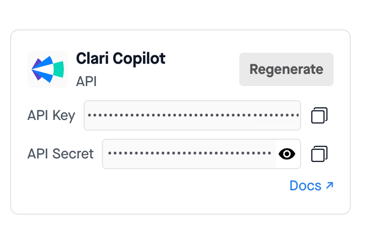
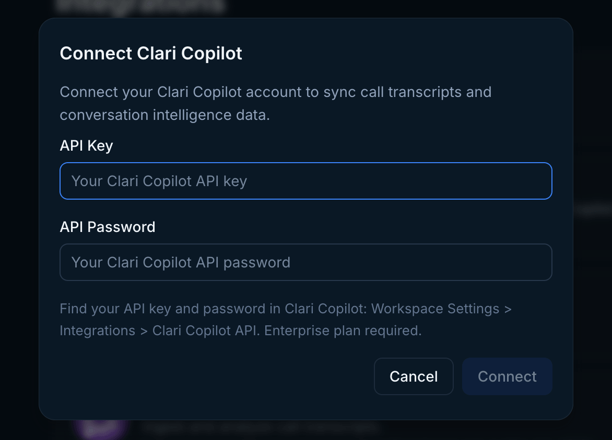
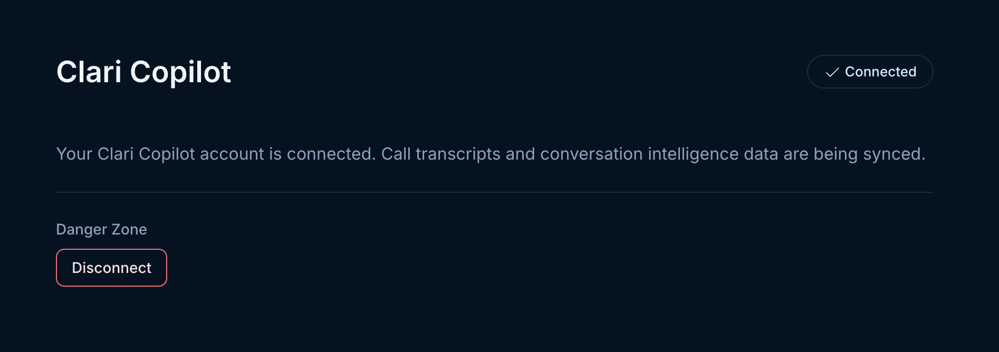

Use the instructions below to enable the Clari Copilot integration in Endgame. Once enabled, Endgame will process your Clari Copilot call data and provide insights via the Endgame UI.

## Enable the integration

<Note>
  To connect to the Clari Copilot API, you must be a Clari Copilot
  Administrator, and your organization must have an Enterprise plan.
</Note>

<Steps>
  <Step title="Access Clari Copilot integration">
    Log into Endgame and navigate to the [integrations](https://app.endgame.io/settings/integrations) page. Only Endgame Admins can configure organization integrations. Click "Connect" for Clari Copilot to begin the setup process.

    <Frame caption="Clari Copilot connection">
      
    </Frame>

  </Step>
  <Step title="Add Clari Copilot API key and password">
    You will need to get your Clari Copilot API key and password to share with Endgame. This can be located within Clari by going to Workplace settings -> Integrations -> Clari Copilot API or navigating directly to [Admin Integrations](https://copilot.clari.com/settings#adminIntegrations).
     
    <Frame caption="Clari Copilot API key and password">
      
    </Frame>

    Enter your API key and password in the connection modal and click Connect. Once your credentials have been added, Endgame will initiate ingestion and processing of your call data.

    <Warning>
    You must have Salesforce connected to Clari Copilot to provide account ID associations for call transcripts. Without this data, Endgame cannot correctly link call data to Salesforce accounts.
    </Warning>

    <Frame caption="Clari Copilot connect modal">
      
    </Frame>

  </Step>
  <Step title="Update your connection">
    Users can update or disconnect their Clari Copilot connection at any time. Disconnecting will stop the ingestion of new call data.

    To update your connection with new credentials, hover over the Connect button in the top right corner. When it shows Reconnect, click it to enter new API credentials. To disconnect, click the Disconnect button in the lower left-hand corner.

    <Frame caption="Clari Copilot manage view">
      
    </Frame>

  </Step>
</Steps>

## What's next?

That's it! Now that you've connected Clari Copilot to Endgame, we'll automatically ingest your call data and present our insights in Endgame.

## Need help or have feedback?

We'd love to hear from you! You can reach us at [support@endgame.io](mailto:support@endgame.io).
