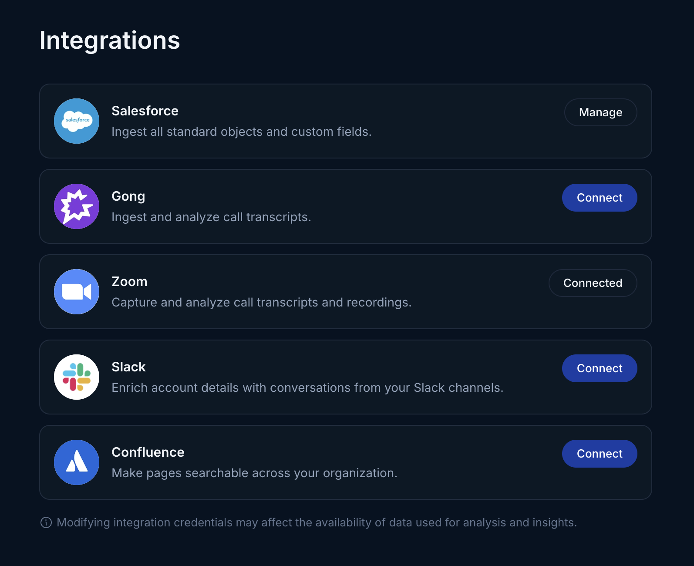
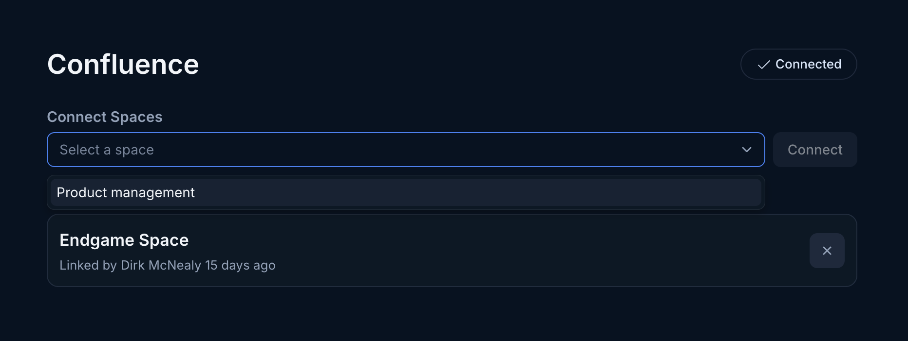
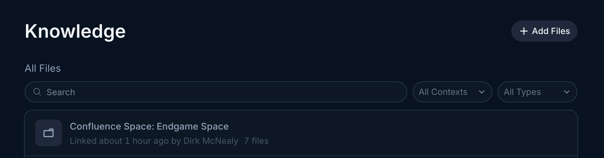

Use the instructions below to enable Confluence integration in Endgame. Once enabled, Endgame will process the content from designated spaces and provide insights via the Endgame UI.

<Steps>
  <Step title="Access integrations">
    Log into Endgame and navigate to the [integrations](https://app.endgame.io/settings/integrations) page.

    <Frame caption="Integrations view">
      
    </Frame>

  </Step>
  <Step title="Authenticate with Confluence">
    Click on Connect for Confluence and follow the authentication steps. Your organization will only have a single authenticated user for Confluence, so whoever authenticates should have access to the spaces you wish to sync. Endgame will have access to all the spaces the user has access to, but will only ingest and process data from the spaces selected in the following step.
  </Step>
  <Step title="Select spaces to sync">
    Once authenticated, the user will be directed to the [Confluence management](https://app.endgame.io/settings/integrations/confluence) page (only available once you have authenticated to Confluence). Here the user can select the spaces they wish to sync to Endgame. They can also unselect spaces they no longer wish to have synced in this view. All content within selected spaces will be synced and automatically associated to accounts where applicable.

    <Frame caption="Space selection">
      
    </Frame>

  </Step>
  <Step title="View synced confluence content">
    You can view the full content of the synced spaces within the [knowledge view](https://app.endgame.io/settings/knowledge). Spaces will be listed as folders with all synced pages as nested content.
      <Frame caption="View confluence content">
      
    </Frame>
  </Step>
</Steps>

You can find more information about managing knowledge [here](https://docs.endgame.io/knowledge/file-upload)
