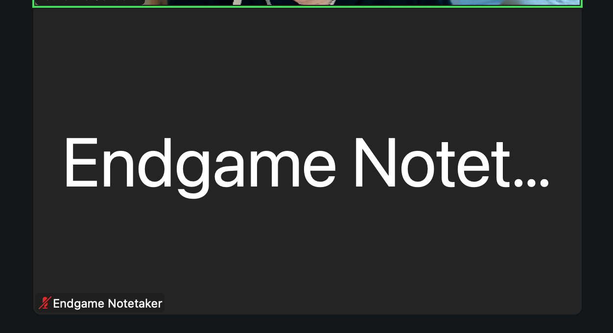
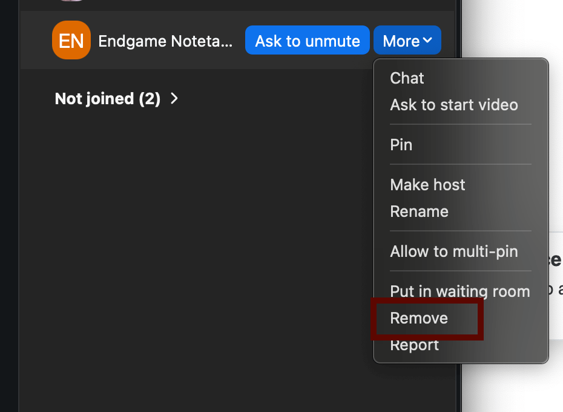
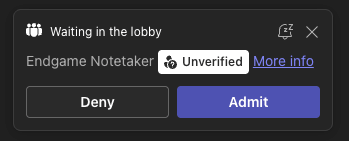
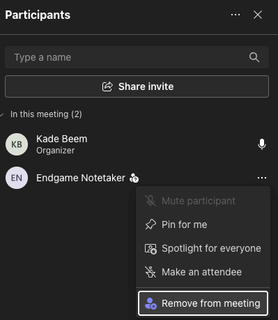

<Warning>
  The Endgame Notetaker is only available to select organizations. To enable it
  for your team, contact [support@endgame.io](mailto:support@endgame.io).
</Warning>

An Endgame staff member must activate the Endgame Notetaker for your organization. Coordinate with your Sales Representative to enable this feature.

Once enabled, Endgame Notetaker will join any _external_ meetings synced to Endgame. We source team meeting data in a couple of ways:

- email correspondence that is synced to Salesforce and related to a meeting
- individual [google calendar integrations](/integrations/google-drive#google-calendar-integration) (if connected)
- individual [outlook calendar integrations](/integrations/microsoft-outlook-calendar) (if connected)

The Notetaker will be very visible when joining your meeting, it generates a transcript of the meeting content. Once complete, Endgame will process that transcript data and associated it to an account making it available to Endgame chat responses.

## Zoom

<Frame caption="Endgame Notetaker attendee">
  
</Frame>

The host of the meeting can remove the Notetaker by navigating to the attendee menu and clicking remove. **Please do not report the notetaker as malicious to your meeting operator when removing.**

<Frame caption="Remove Notetaker Zoom">
  
</Frame>

## Microsoft Teams

When the Endgame Notetaker joins a Microsoft Teams meeting, it will appear in the meeting lobby and must be admitted by the host before it can record. Open the **People** panel, find the Notetaker in the lobby, and click **Admit**.

<Frame caption="Endgame Notetaker Teams attendee">
  
</Frame>

To remove the Notetaker from a Teams meeting, open the **People** panel, hover over the Notetaker, click the **...** menu, and select **Remove from meeting**. **Please do not report the notetaker as malicious when removing.**

<Frame caption="Endgame Notetaker in Teams meeting">
  
</Frame>

### Endgame Notetaker FAQs

| Question                                                                            | Answer                                                                                                                                                                       |
| ----------------------------------------------------------------------------------- | ---------------------------------------------------------------------------------------------------------------------------------------------------------------------------- |
| **What meetings does the Notetaker join?**                                          | Once enabled, the Notetaker will automatically join any meeting that is synced to Endgame.                                                                                   |
| **Does the Notetaker join automatically or do I need to invite it to my meetings?** | The Notetaker joins meetings automatically, there is currently no mechanism for manually adding the Notetaker to a meeting.                                                  |
| **What does Endgame do with the transcripts the Notetaker generates?**              | Endgame stores the transcript from your meeting and processes it to extract important facts. These facts are surfaced in chat responses when you ask about meeting activity. |
| **How does the Notetaker know which account to associate my meeting with?**         | We primarily use invitees to associate meetings to accounts and use event title or description as a fallback if needed.                                                      |
| **How long does it take for my transcript to be available to Endgame chat?**        | We can usually process and surface transcript data within an hour of meeting completion.                                                                                     |
| **Can I remove the Notetaker from a meeting if I don't want it recorded?**          | Just like any other unwanted attendee, you can remove the Notetaker from your meeting using the mechanism in your meeting operator of choice.                                |
