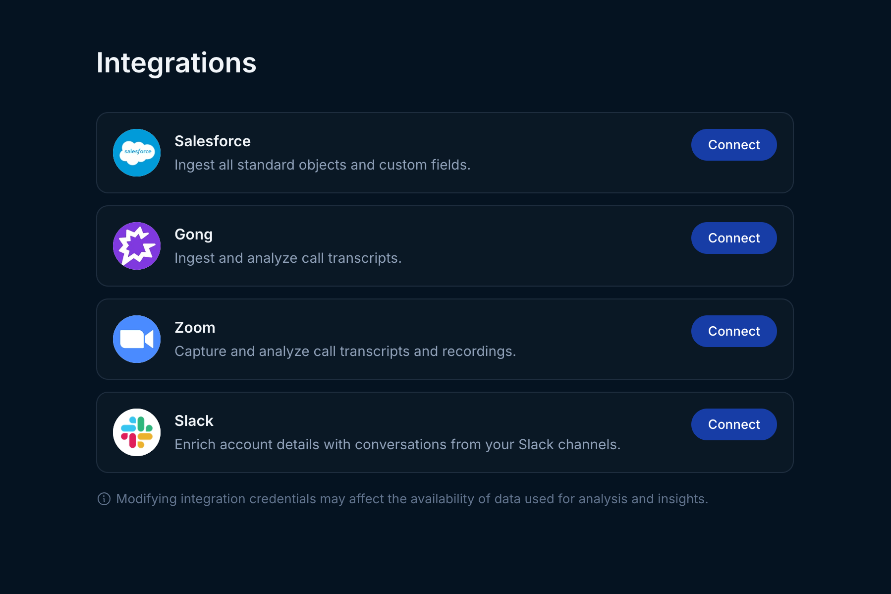

Use the instructions below to enable Gong integration in Endgame. Once enabled, Endgame will process relevant transcripts from Gong once every hour and provide our insights via the Endgame UI.

## Enable the integration

<Warning>
  Connecting to the Gong API requires that the connecting user is a [Gong Technical Admin](https://help.gong.io/hc/en-us/articles/360028568911-About-permission-profiles)
</Warning>

<Steps>
  <Step title="Access Configuration">
    If needed log into your Endgame account via Salesforce

    Navigate to [https://app.endgame.io/settings/integrations](https://app.endgame.io/settings/integrations)
  </Step>
  <Step title="Start Setup">
    From the integrations page, click "Connect" to kick off the Gong authentication process.

    <Frame>
      
    </Frame>
    
  </Step>
  <Step title="Grant Access">
    In the resulting page, click "Allow" to grant Endgame access to your Gong Account

    
  </Step>
</Steps>

## What's next?

That's it! Now that you've connected Gong to Endgame, we'll take a day or two to automatically ingest your data into our systems and present our insights back to you in Endgame.

## Common Questions

In the case that connecting Gong gives you any trouble, it's likely the user authenticating lacks the Technical Admin permission within Gong. This can be explicitly enabled for the user making the connection in the [Team Members Settings](https://app.gong.io/company/team-members).

<Info>
  We use Gong purely to obtain call transcripts. Endgame only processes transcripts through our AI systems for accounts we have been granted access to in Salesforce. If you haven't given us access to a given account, the Gong transcripts for that account will not touch any AI systems.
</Info>

## Need help or have feedback?

We'd love to hear from you! You can reach us at [support@endgame.io](mailto:support@endgame.io).