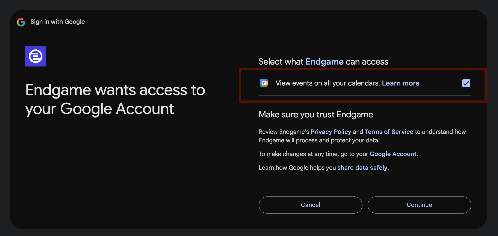

### Syncing knowledge documents

Individual users can authenticate to Google Drive to [enable syncing](https://docs.endgame.io/features/file-upload#link-files-from-google-drive) of folders and files for use as contextual knowledge in chat responses. This can be done on a user-by-user basis to enable uploads at the account level (all users) or the organization level (admin users only). We do not currently offer a single integration user experience.

### Exporting content to Google

Authenticating to Google Drive also enables direct upload of thread assets to [Google Sheets](https://docs.endgame.io/features/export-thread-content#export-table-to-google-sheets) and [Google Docs](https://docs.endgame.io/features/export-thread-content#export-to-google-docs). The authentication flow is automatically triggered when a user attempts to perform any of these actions.

### Google calendar integration

Individual users can sync their google calendars to provide more accurate and comprehensive meeting data for use in chat responses. This can be done in [settings](https://app.endgame.io/settings) under Connections.

When going through the connection flow, users _must_ check the box to allow Endgame to "View events on all your calendars" otherwise Endgame will not be able to ingest calendar data.

<Frame caption="Google calendar permissions">
  
</Frame>

### Google Drive Security FAQs

| Question                                                                                                                    | Answer                                                                                                                                                                                                                                                                                                                                                                                                                                                                                                      |
| --------------------------------------------------------------------------------------------------------------------------- | ----------------------------------------------------------------------------------------------------------------------------------------------------------------------------------------------------------------------------------------------------------------------------------------------------------------------------------------------------------------------------------------------------------------------------------------------------------------------------------------------------------- |
| **What permissions does Endgame request?**                                                                                  | Endgame requests [drive.file](https://developers.google.com/workspace/drive/api/guides/api-specific-auth) and [drive.readonly](https://developers.google.com/workspace/drive/api/guides/api-specific-auth) permissions for syncing and [calendar.events.readonly](https://www.googleapis.com/auth/calendar.events.readonly) and [userinfo.email](https://www.googleapis.com/auth/userinfo.email) for the calendar integration.                                                                              |
| **Why do individual users need to authenticate to Google?**                                                                 | Individual user authentication is required to sync files to accounts. It's also necessary if a user wants to download content directly to [Google Sheets](https://docs.endgame.io/features/export-thread-content#export-table-to-google-sheets) or [Google Docs](https://docs.endgame.io/features/export-thread-content#export-to-google-docs). Individual users can also optionally sync their google calendar to Endgame. Users who don't need these features are not required to authenticate to Google. |
| **Does Endgame sync my entire Drive once I've connected?**                                                                  | No, Endgame only syncs folders or files that you explicitly select.                                                                                                                                                                                                                                                                                                                                                                                                                                         |
| **Does Endgame keep a copy of the files it syncs from Drive?**                                                              | We create a copy of the file to process it for use in your chat responses. However, when you unsync a file, we delete the source content from our database.                                                                                                                                                                                                                                                                                                                                                 |
| **Can Endgame Admins delete the files linked on behalf of users or does the originating user have to delete it?**           | Admins can delete or unlink any files that any user has added.                                                                                                                                                                                                                                                                                                                                                                                                                                              |
| **If a person leaves the company, how does this impact any files being referenced in their personal Drives?**               | If a person leaves the company and their Google credentials are invalidated, Endgame will no longer be able to keep their linked files up to date.                                                                                                                                                                                                                                                                                                                                                          |
| **How are Drive files used in chat responses, are files uploaded by an individual only available to them, in their chats?** | Any files associated with the organization or accounts are available to all users via chat. We cannot restrict data surfaced in chat based on Drive permissions of the source content. Context is shared across all users.                                                                                                                                                                                                                                                                                  |
