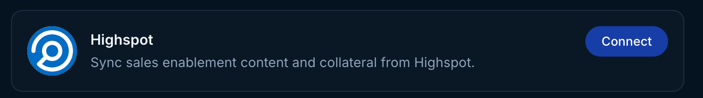
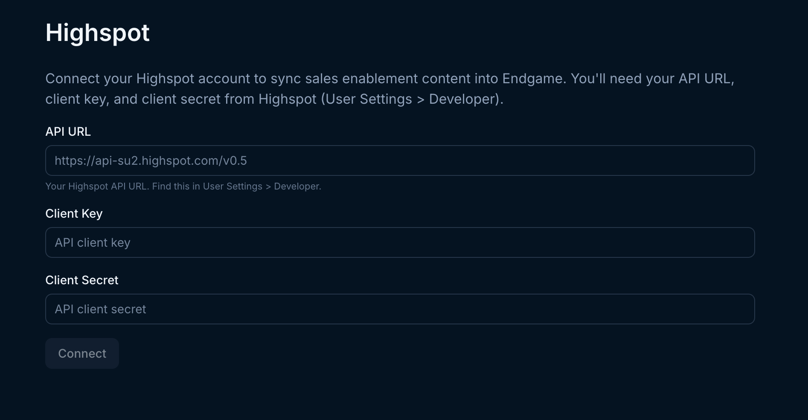
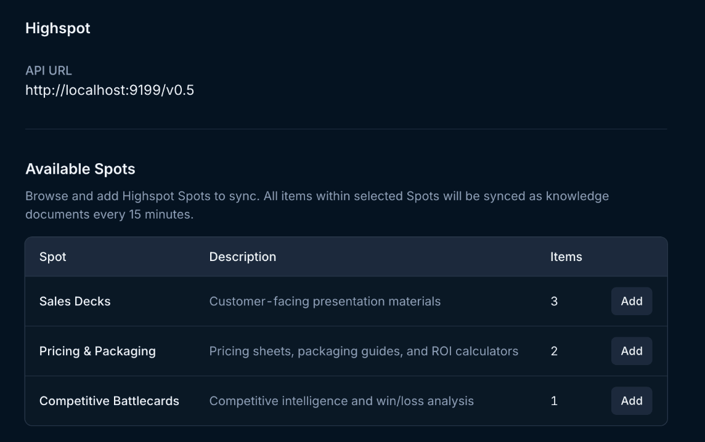
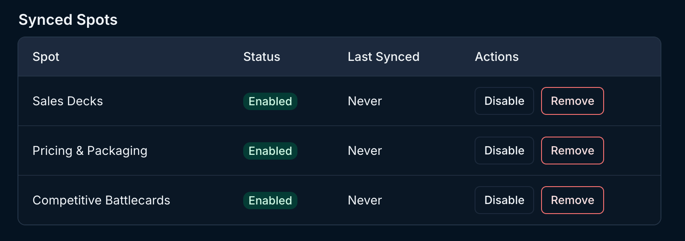
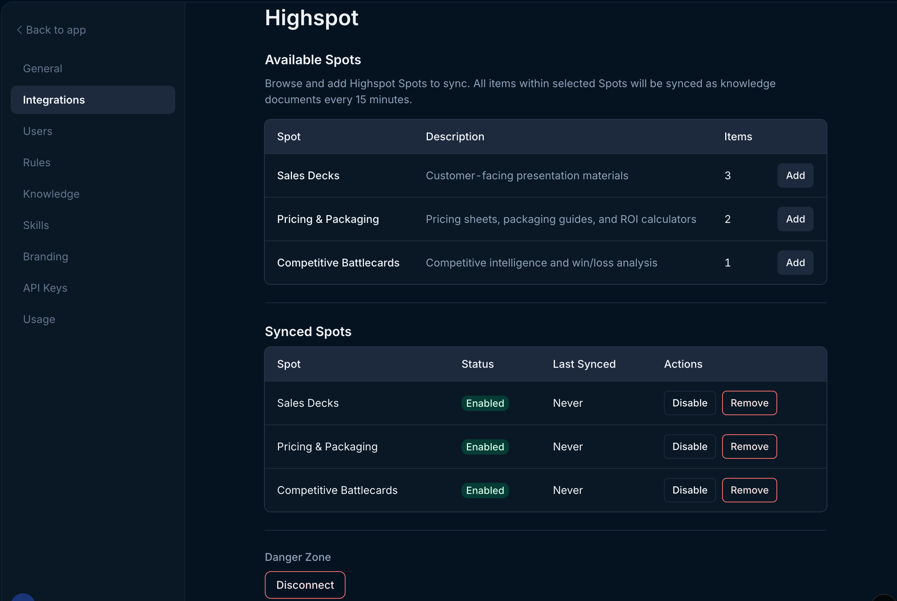

<Warning>
  **Beta:** This feature is in beta and is not available to all users. Contact
  your Endgame Administrator to discuss access.
</Warning>

Use the instructions below to enable the Highspot integration in Endgame. Once enabled, Endgame will process content from your selected Highspot Spots and provide insights via the Endgame UI.

## Enable the integration

<Note>
  Connecting a Highspot instance to Endgame requires that the connecting user is
  a Highspot Administrator.
</Note>

<Steps>
  <Step title="Access Highspot integration">
    Log into Endgame and navigate to the [integrations](https://app.endgame.io/settings/integrations) page. Only Endgame Admins can configure organization integrations. Click "Connect" for Highspot to begin the setup process.

    <Frame caption="Highspot connection">
      
    </Frame>

  </Step>
  <Step title="Enter your Highspot credentials">
    A modal will appear prompting you to provide your Highspot connection details. Fill out the required fields and click Connect to authenticate.

    <Frame caption="Highspot connection inputs">
      
    </Frame>

  </Step>
  <Step title="Select Spots to connect">
    After authenticating, you will see a list of available Spots from your Highspot instance. Click the **Add** button for any Spots you want Endgame to ingest.

    <Frame caption="Available Highspot Spots">
      
    </Frame>

  </Step>
  <Step title="View and edit connected Spots">
    Once connected, you can view and manage your selected Spots at any time from the Highspot integration page. **Disable** Spots to stop ingest and **Remove** to fully remove them and discontinue use of the synced data.

    <Frame caption="Connected Highspot Spots">
      
    </Frame>

  </Step>
  <Step title="Updating your connection">
    Users can disconnect their Highspot connection at any time. Disconnecting will stop the ingestion of new content from Highspot and discontinue use of existing synced data. To disconnect, click the Disconnect button in the lower left-hand corner.

 <Frame caption="Highspot view">
      
    </Frame>
  </Step>
</Steps>

## What's next?

That's it! Now that you've connected Highspot to Endgame, we'll automatically ingest your Spot content every 15 minutes and present our insights in Endgame.

## Need help or have feedback?

We'd love to hear from you! You can reach us at [support@endgame.io](mailto:support@endgame.io).
