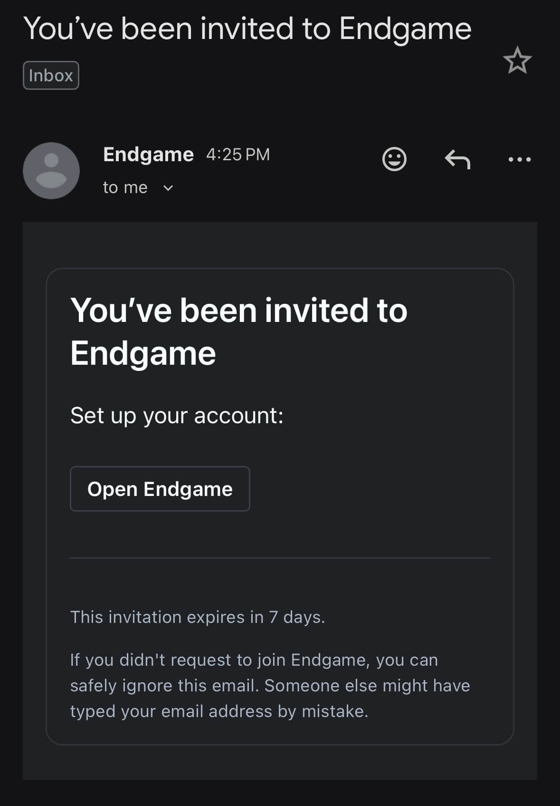
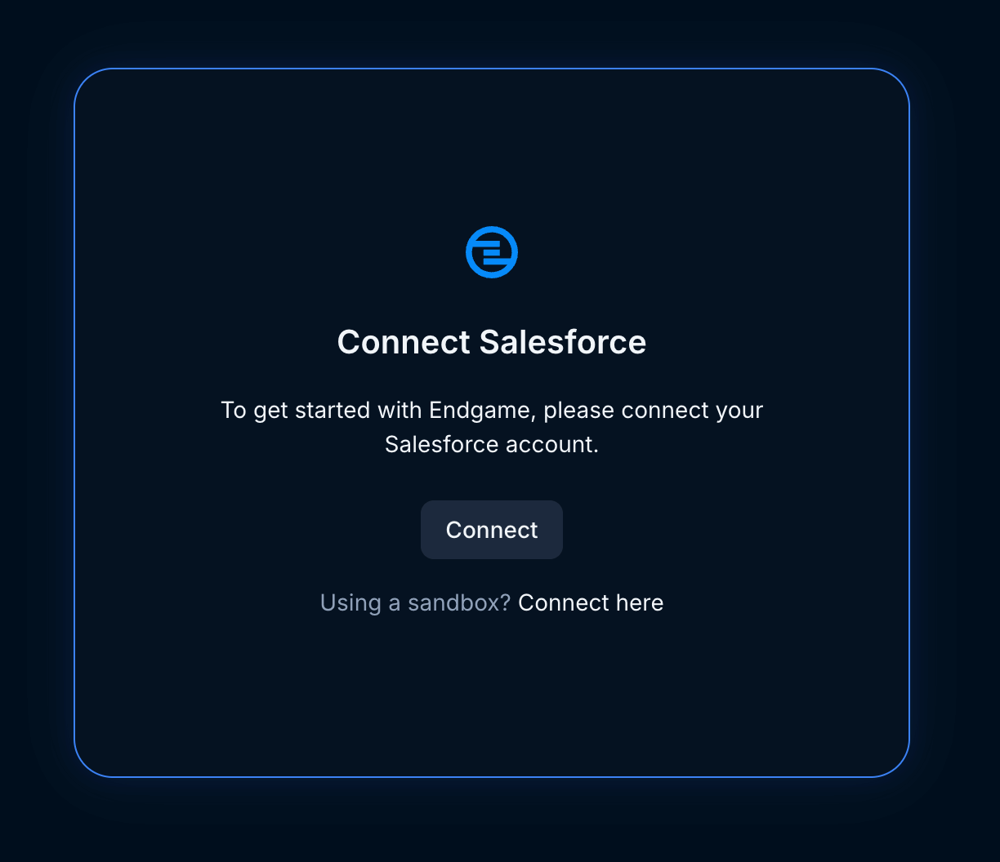
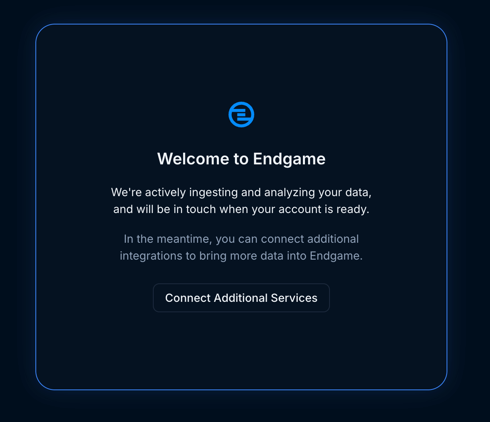

Getting started with Endgame is simple, you will receive an invitation via email from the Endgame team to login and begin your integrations setup.

## Quick Setup

<Steps>
  <Step title="Authenticate">
    Using the link in the invite email you received from Endgame, authenticate using Google or Salesforce.

    <Frame caption="Invite Email">
      
    </Frame>

  </Step>
  <Step title="Connect Salesforce ">
    From the welcome view, click to Connect Salesforce and authenticate with integration user credentials. 
    
    <Frame caption="Connect Salesforce">
      
    </Frame>

  </Step>
  <Step title="Approve Salesforce Connected App">
    As a user with the `Manage Connected Apps` permission in Salesforce, navigate to `Setup -> Manage Apps -> Connected Apps OAuth Usage`, and click "Install" next to the "EndgameLabs2" app.
  </Step>
  <Step title="Connect additional services">
    Once you have connected Salesforce, you'll have the option to connect additional services:

    - [Gong](/integrations/gong) (if you're a technical admin)
    - [Zoom](/integrations/zoom) (if you're a Zoom administrator)

      <Frame caption="Connect additional services">
        
      </Frame>

  </Step>
</Steps>

## What happens next?

Once you have things connected, Endgame will automatically start ingesting your integrations data. This can take some time, and our team will reach out when it's ready.

<Info>
  Data ingestion typically takes a day or two, depending on the size of your
  Salesforce instance. Then Endgame team will be in touch when your data is
  ready.
</Info>

## Next Steps

<CardGroup cols={2}>
  <Card title="Core Concepts" icon="lightbulb" href="/core-concepts">
    Learn how Endgame works under the hood
  </Card>
  <Card title="Navigate Endgame" icon="compass" href="/navigating-endgame">
    Master the Endgame interface
  </Card>
</CardGroup>
