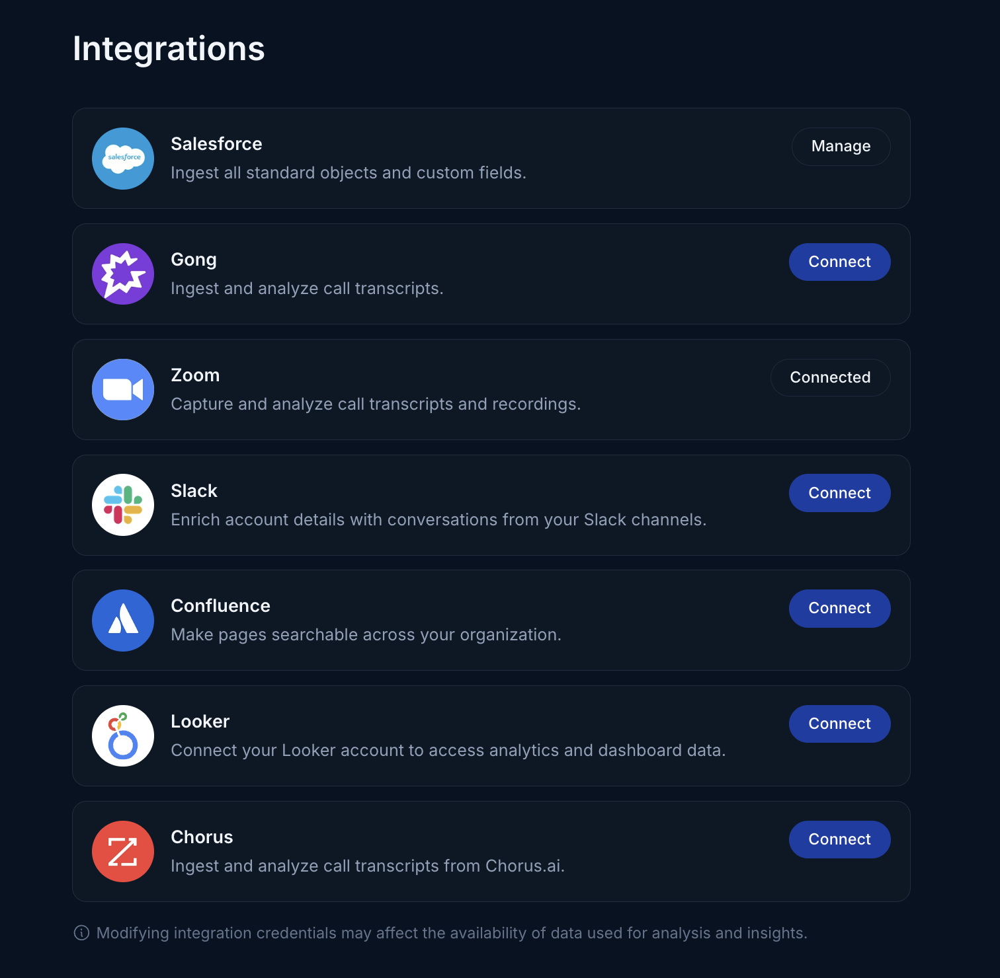
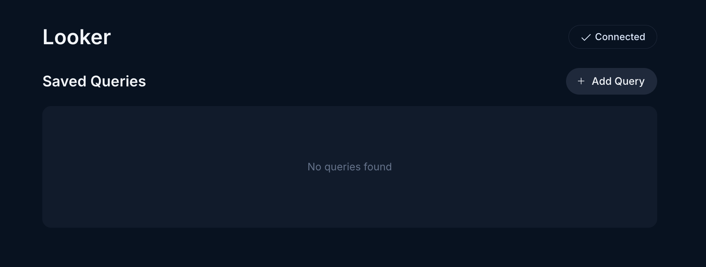

Use the instructions below to enable the Looker integration in Endgame. Once enabled, Endgame will query your Looker data once per day and include Looker insights in your Endagme chats.

## Adding the App

<Warning>
  Connecting to Looker requires that the connecting user can access the Looker admin interface.
</Warning>

<Steps>
  <Step title="Access integrations">
    Log into Endgame and navigate to the [integrations](https://app.endgame.io/settings/integrations) page.

    <Frame caption="Integrations page">
      
    </Frame>
  </Step>
  <Step title="Add Looker client details">
    On the integrations page, click Connect for Looker. From the Looker admin interface copy the Client ID, Client Secret, and Tenant URL into the connection modal fields and click Connect.

    <Frame caption="Connection modal">
      
    </Frame>
  </Step>
  <Step title="Add Looker queries">
    Once your client details have been added, you'll be routed to the Looker management page where you can see existing queries. Click on the Add Query button in the top right corner and copy in the Query ID for the data you would like Endgame to ingest. It is helpful to add a Title and Description for not only data analysis, but also for managing your queries. Once you enter a valid Query ID, you will see a preview of the first 10 rows of the query. Once saved, a initial ingest of the query data will be initiated.

    Users can delete a saved query at anytime by hovering over the query and clicking on the trash icon.

    <Frame caption="Looker query list">
      
    </Frame>
    <Frame caption="Looker query connection">
      
    </Frame>
  </Step>
</Steps>