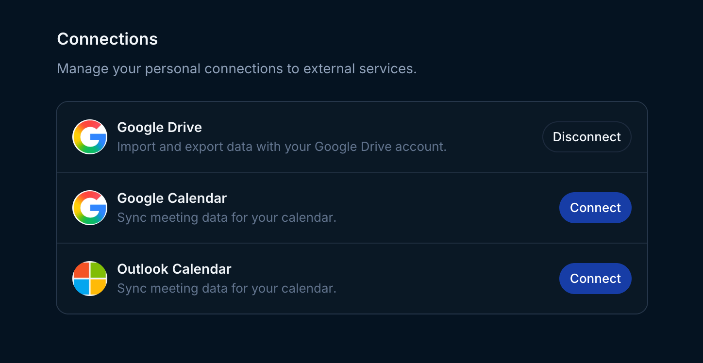
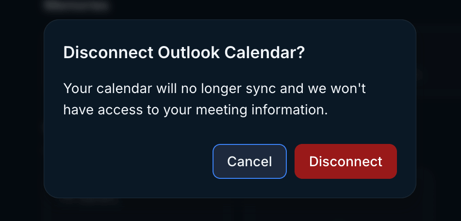

<Warning>
  Access to Microsoft integrations is managed by your organization. If the
  Outlook integration isn't visible in Endgame, your organization hasn't enabled
  it yet.
</Warning>

Individual users can sync their Outlook calendars to provide more accurate and comprehensive meeting data for use in chat responses. This can be done in [settings](https://app.endgame.io/settings) under Connections.

<Frame caption="Microsoft Outlook Calendar connection">
  
</Frame>

After clicking **Connect**, users will go through the Microsoft authentication flow to grant Endgame permission to ingest their calendar data.

<Frame caption="Microsoft account selection">
  
</Frame>

Users can disconnect their Outlook calendar anytime by clicking **Disconnect** next to the Outlook Calendar integration. A confirmation modal will appear. Click **Disconnect** to confirm. The calendar will no longer sync and Endgame will not have access to future meeting information.

<Frame caption="Disconnect Outlook Calendar confirmation">
  
</Frame>
