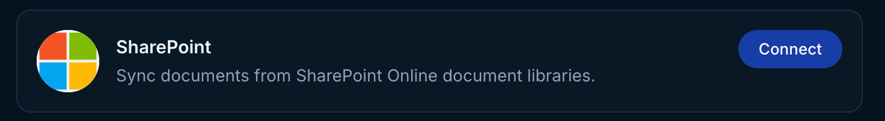
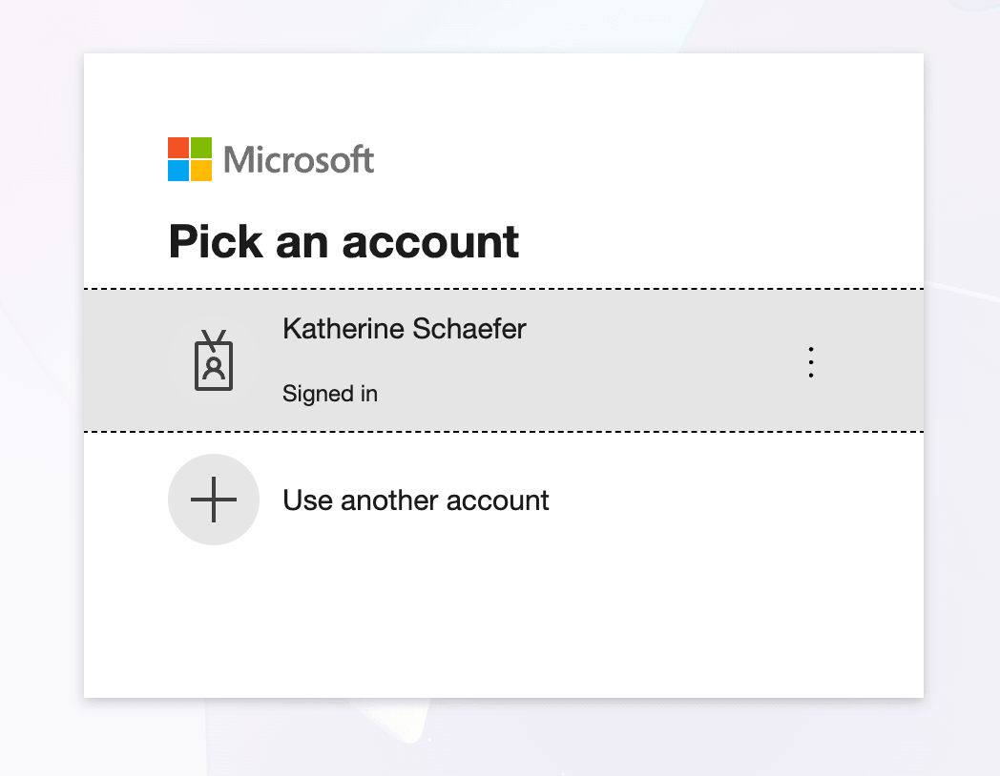
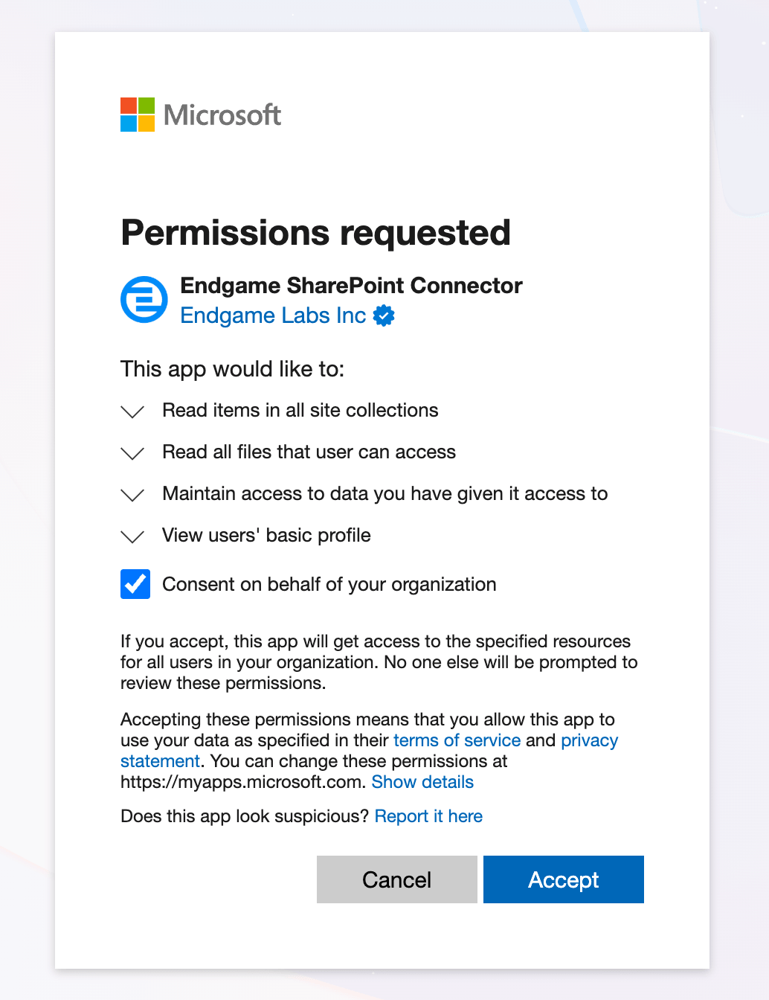
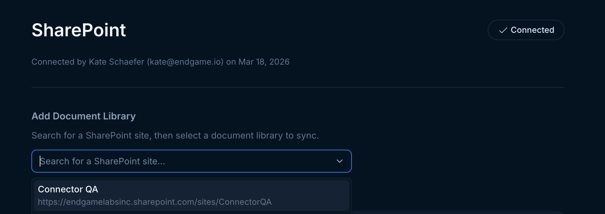
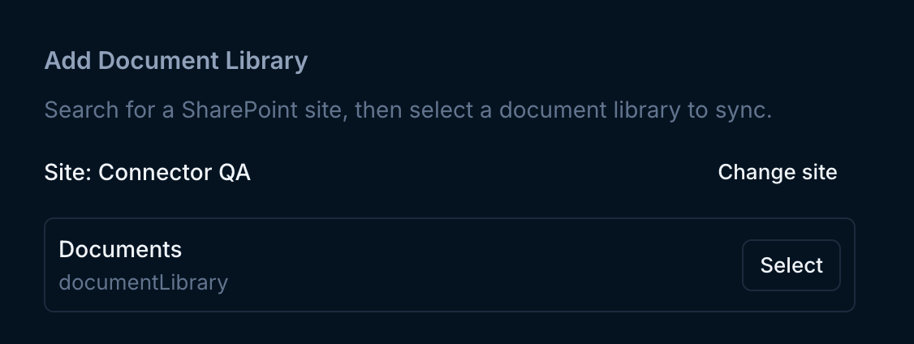
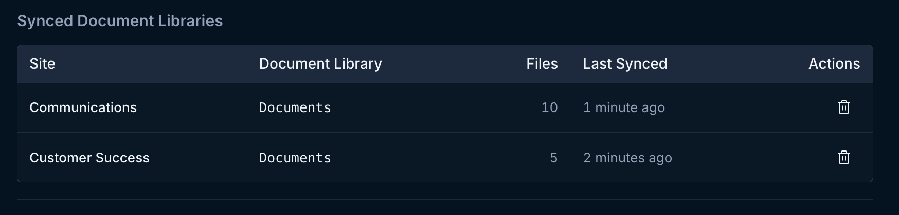
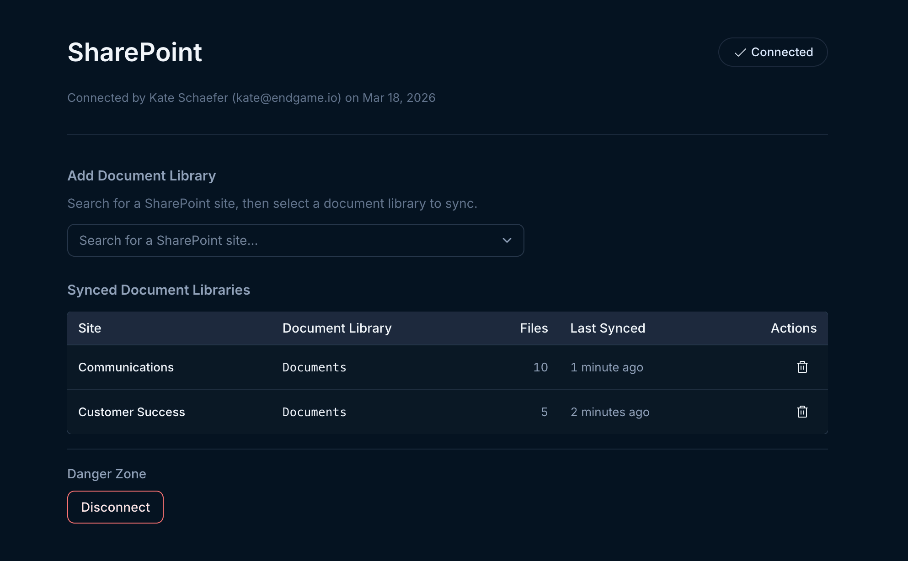
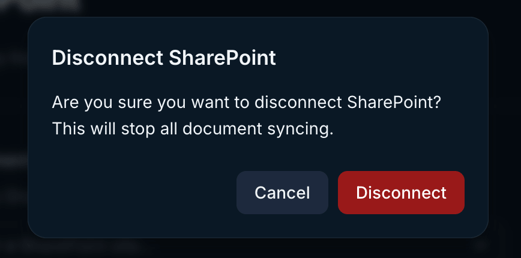

Use the instructions below to enable the Microsoft SharePoint integration in Endgame. Once enabled, Endgame will ingest documents from your SharePoint document libraries, making them available in Endgame chat responses.

## Enable the integration

<Note>
  Connecting to the Microsoft SharePoint API requires that the connecting user
  is a SharePoint Administrator.
</Note>

<Steps>
  <Step title="Navigate to Configuration">
    Navigate to the [integrations page](https://app.endgame.io/settings/integrations). Only Endgame Admins can configure organization integrations.
  </Step>
  <Step title="Start Setup">
    From the integrations page, click "Connect" on the SharePoint card to kick off the authentication process.

       <Frame caption="Connect Microsoft SharePoint">
        
    </Frame>

  </Step>
  <Step title="Grant Permissions">
    Select the Microsoft account you wish to connect to Endgame and go through the authentication flow. Ensure you check the box for "Consent on behalf of your organization" to give Endgame access to the necessary scopes.

        <Frame caption="Microsoft account selection">
        
        </Frame>

         <Frame caption="Microsoft grant permission">
        
        </Frame>

  </Step>
  <Step title="Add Document Libraries">
    Once connected, click to Manage your configuration from the integrations page. You can now add SharePoint document libraries to sync with Endgame.

    First, search for the SharePoint site that contains the document library you want to sync.

    <Frame caption="Search for a SharePoint site">
        
    </Frame>

    After selecting a site, you will see the available document libraries. Click "Select" to add as many document libraries as you wish to connect from that site.

    <Frame caption="Select a document library">
        
    </Frame>

    Your synced document libraries will appear in the table below, showing the site, document library name, file count, and last sync time. You can remove a synced library at any time by clicking the trash icon. Your libraries sync to Endgame immediately upon connection and then every 15 minutes thereafter.

    <Frame caption="Synced document libraries">
        
    </Frame>

  </Step>
  <Step title="Manage your connection">
    You can view and manage your full SharePoint configuration from the [integration page](https://app.endgame.io/settings/integrations/sharepoint). To disconnect, click the "Disconnect" button in the bottom left corner. Disconnecting will stop all document syncing and remove your synced document library configuration.

    To update your connection with a new user hover over the Connect button in the top right corner and when it shows Reconnect, click it to trigger the authentication process. Reconnecting will preserve your library configuration.

    <Frame caption="SharePoint integration view">
        
    </Frame>

    <Frame caption="Disconnect SharePoint">
        
    </Frame>

  </Step>
</Steps>

<Note>
  Endgame will _only_ ingest document libraries that you have explicitly added
  in the SharePoint integration configuration. No other data is accessed or
  ingested without your permission.
</Note>

## What's next?

That's it! Now that you've connected SharePoint to Endgame, we'll automatically sync your document libraries and present our insights in Endgame.

## Need help or have feedback?

We'd love to hear from you! You can reach us at [support@endgame.io](mailto:support@endgame.io).
