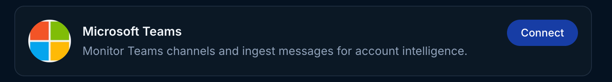
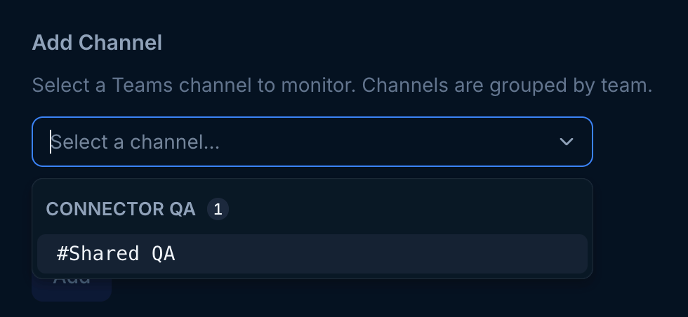
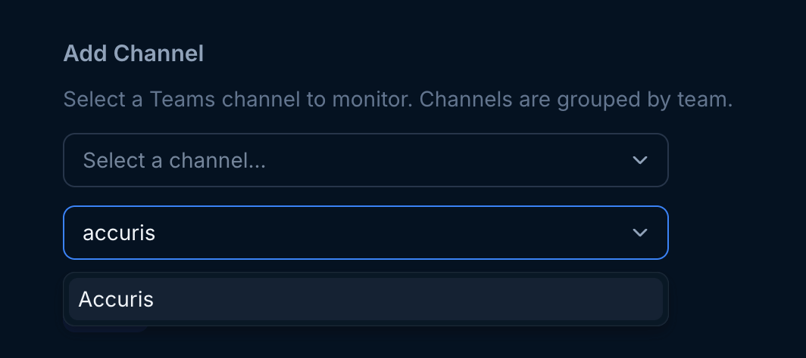
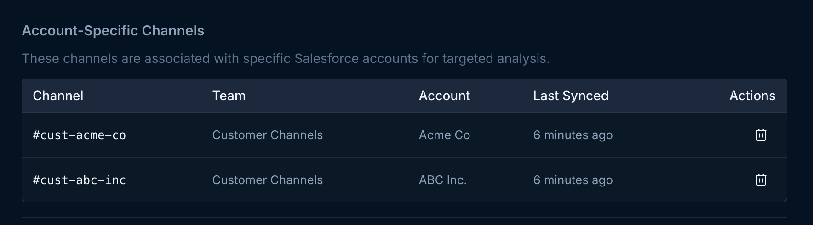
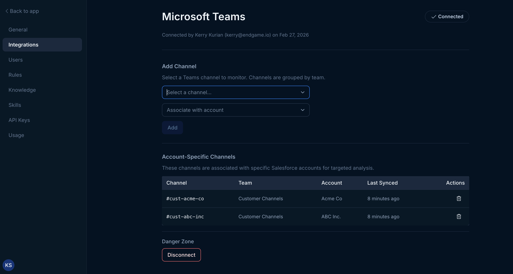

Use the instructions below to enable the Microsoft Teams integration in Endgame. Once enabled, Endgame will ingest your Teams messages from specific channels and associate them with specific Accounts making them available in Endgame chat responses.

## Enable the integration

<Warning>
  Connecting to the Microsoft Teams API requires that the connecting user is
  either a Teams Administrator. TODO: confirm this
</Warning>

<Steps>
  <Step title="Navigate to Configuration">
    Navigate to the [integrations page](https://app.endgame.io/settings/integrations). Only Endgame Admins can configure organization integrations.
  </Step>
  <Step title="Start Setup">
    From the integrations page, click "Connect" to kick off the Teams authentication process.

<Frame caption="Microsoft Teams integration">
  
</Frame>

  </Step>
  <Step title="Grant Permissions">
    On the next page, click "Allow" to give us permissions.

    TODO

  </Step>
  <Step title="Configure Channel Mapping">
    You will be directed to a configuration page where you can designate which public Teams channel content will be associated with specific Endgame Accounts.
    
    First, you select the channel for which you wish to make an association.

    <Frame caption="Select Channel">
        
    </Frame>

    Second, choose which account to association with that channel and click Add.

     <Frame caption="Select Account">
        
    </Frame>

    You will see your association show up in the Account-specific Channels list below. You can remove these associations anytime by clicking the trash icon.

     <Frame caption="Account specific channel list">
        
    </Frame>

  </Step>
  <Step title="Updating your connection">
  Users can update or disconnect their Teams connection at anytime. To update your connection hover over the Connect button in the top right corner and when it shows Reconnect, click it to trigger the authentication process. To disconnect, click the Disconnect button in the lower left hand corner.

   <Frame caption="Microsoft Teams integration view">
        
    </Frame>
  </Step>

</Steps>

<Note>
  Endgame currently cannot distinguish between different account conversations in a single Teams channel. Instead, use Teams channels that are dedicated to singular account conversations to enhance your Endgame data.

We will _only_ ingest channels that you have selected and associated with an Account in the Teams integration configuration. Other than the names of public channels, no other data is ingested without your permission.

</Note>

## What's next?

That's it! Now that you've connected Teams to Endgame, we'll automatically ingest your data into our systems every 15 minutes and present our insights in Endgame.

## Need help or have feedback?

We'd love to hear from you! You can reach us at [support@endgame.io](mailto:support@endgame.io).
