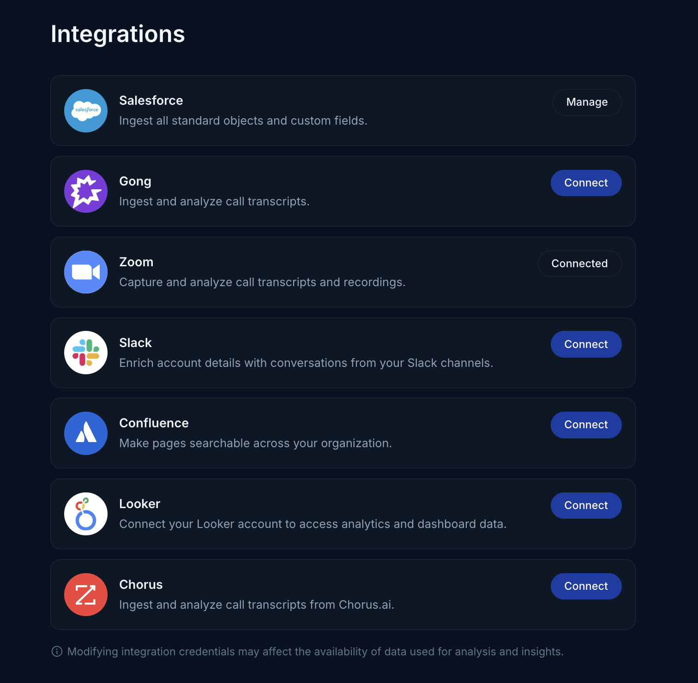
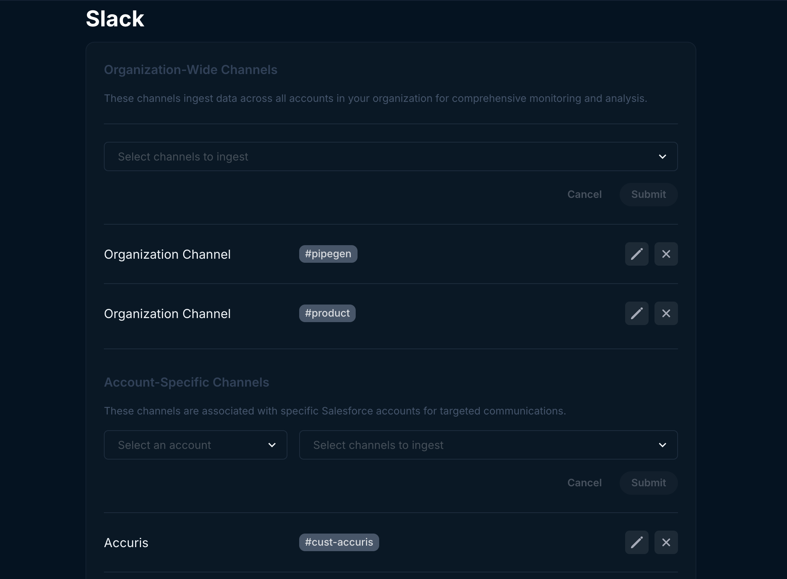

Use the instructions below to enable the Notion integration in Endgame. Once enabled, Endgame will process the content from linked content and provide insights via the Endgame UI.

## Enable the integration

<Warning>TODO: does person need to be an admin?</Warning>

<Steps>
  <Step title="Navigate to Configuration">
    Navigate to the [integrations page](https://app.endgame.io/settings/integrations). Only Endgame Admins can configure organization integrations

  </Step>
  <Step title="Start Setup">
    From the integrations page, click "Connect" to kick off the Notion authentication process.

    <Frame>
      
    </Frame>

  </Step>
  <Step title="Set up integration">
  
  </Step>
  <Step title="Publish document URLs">
  

  </Step>
  <Step title="Configure Channel Mapping">
    You will be directed to a configuration page where you can designate which public Slack channel content will be associated with specific Endgame Accounts. Establishing these channel connections also enables you to initiate Endgame threads directly within the corresponding Slack channels. For comprehensive guidance on utilizing Endgame within Slack, check out our [Slack](/features/slack) documentation.

    Additionally, you have the option to configure Organization-Wide Channels. While these channels do not contribute data for analytical purposes, they facilitate multi-account Endgame conversations within those specific channels.

    <Frame>
      
    </Frame>
    For instance, if you have an account for a company named CompanyCo, you would select that from the Account dropdown. Then in Channels, select the channels that are associated with that Account, such as one called #deal-companyco.

    You can add multiple channels to a single Account, but only one at a time. So using the previous example, you could then also add a #companyco-help channel. Both channels would then have their messages ingested to Endgame and be associated with that single Account.

    To connect an organization-wide channel, "Select channels to ingest" and Submit.

  </Step>
</Steps>

<Note>
  Endgame currently cannot distinguish between different account conversations in a single Slack channel. Instead, use Slack channels that are dedicated to singular account conversations to enhance your Endgame data.

We will _only_ ingest channels that you have selected and associated with an Account or at the Organization level. Other than the names of public channels, no other data is ingested without your permission.

</Note>

## What's next?

That's it! Now that you've connected Slack to Endgame, we'll automatically ingest your data into our systems every 15 minutes and present our insights in Endgame. For comprehensive guidance on utilizing Endgame threads within Slack, check out our [Slack](/features/slack) documentation.

## Need help or have feedback?

We'd love to hear from you! You can reach us at [support@endgame.io](mailto:support@endgame.io).
