<Warning>
  **Beta:** This feature is in beta and is not available to all users.
</Warning>

Use the instructions below to enable the Notion integration in Endgame. Once enabled, Endgame will process your linked Notion pages and provide insights via the Endgame UI.

## Enable the integration

<Warning>
  Creating a Notion integration requires that the connecting user is a Notion
  Administrator for the workspace that you wish to connect.
</Warning>

<Steps>

<Step title="Create integration in Notion">
Before setting up your connection within Endgame, you must first create a new integration within Notion.

In Notion click on your workspace in the top left corner -> Settings -> Connections (under Integrations) -> Develop or Manage Integrations (scroll to bottom) -> Internal Integrations (bottom of side menu) -> Create a New Integration.

<Frame caption="Notion settings">
  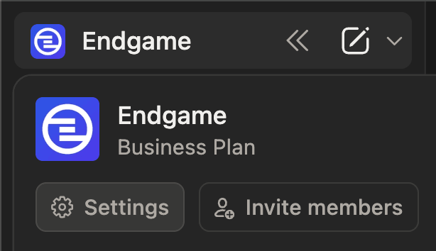
</Frame>

<Frame caption="Notion connections">
  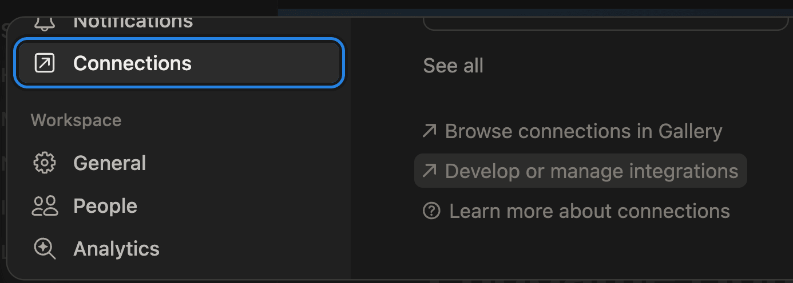
</Frame>
Name your integration something to indicate it will be used to connect to
Endgame, i.e., Endgame Integration. Select the workspace you wish to connect.
_Endgame currently only supports a single workspace connection._

<Frame caption="Create new integration Notion">
  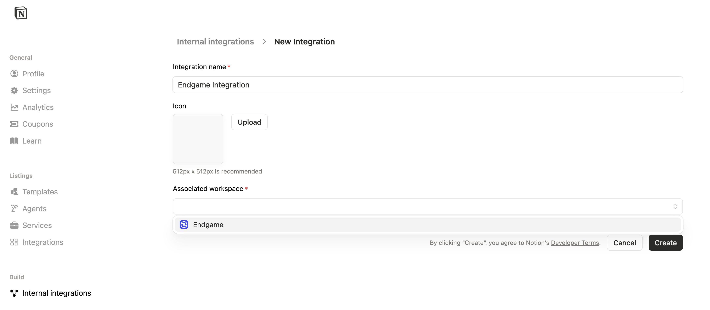
</Frame>

Once created, you can edit the integration's Capabilities. Endgame only requires the "Read Content" and "Read user information including email addresses" scopes.

<Frame caption="Edit capabilities">
  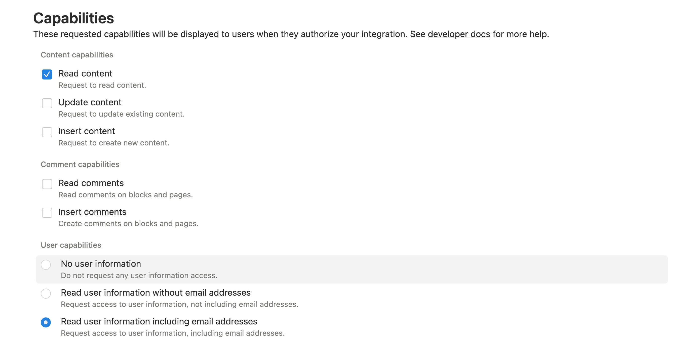
</Frame>

</Step>

<Step title="Grant integration access to pages">
You will need to grant access to the content in Notion that you want to sync to Endgame. We recommend organizing your content into nested file structures to avoid having to grant individual access to each page. If you give Endgame access at the parent level, all content nested below that page will also be accessible.

There are two ways to select content:

1. Navigate to the page you want to give access to. Click on the three dot menu in the top right corner -> Connections -> select the connection you set up in the previous step.

<Frame caption="Connect page to integration">
  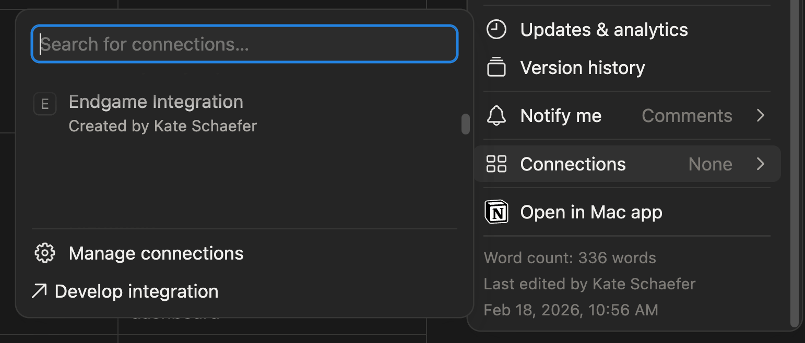
</Frame>

You will be prompted with a modal listing the capabilities you granted to this integration. Click **Confirm** to proceed.

<Frame caption="Confirmation connect page">
  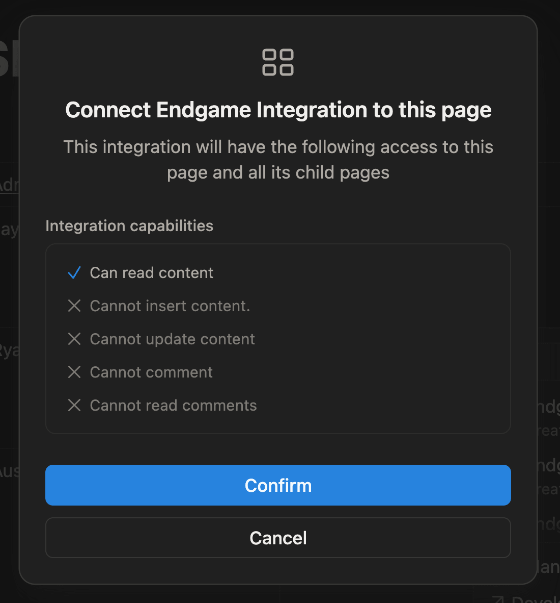
</Frame>

2. From the integration page, navigate to the Content access tab -> Edit Access -> select the pages you want to share -> Save.

<Frame caption="Manage page access">
  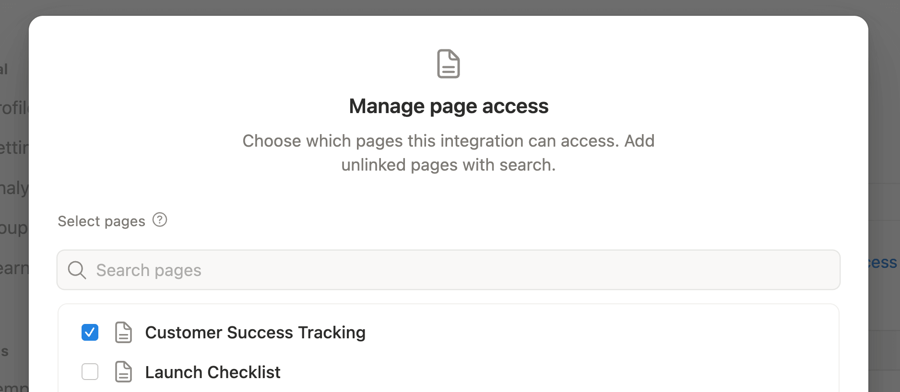
</Frame>

</Step>

  <Step title="Configuration in Endgame">
    Navigate to the [integrations page](https://app.endgame.io/settings/integrations) and click Connect for the Notion option.

    <Frame caption="Manage Notion integration">
      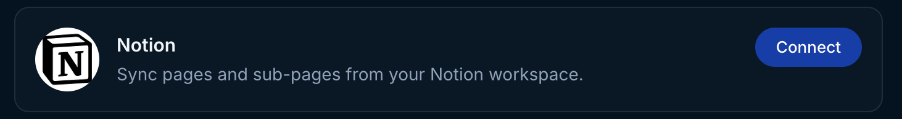
    </Frame>

    You will need to copy and paste your secret key from the Notion integration page into the field.

<Frame caption="Provide Notion secret">
  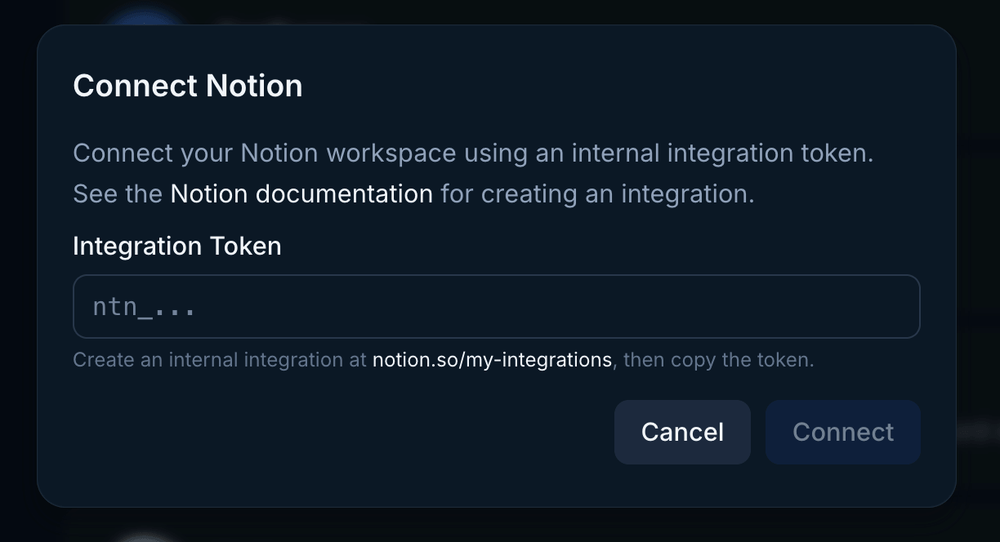
</Frame>

  </Step>

  <Step title="Copy URLs from Notion to Endgame">

You have already given Endgame access within Notion, but you need to additionally tell Endgame which pages you want to ingest. You do this by copying the URL for the Notion page (that you have already given access to in Notion) into the Notion Page URL input and clicking Add Page.

<Frame caption="Notion page URLs">
  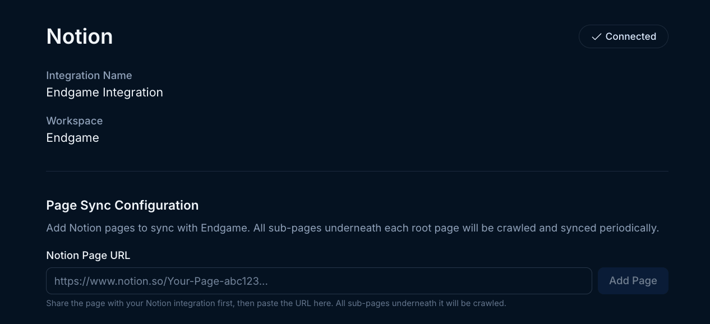
</Frame>

Endgame will by default ingest all nested content for a page. If you wish to exclude some pages or simply view the pages being synced, click on the circular arrow icon for the page. This will display all the nested pages. You can toggle off pages you do not want to include in the Endgame sync. When you are done with this configuration, you can close the preview by clicking the "X" in the top right corner.

Endgame syncs your page data every hour. You can trigger an immediate sync by clicking the Sync button.

<Frame caption="Notion synced content">
  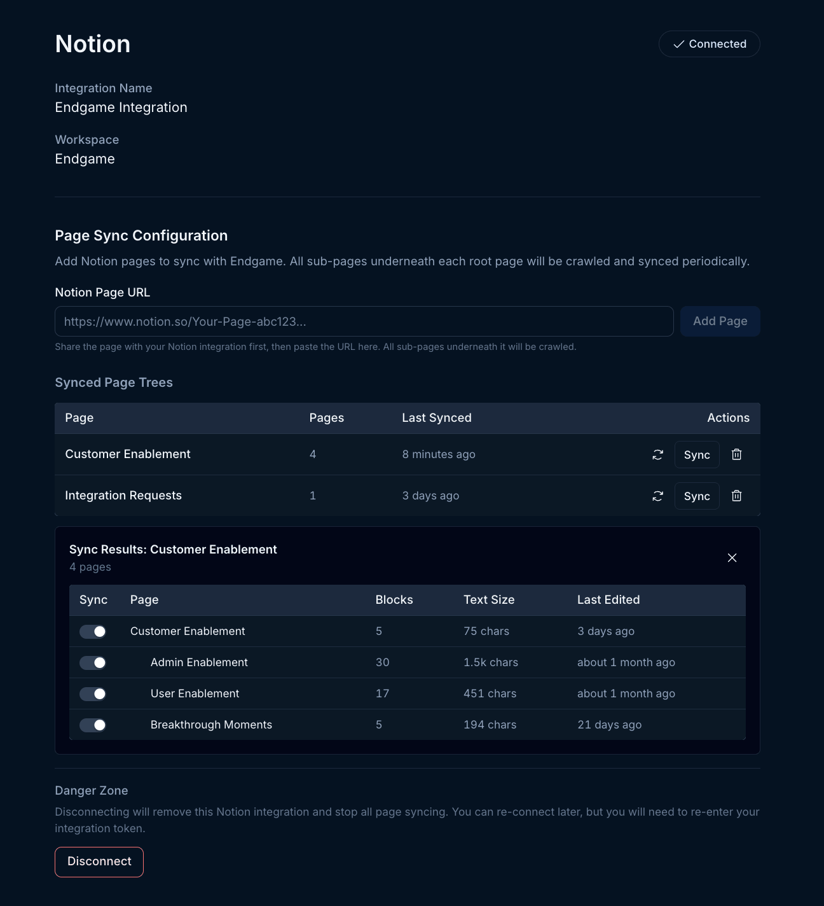
</Frame>

Page content can be deleted by clicking the trash icon for the page. Note that deleting a page with nested content will delete all nested page content as well. If you wish to only exclude certain nested pages, follow the instructions above.

  </Step>
    <Step title="Updating your connection">
  Users can update or disconnect their Notion connection at any time. Disconnecting will remove all your existing page data and the links you have created. 
  
  To update your connection with a new secret and keep your page links, hover over the Connect button in the top right corner and when it shows Reconnect, click it to open the Notion secret modal. To disconnect, click the Disconnect button in the lower left hand corner.

You can also revoke integration permissions within Notion at the integration or page level.

  </Step>
</Steps>

## What's next?

That's it! Now that you've connected Notion to Endgame, we'll automatically ingest your data into our systems once an hour and present our insights in Endgame.

## Need help or have feedback?

We'd love to hear from you! You can reach us at [support@endgame.io](mailto:support@endgame.io).
