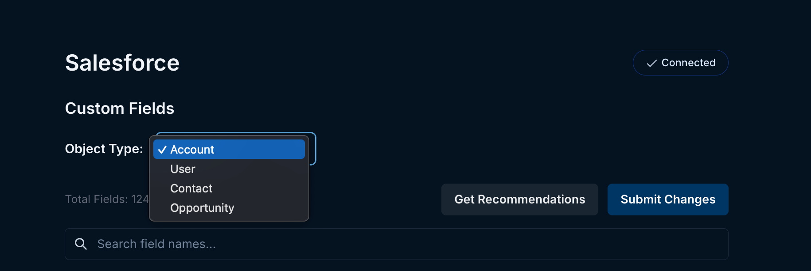

## Authentication

Endgame authenticates users via Salesforce OAuth. This allows for a seamless and secure user experience by leveraging Salesforce's robust authentication framework.

The API Integration User should sign in to Endgame first if you are using one.  Endgame pulls data using the first user who connects - subsequent logins are only used for SSO.

An admin can change the integration user on the [integration settings page](https://app.endgame.io/settings/integrations).

## Connected App Approval

<Warning>
  Approving a Connected App in Salesforce requires the [Customize Application AND either the Modify All Data OR Manage Connected Apps](https://help.salesforce.com/s/articleView?id=005132365&type=1) permissions.
</Warning>

Salesforce requires an approval process for Connected Apps, which needs to be completed before Endgame can receive data.

After going through the initial OAuth handshake, navigate to `Setup` -\> `Connected Apps` -\> `Connected Apps OAuth Usage` and click `Install` next to the EndgameLabs2 app.

## User Permissions

If you encounter an `OAUTH_APPROVAL_ERROR_GENERIC` error while signing in to Endgame, check the following:

**Connected App Approval** - The `EndgameLabs2` Salesforce Connected App must be approved in Salesforce before users can log in.

**Users** - Check the `Permitted Users` setting under `Apps -> Connected Apps -> Manage Connected Apps -> EndgameLabs2` in Salesforce.  `Permitted Users` has two options:

- `All users may self-authorize`- all users will be able to access Endgame without pre-approval in Salesforce
- `Admin approved users are pre-authorized`- individual users will need to be assigned a profile or permission set that grants them access to the app.

**Integration User** - The integration user must have the `Approve Uninstalled Connected Apps` permission to connect and for the `EndgameLabs2` app to show up in Salesforce.

## (Optional) API Integration User

Endgame accesses data using the Bulk API 2.0 APIs, so the initial connection can be done with a dedicated API Integration user.  In salesforce user creation, select:

- **User License**: Salesforce Integration
- **Profile**: Minimum Access - API Only Integrations
- **Additional Permissions**: `Approve Uninstalled Connected Apps`

Use the integration user for the initial connection to Endgame.

## Data ingestion

Endgame leverages the Bulk API 2.0 fetch data from Salesforce on an hourly basis—which means integration is generally immaterial when it comes to API limits. We ingest the objects outlined below by default—but it's also possible to explicitly define additional objects as needed. After the initial sync, we constrain subsequent requests to records that have been updated (as determined by SystemModStamp).

Endgame polls for the query job to complete with incremental backoffs starting at every one minute and going up to ten minutes between job completion poll attempts.

Endgame also downloads the results using a page size of 25,000, downloading those pages in parallel.

Data from Salesforce is fetched using the credentials of the first user to log into Endgame. If needed, these credentials can be updated to a different user by sending a request to [support@endgame.io](mailto:support@endgame.io).

<Note>
  Only accounts the integration user has permission to in Salesforce will be run through any AI systems. The integration user is the one you first log in with after consultation with Endgame. The user can be updated by going to the [integration page](https://app.endgame.io/settings/integrations/salesforce), hovering over the Connect button in the top right corner and clicking Reconnect.
</Note>

## Default objects

Endgame ingests a number of Salesforce objects by default, many of these are accessible via chat including Account, Opportunity, and Contact. We will continue to make more object accessible in the future.

## Important fields

Endgame references all standard fields in the above objects by default, and while custom fields are also ingested as part of the integration, Endgame does not automatically reference all custom fields as Salesforce instances often have hundreds of fields and only a handful that truly matter to help users deeply understand their accounts.

Instead, Endgame provides two mechanisms to reference information from custom fields: 1) by explicitly instructing Endgame to reference certain custom fields ("Important fields") within a chat prompt; and 2) by allowing administrators to designate specific custom fields for Endgame to reference by default.

To configure your Important fields:

<Steps>
  <Step title="Go to Salesforce configuration page">
    Navigate to https://app.endgame.io/settings/integrations/salesforce (only available to admins)
  </Step>
  <Step title="Select an object">
    Select the object that contains fields you deem important from an Endgame perspective.

    <Frame caption="Salesforce object selection">
      
    </Frame>
  </Step>
  <Step title="Mark select fields as important">
    Search for and mark "Important" the fields you want Endgame to focus on. Then, click "Submit Changes". It will take a few minutes for your changes to be reflected.

    <Warning>
      You can select up to 50 fields per object.
    </Warning>
    

    <Warning>
      Standard fields along with custom fields that are populated on 1 or fewer records are omitted from the list.
    </Warning>
  </Step>
</Steps>