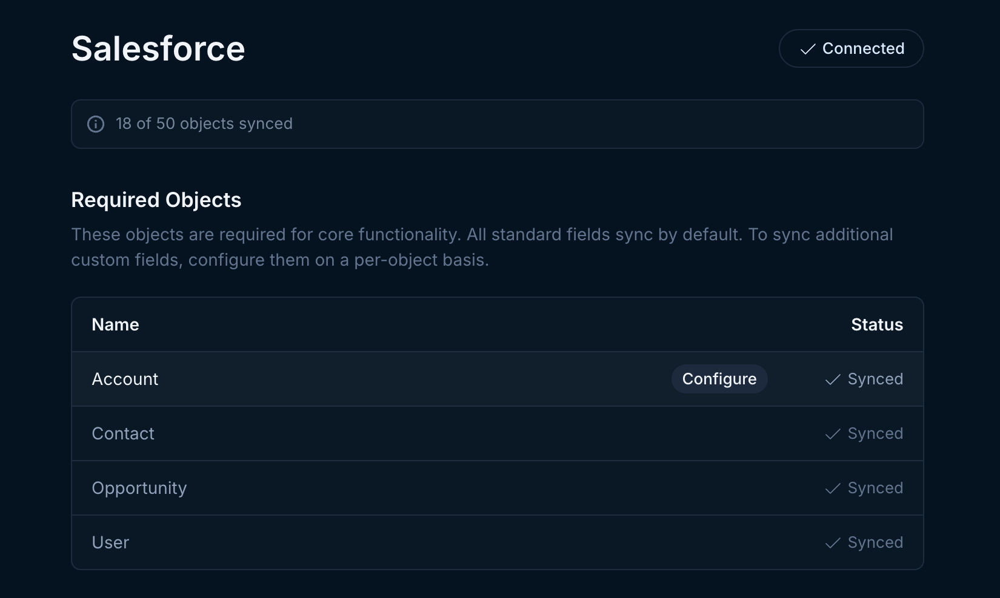
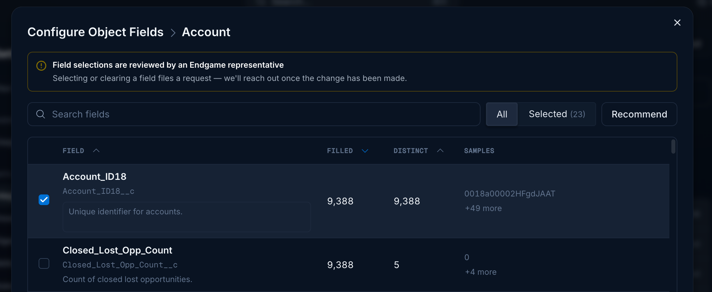
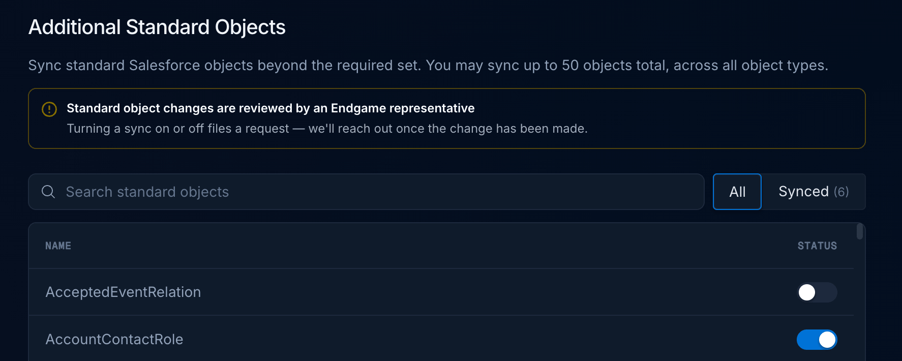
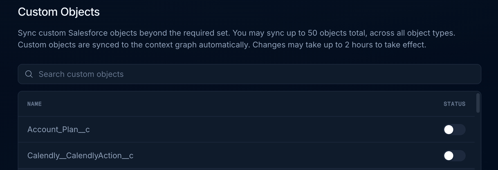

## Integration User

Admins connect a Salesforce integration user to initialize the connection of Endgame with Salesforce during onboarding.

An admin can change the integration user on the [integration settings page](https://app.endgame.io/settings/integrations) if needed.

## Connected App Approval

<Warning>
  Approving a Connected App in Salesforce requires the [Customize Application
  AND either the Modify All Data OR Manage Connected
  Apps](https://help.salesforce.com/s/articleView?id=005132365&type=1)
  permissions.
</Warning>

Salesforce requires an approval process for Connected Apps, which needs to be completed before Endgame can receive data.

After going through the initial OAuth handshake, navigate to `Setup` -\> `Connected Apps` -\> `Connected Apps OAuth Usage` and click `Install` next to the EndgameLabs2 app.

## User Permissions

If you encounter an `OAUTH_APPROVAL_ERROR_GENERIC` error while signing in to Endgame, check the following:

**Connected App Approval** - The `EndgameLabs2` Salesforce Connected App must be approved in Salesforce before users can log in.

**Users** - Check the `Permitted Users` setting under `Apps -> Connected Apps -> Manage Connected Apps -> EndgameLabs2` in Salesforce. `Permitted Users` has two options:

- `All users may self-authorize` - all users will be able to access Endgame without pre-approval in Salesforce.
- `Admin approved users are pre-authorized` - individual users will need to be assigned a profile or permission set that grants them access to the app.

**Integration User** - The integration user must have the `Approve Uninstalled Connected Apps` permission to connect and for the `EndgameLabs2` app to show up in Salesforce.

## (Optional) API Integration User

Endgame accesses data using the Bulk API 2.0 APIs, so the initial connection can be done with a dedicated API Integration user. In Salesforce user creation, select:

- **User License**: Salesforce Integration
- **Profile**: Minimum Access - API Only Integrations
- **Additional Permissions**: `Approve Uninstalled Connected Apps`

Use the integration user for the initial connection to Endgame.

## Data ingestion

Endgame leverages the Bulk API 2.0 to fetch data from Salesforce on an hourly basis—which means integration is generally immaterial when it comes to API limits. We ingest the objects outlined below by default—but it's also possible to explicitly define additional objects as needed. After the initial sync, we constrain subsequent requests to records that have been updated (as determined by SystemModStamp).

Endgame polls for the query job to complete with incremental backoffs starting at every one minute and going up to ten minutes between job completion poll attempts.

Endgame also downloads the results using a page size of 25,000, downloading those pages in parallel.

Data from Salesforce is fetched using the credentials of the first user to log into Endgame. If needed, these credentials can be updated to a different user by sending a request to [support@endgame.io](mailto:support@endgame.io).

<Note>
  Only accounts the integration user has permission to access in Salesforce will
  be run through any AI systems. The integration user is the one you first log
  in with after consultation with Endgame. The user can be updated by going to
  the [integration
  page](https://app.endgame.io/settings/integrations/salesforce), hovering over
  the Connect button in the top right corner and clicking Reconnect.
</Note>

## Important fields

Endgame adds the standard fields on Required Objects by default to the context graph, and while custom fields are also ingested as part of the integration, Endgame does not automatically reference all custom fields as Salesforce instances often have hundreds of fields and only a handful that truly matter to help users deeply understand their accounts.

Endgame enables administrators to designate specific custom fields on our core required objects (Account, Opportunity, User, Contact) for Endgame to add to the context graph.

To configure your Important (custom) fields:

<Steps>
  <Step title="Go to Salesforce configuration page">
    Navigate to the [Salesforce configuration page](https://app.endgame.io/settings/integrations/salesforce) (only available to admins)
  </Step>
  <Step title="Configure important fields on required objects">
  Click on **configure** on a core object in the Required Objects list.

<Frame caption="Required object configuration">
  
</Frame>

  </Step>
  <Step title="Mark select fields as important">
    Search for the fields you want Endgame to include in responses, use the checkbox to select them, then click Save Changes. Your change request will be submitted to Endgame and you will be notified once your fields have been added.
    
  <Frame caption="Configure object fields modal">
  
</Frame>

    <Warning>
      You can select up to 50 fields per object. Standard fields along with custom fields that are populated on 1 or fewer records are omitted from the list.
    </Warning>

  </Step>
</Steps>

## Additional objects

You can add additional Standard Objects to the Endgame context graph by toggling them on under Additional Standard Objects. Your change request will be submitted to Endgame and you will be notified once your objects have been added.

<Frame caption="Additional Salesforce objects">
  
</Frame>

You can add additional Custom Objects to the Endgame context graph by toggling them on under Custom Objects. Changes are made automatically and can take up to 2 hours to take effect.

<Frame caption="Salesforce custom objects">
  
</Frame>
