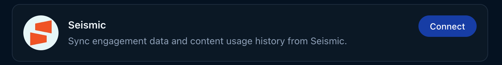
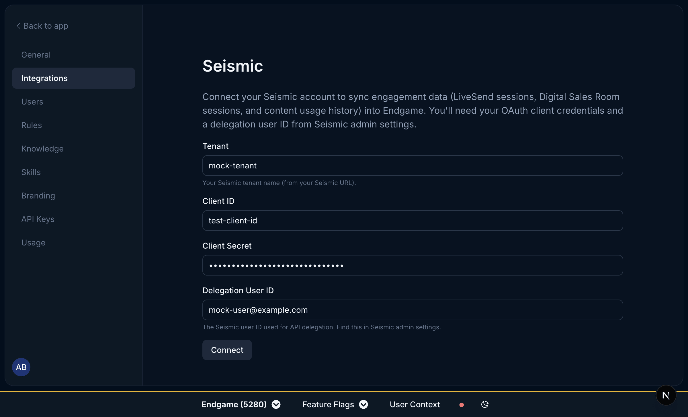
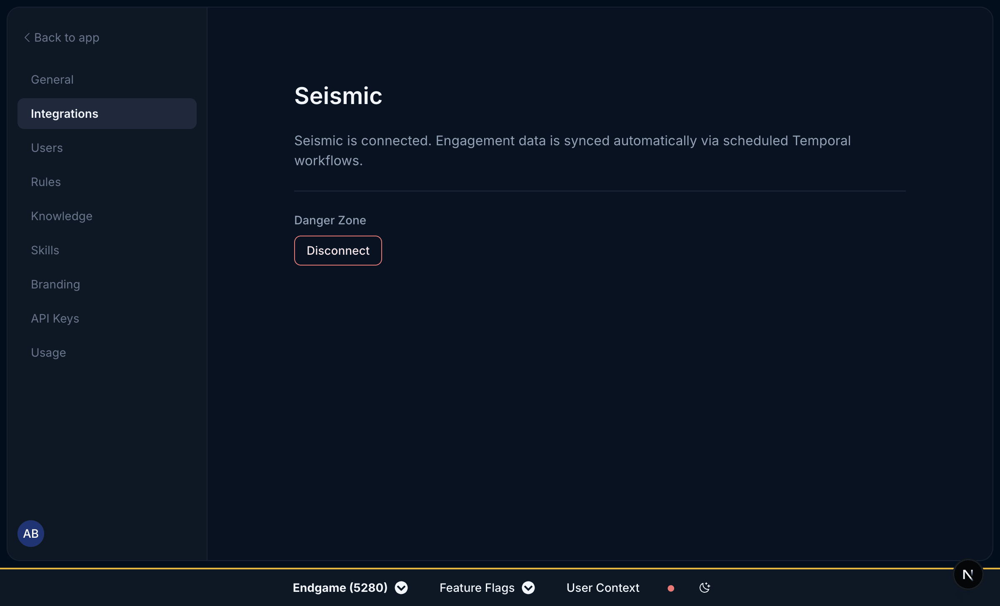
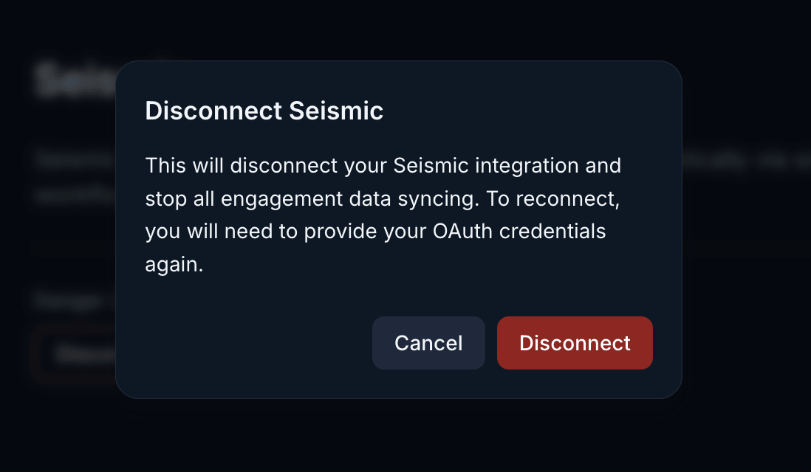

<Warning>
  **Beta:** This feature is in beta and is not available to all users. Contact
  your Endgame Administrator to discuss access.
</Warning>

Use the instructions below to enable the Seismic integration in Endgame. Once enabled, Endgame will process content from your Seismic instance and provide insights via the Endgame UI.

## Enable the integration

<Note>To connect to the Seismic API, you must be a Seismic Administrator.</Note>

<Steps>
  <Step title="Access Seismic integration">
    Log into Endgame and navigate to the [integrations](https://app.endgame.io/settings/integrations) page. Only Endgame Admins can configure organization integrations. Click "Connect" for Seismic to begin the setup process.

    <Frame caption="Seismic connection">
      
    </Frame>

  </Step>
  <Step title="Add Seismic credentials">
    You will need your OAuth client credentials and a delegation user ID from your Seismic admin settings. Enter the following four fields and click Connect:

    - **Tenant** — your Seismic tenant name (from your Seismic URL)
    - **Client ID** — your OAuth client ID
    - **Client Secret** — your OAuth client secret
    - **Delegation User ID** — the Seismic user ID used for API delegation (find this in Seismic admin settings)

    Once your credentials have been added, Endgame will initiate ingestion and processing of your Seismic content.

    <Frame caption="Seismic connection inputs">
      
    </Frame>

  </Step>
  <Step title="Disconnect your integration">
    Users can disconnect their Seismic connection at any time. Disconnecting will stop all engagement data syncing. To reconnect, you will need to provide your OAuth credentials again.

    To disconnect, click the **Disconnect** button in the Danger Zone section.

    <Frame caption="Seismic connected view">
      
    </Frame>

    <Frame caption="Seismic disconnect confirmation">
      
    </Frame>

  </Step>
</Steps>

## What's next?

That's it! Now that you've connected Seismic to Endgame, we'll automatically ingest your content and present our insights in Endgame.

## Need help or have feedback?

We'd love to hear from you! You can reach us at [support@endgame.io](mailto:support@endgame.io).
