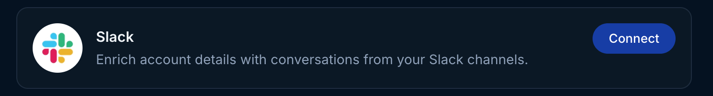
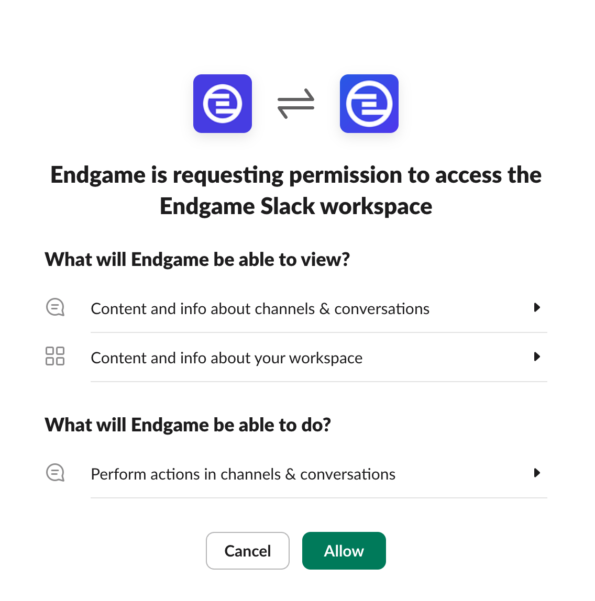

Endgame connects to your Slack workspace to associate messages in specific channels with accounts and enable Endgame chat threads directly in Slack. To install, log in to your Endgame account and navigate to Settings \> Integrations \> Slack, then click "Connect" to add Endgame to Slack. Follow the steps below to complete the setup.

## Enable the integration

<Note>
  Connecting to the Slack API requires that the connecting user is either a
  Slack Administrator or gets permission from one. Be sure to check with your
  organization admin before trying to connect Slack.
</Note>

<Steps>
  <Step title="Navigate to Configuration">
    Navigate to the [integrations page](https://app.endgame.io/settings/integrations). Only Endgame admins can configure organization integrations.

    If needed, log in to your Endgame account via Salesforce.

  </Step>
  <Step title="Start Setup">
    From the integrations page, click "Connect" to kick off the Slack authentication process.

    <Frame caption="Slack connection">
      
    </Frame>

  </Step>
  <Step title="Request Approval (if needed)">
    If you don't have administrative privileges, you'll be directed to a request approval page. After you submit the request, Slackbot will send a direct message to your organization's admins. You'll then receive a Slackbot message confirming whether your request was approved or denied.

    Note: If this approval page does not appear, your account has already been authorized.

  </Step>
  <Step title="Grant Permissions">
    On the next page, click "Allow" to grant the required permissions.

    <Frame caption="Slack permissions page">
      
    </Frame>

  </Step>
  <Step title="Configure Channel Mapping">
    You'll be directed to a configuration page where you can map public Slack channels to specific Endgame accounts. These channel connections also enable you to start Endgame threads directly in the corresponding Slack channels. For more on using Endgame in Slack, check out our [Slack](/features/slack) documentation.

    Additionally, you can configure organization-wide channels. Data from these channels is ingested and, once processed, the resulting insights are associated with individual accounts. From these channels, you can also start multi-account conversations.

    <Frame>
      
    </Frame>

    For instance, if you have an account for a company named CompanyCo, select it from the Account dropdown. Then, in the Channels field, select the channels associated with that account, such as #deal-companyco.

    You can add multiple channels to a single account, but only one at a time. Using the previous example, you could also add a #companyco-help channel. Both channels would then have their messages ingested into Endgame and associated with that single account.

    To connect an organization-wide channel, select the desired channels under "Select channels to ingest" and click **Submit**.

  </Step>
</Steps>

<Note>
  We will _only_ ingest channels that you have selected and associated with an
  account or at the organization level. Other than the names of public channels,
  no other data is ingested without your permission.
</Note>

## What's next?

That's it! Now that you've connected Slack to Endgame, we'll automatically ingest your data into our systems every 15 minutes and present our insights in Endgame. To learn more about using Endgame threads in Slack, see our [Slack](/features/slack) documentation.

## AI Disclaimer

Endgame uses large language models to generate insights and responses. Endgame is purpose-built for sales teams and draws from your connected data sources, including Salesforce, call recordings, email, and Slack, to provide deeply contextual answers. Our engineering team focuses heavily on accuracy and correctness, but AI-generated responses may occasionally be inaccurate or incomplete. We recommend verifying critical information before acting on it.

## Privacy Policy

You can find our privacy policy at [https://www.endgame.io/privacy](https://www.endgame.io/privacy).

## Need help or have feedback?

We'd love to hear from you! You can reach us at [support@endgame.io](mailto:support@endgame.io).
