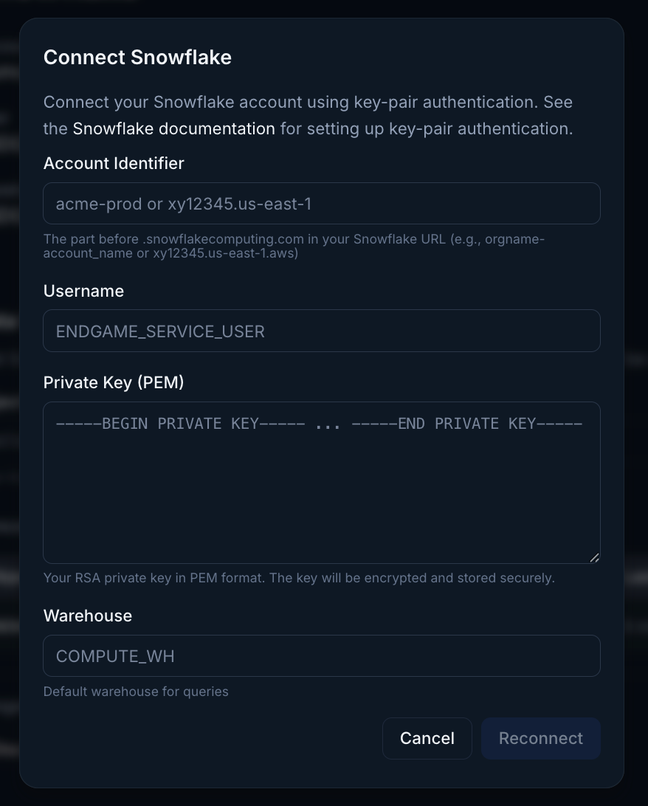
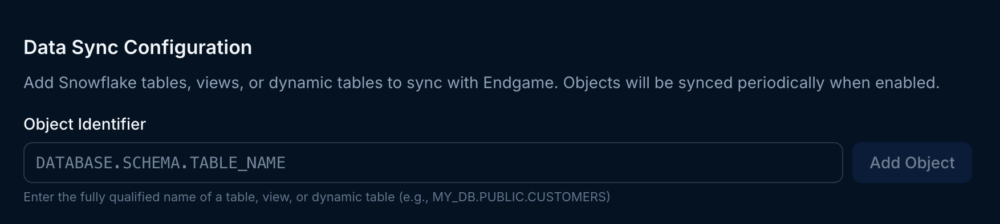

Use the instructions below to enable the Snowflake integration in Endgame. Once enabled, Endgame will query your Snowflake data once per day and include Snowflake insights in your Endagme chats.

<Warning>
  **Beta:** This feature is in beta and is not available to all users.
</Warning>

## Adding the App

<Warning>
  Connecting to Snowflake requires that the user is an ACCOUNTADMIN or
  equivalent and has OpenSSL installed on their local machine.
</Warning>
<Steps>
<Step title="Generate a key pair">

    Endgame uses [key-pair authentication](https://docs.snowflake.com/en/user-guide/key-pair-auth) to connect to your Snowflake account.
    Generate a key pair by running these commands in your terminal:

```
# Generate a private key (PKCS8 format, unencrypted)
 openssl genrsa 2048 | openssl pkcs8 -topk8 -inform PEM -out snowflake_key.p8 -nocrypt

 # Extract the public key
 openssl rsa -in snowflake_key.p8 -pubout -out snowflake_key.pub
```

This creates two files:

- `snowflake_key.p8` — Your private key (you'll provide this to Endgame)
- `snowflake_key.pub` — Your public key (you'll register this in Snowflake)

Keep your private key secure. Do not share it or commit it to version control.

</Step>
<Step title="Create a Role and Service User in Snowflake">
Open a SQL worksheet in Snowflake (click + Create → SQL File) and run the following commands.

1.  Create a read-only role:

```
CREATE ROLE ENDGAME_CONNECTOR_READONLY;
```

This creates a new role with no permissions. You'll grant specific permissions in the next steps.

2.  Grant warehouse access:

```
GRANT USAGE ON WAREHOUSE <your_warehouse> TO ROLE ENDGAME_CONNECTOR_READONLY;
```

Replace `<your_warehouse>` with your warehouse name (e.g., COMPUTE_WH). This allows the role to run queries.

3.  Grant database access:
    For each database you want Endgame to access, grant the appropriate permissions:

**For standard databases:**

```
GRANT USAGE ON DATABASE <database_name> TO ROLE ENDGAME_CONNECTOR_READONLY;
GRANT USAGE ON ALL SCHEMAS IN DATABASE <database_name> TO ROLE ENDGAME_CONNECTOR_READONLY;
GRANT SELECT ON ALL TABLES IN DATABASE <database_name> TO ROLE ENDGAME_CONNECTOR_READONLY;
GRANT SELECT ON ALL VIEWS IN DATABASE <database_name> TO ROLE ENDGAME_CONNECTOR_READONLY;

-- For future objects (so new tables are automatically accessible)
GRANT USAGE ON FUTURE SCHEMAS IN DATABASE <database_name> TO ROLE ENDGAME_CONNECTOR_READONLY;
GRANT SELECT ON FUTURE TABLES IN DATABASE <database_name> TO ROLE ENDGAME_CONNECTOR_READONLY;
GRANT SELECT ON FUTURE VIEWS IN DATABASE <database_name> TO ROLE ENDGAME_CONNECTOR_READONLY;
```

**For shared/imported databases:**

```
GRANT IMPORTED PRIVILEGES ON DATABASE <database_name> TO ROLE ENDGAME_CONNECTOR_READONLY;
```

4.  Create the service user:

First, get your public key content. Open `snowflake_key.pub` and copy the content between the header and footer lines (exclude `-----BEGIN PUBLIC KEY-----` and `-----END PUBLIC KEY-----`).
Remove any newlines so it's a single continuous string.

Then create the user:

```
CREATE USER ENDGAME_SERVICE_USER
TYPE = SERVICE
RSA_PUBLIC_KEY = '<your_public_key_content>';
```

5.  Assign the role to the service user:

```
GRANT ROLE ENDGAME_CONNECTOR_READONLY TO USER ENDGAME_SERVICE_USER;

ALTER USER ENDGAME_SERVICE_USER SET DEFAULT_WAREHOUSE = <your_warehouse>;
ALTER USER ENDGAME_SERVICE_USER SET DEFAULT_ROLE = ENDGAME_CONNECTOR_READONLY;
```

</Step>
<Step title="Find your account identifier">
 Your Snowflake account identifier is displayed in your Snowflake URL or in the account selector. It follows the format `orgname-accountname` (e.g., `myorg-account123`).

You can also find it by running:

```
SELECT CURRENT_ORGANIZATION_NAME() || '-' || CURRENT_ACCOUNT_NAME();
```

For more details, see [Snowflake Account Identifiers](https://docs.snowflake.com/en/user-guide/admin-account-identifier).

</Step>
<Step title="Connect Snowflake to Endgame">
    Log into Endgame and navigate to the [integrations](https://app.endgame.io/settings/integrations) page.
    Click to Connect with Snowflake and enter your organization data in the modal.

    <Frame caption="Snowflake connector modal">
      
    </Frame>

  </Step>
  <Step title="Add snowflake objects">
  Once you have successfully connected Endgame to your snowflake instance, you can add object identifiers for the  tables, views, or dynamic tables you want to sync to Endgame.

<Warning>
  Snowflake views should contain summary or aggregated data. Endgame can not
  process and analyze raw event data. We recommend that any table contain 20k rows or less for best performance. 
</Warning>

<Frame caption="Snowflake object identifiers">
  
</Frame>

You may remove an object at anytime by clicking on the trash icon under Actions. This will stop future syncs and delete the associated data in Endgame. 
  </Step>
</Steps>

<Info>
  Because of their nature, Snowflake tables are assumed to be applicable at an
  organization level, relevant to many accounts. They are not account specific.
</Info>
