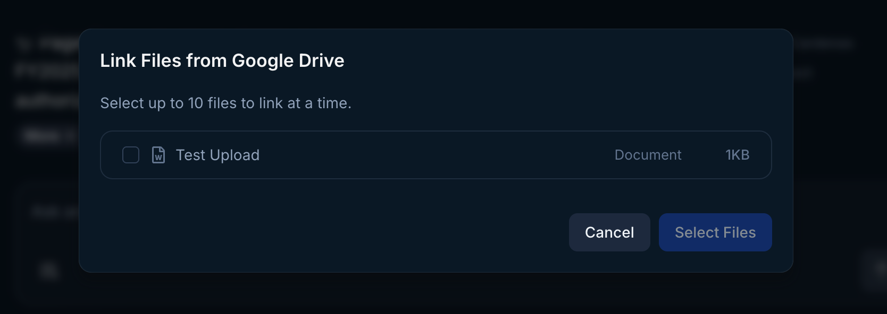

Admin users can upload knowledge documents to enhance the context provided to Endgame for all chat responses. This unified view displays all knowledge content across your entire organization, including both organization-level and account-specific documents. Organization-level content is particularly useful for materials like playbooks, case studies, sales decks, or any other resources that aren't already captured through Endgame's existing integrations. Account-specific documents can also be uploaded and managed here, ensuring comprehensive knowledge management in a single location. Helpful filters are provided for document level, entity type, and account in addition to basic search.

<Frame caption="Admin knowledge view">
  
</Frame>

When uploading content through the Admin knowledge view, the system automatically categorizes documents as organization or account content and intelligently detects account associations. This can take a few minutes to run, the more files uploaded, the longer the associations take. Admins have the ability to edit account associations manually.

<Info>
  Adding an account association to an organization-level document converts it to an account specific document. 
</Info>

<Frame caption="Edit knowledge document">
  
</Frame>

## Upload files from from your device

Navigate to the [Knowledge](https://end-p1.endgame.io/settings/knowledge) section in settings. Click Add Files and select Upload from device.

<Frame caption="Knowledge File Upload">
  
</Frame>

Go through the flow to select up to 10 files at a time from your device. You can edit the titles and descriptions for the files before clicking to Upload Files.

<Frame caption="File Upload Flow">
  
</Frame>

### Link files from Google Drive

Navigate to the [Knowledge](https://end-p1.endgame.io/settings/knowledge) section in settings. Click Add Files and select Link from Google Drive.

<Frame caption="Knowledge File Upload">
  
</Frame>

Go through the Google authentication process. Select all permissions requested for the best Endgame experience. Once authenticated, select up to 10 files at a time to sync with Endgame. You can edit the description for the files before clicking to Select Files.

<Frame caption="Google File Select">
  
</Frame>

### Import files from a public URL

Navigate to the [Knowledge](https://app.endgame.io/settings/knowledge) section in settings. Click Import from public URL.

<Frame caption="Knowledge File Upload">
  
</Frame>

Copy and paste a link to a public document or webpage. After you click Add Link, you will be able to add a title and a description for the URL. Continue to add additional URLs and click Save once completed. Your document will now be added to your list of Knowledge documents.

<Frame caption="Import from public URL">
  
</Frame>

### File sync frequency

| **Knowledge source** | **Frequency** |
|-----------------|-----------|
| Google Drive | automatically 1/day - option for manual sync anytime|
| Confluence | automatically 1/hour - option for manual synca anytime|
| Public web URL | must trigger manual sync |
| Personal upload | must re-upload for new content |

