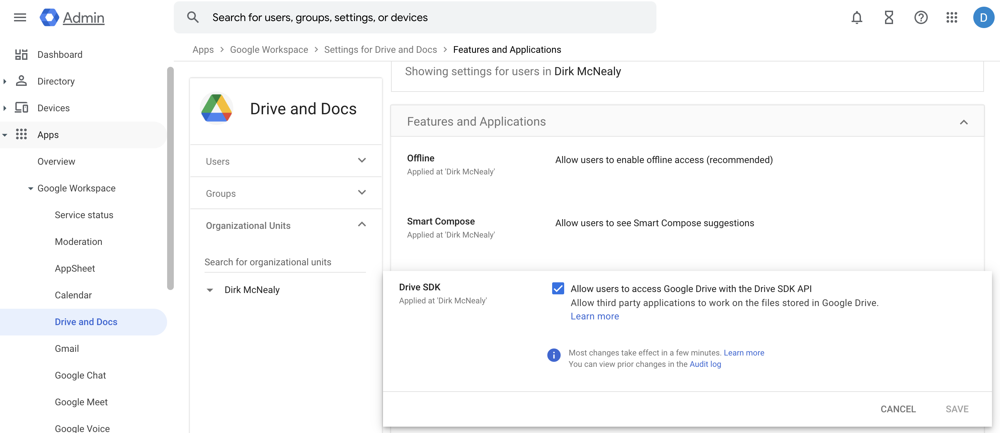
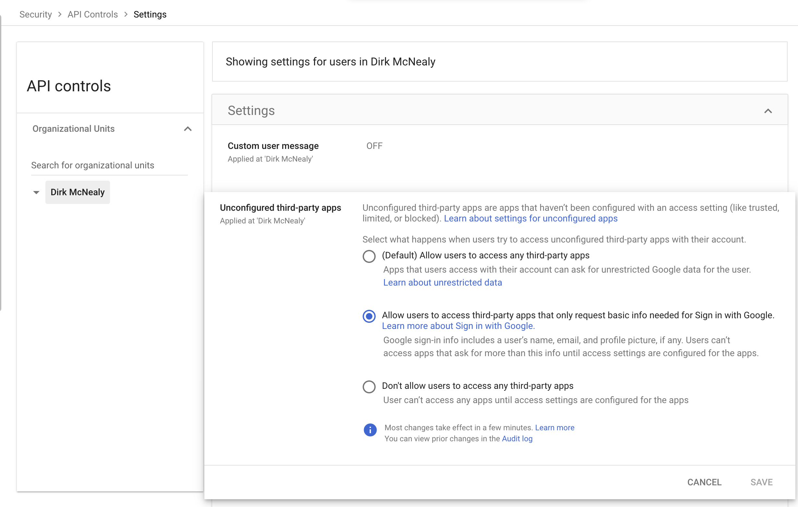
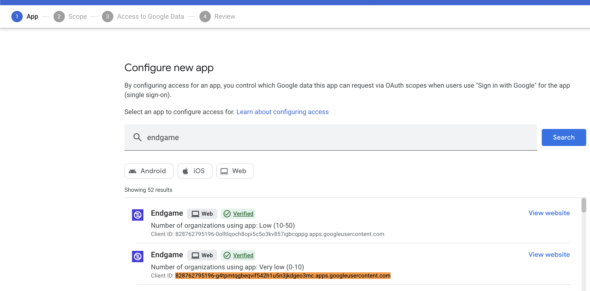
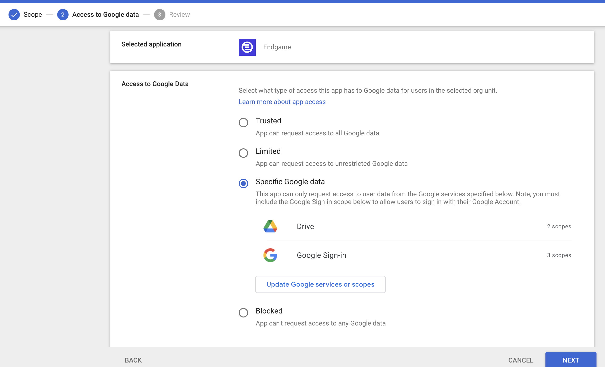

Your organization's Google workspace configuration may include restrictions that prevent Endgame from syncing files in your Drive. In such cases, you may experience difficulty authenticating with Google through Endgame, or you may successfully authenticate but find that no files appear as available for syncing to Endgame. We've outlined a few steps you can take at the workspace level to grant access that Endgame needs.

## Workspace Restrictions

### Apps / Google Workspace / Drive and Docs Restrictions

A Google administrator must check this box or no external Google Drive applications will work in your workspace.

<Frame caption="Enable Drive SDK">
  
</Frame>

### Security / API Controls / Settings Restrictions

If your workspace restricts third-party applications as shown below, you will need to either request administrator approval for Endgame or have an administrator add Endgame as an approved application in your organization's configuration.

<Frame caption="Goolge Drive blocking third party applications">
  
</Frame>

1. In Security → API Controls → App Access Control → Configure New APP

2. Search for Endgame and select the client ID [828762795196-g4tpmtqgbeqvif542h1u5n3jkdgeo3mc.apps.googleusercontent.com](http://828762795196-g4tpmtqgbeqvif542h1u5n3jkdgeo3mc.apps.googleusercontent.com) from the list. The additional Endgame application listed is used for authentication purposes and is safe to configure alongside the primary application.

<Frame caption="Configure new app in workspace">
  
</Frame>

3. Set the configuration to "Specific Google data" (this grants only the necessary permissions as requested). Trusted status is not required.

<Frame caption="Grant data access in workspace">
  
</Frame>