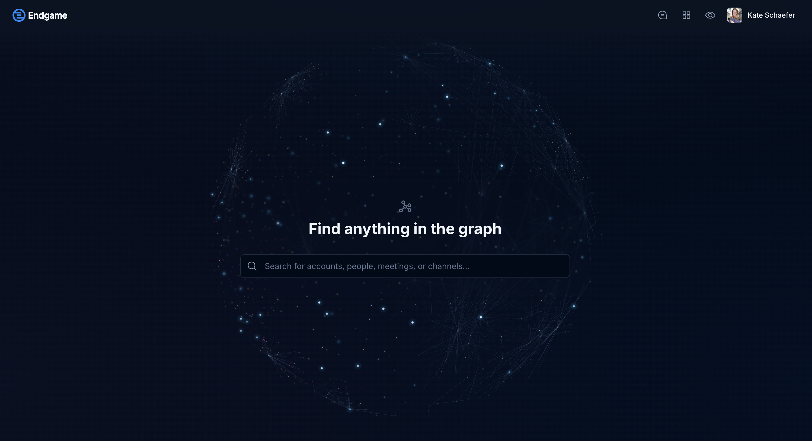
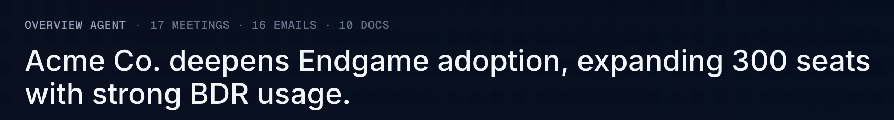
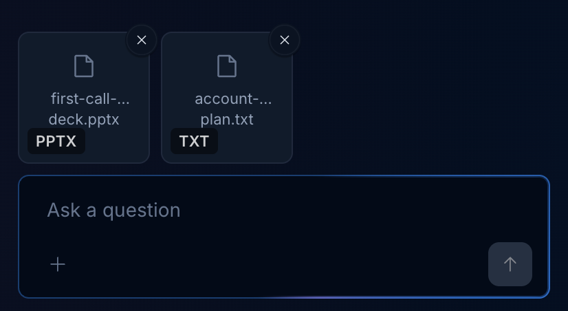
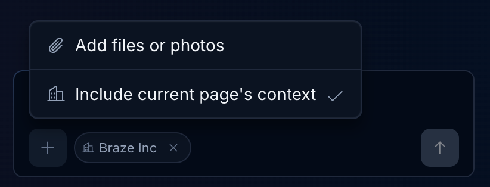

## About Endgame

Endgame enables everyone at your company to deeply understand your customers and prospects. Think of it as a single playbook for the entire team, covering sales and account management use cases such as company research, meeting prep, account planning, deal review, handoffs, and more.

After you [log in](https://login.endgame.io/), you'll land on the Endgame [homepage](https://app.endgame.io/). This is your starting point for searching and exploring your organization's context graph. Search across accounts, people, channels (where applicable), and recent meetings, then click through to any result to see the full view of the knowledge Endgame has assembled on that entity.

<Frame caption="Endgame homepage">
  
</Frame>

<Note>
  **Important:** The only companies you will see are those with Account records
  in your CRM that Endgame has been given access to.
</Note>

## Entity pages

Each entity page brings together everything the context graph knows about that entity. Alongside cited factual data, you'll find compiled insights and rollups produced by Endgame's context agents, which run around the clock to keep every entity current. Sections powered by a context agent are labeled with the name of the agent providing the data.

<Frame caption="Context Agent section">
  
</Frame>

## Chat

Use chat to ask questions about a specific account or across your entire book, just like you would with any AI assistant. Dig into meetings, people, deal details, and more. To open chat, click the text bubble icon in the top navigation.

#### Adding files to a chat

You can attach files to any chat by clicking the **+** button in the chat input. Once added, files appear above the input. To remove a file before submitting, click the **X**.

<Frame caption="Files attached to chat input">
  
</Frame>
_Supported file types: PDF, Word (.doc, .docx), Excel (.xls, .xlsx), CSV, TSV,
JSON, XML, HTML, Markdown, plain text (.txt, .log), and images (.png, .jpg,
.gif, .webp). The maximum file size is 5 MB per file._

You can also include the context of the page you're viewing. Select or deselect the **Include current page's context** option. Click the **X** on the chip in the chat input to remove it.

<Frame caption="Add page context to chat">
  
</Frame>

---

## Quick navigation tips

### Link to accounts in Endgame

You can link directly to a specific account in Endgame using the account's Salesforce ID. Some organizations find this particularly helpful for linking from Salesforce records into Endgame.

Use the following URL format, replacing `[SALESFORCE ACCOUNT ID]` with the account's Salesforce ID:

`https://app.endgame.io/accounts/[SALESFORCE ACCOUNT ID]`

Example: `https://app.endgame.io/accounts/0011234567890ABC`

## Need help or have feedback?

We'd love to hear from you! You can reach us at [support@endgame.io](mailto:support@endgame.io).
