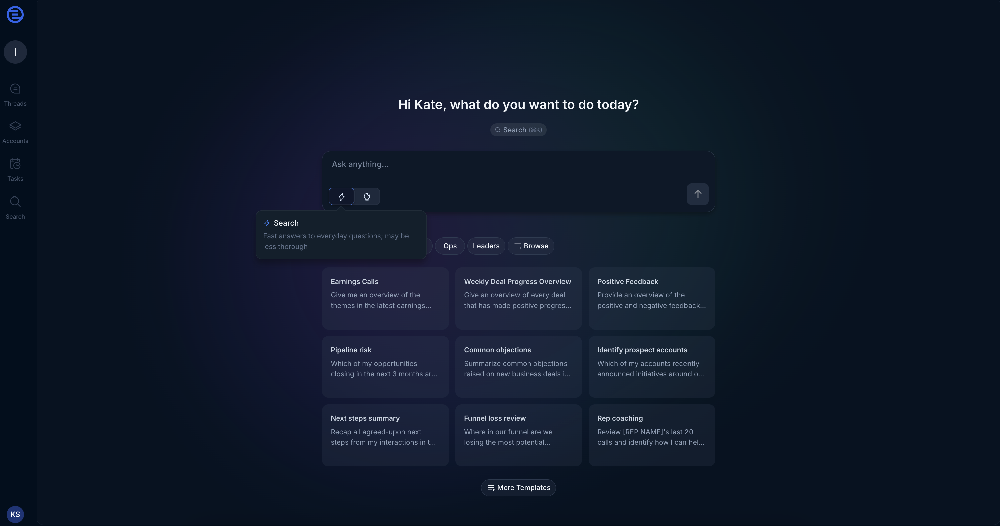
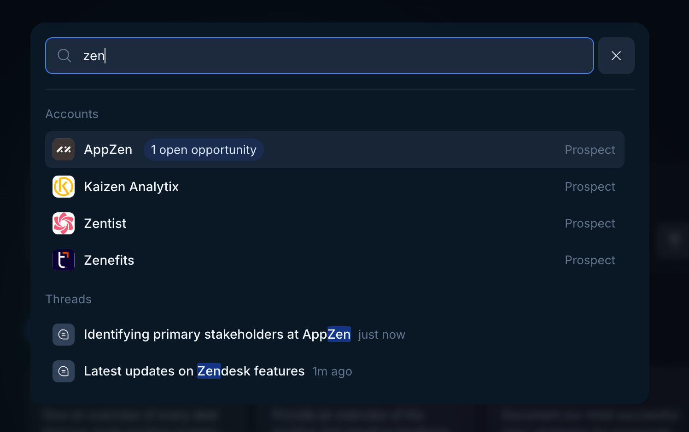
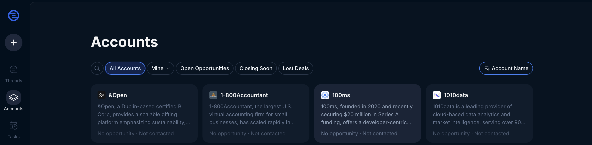
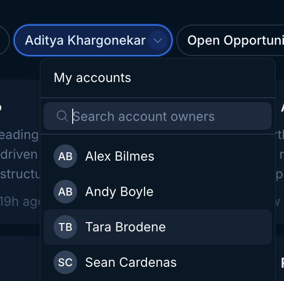
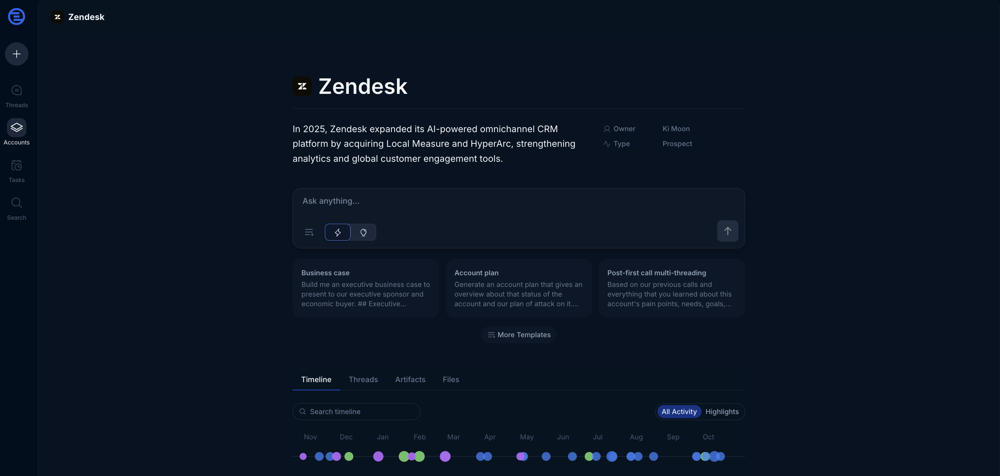
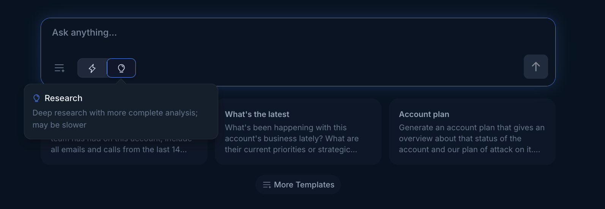
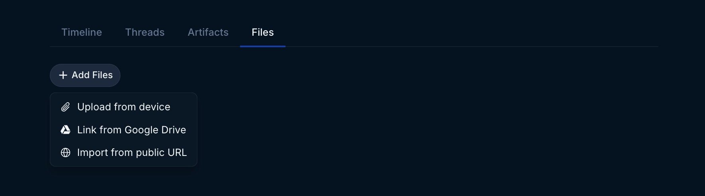

## About Endgame

Endgame enables you and anyone at your company to deeply understand your customers and prospects. Consider Endgame a single sheet of music for the entire team to use for sales and account management use cases such as company research, meeting prep, account planning, deal review, handoffs, and more.

After you [login](https://app.endgame.io/login) with your Salesforce credentials, you'll be presented with Endgame's [home page](https://app.endgame.io/). On the home page you can query across multiple accounts. Here you can explore prompts that cover the entire breadth of the accounts in your organization. Ask questions that target your book of accounts, explore organizational trends, provide insights about your team’s sales strategies, and more. You can also ask targeted, single account questions from this page as well as from the specific account detail pages.

<Frame caption="Endgame home page">
  
</Frame>

## Navigating cross-account thread history

You can view your non-account specific thread history in the Thread List view accessed in the left-hand navigation. Your targeted account thread history lives in that account's Library.

<Frame caption="Multi-account thread list">
  
</Frame>

## Search for accounts or chat threads

Open search by clicking on the search button in the home page or the search option in the left-hand navigation. Type in the name of the company or thread title you want to research. Doing so will pull up accounts and threads to select from — simply click the appropriate account and you'll be taken to the Account Detail page or the corresponding thread.

<Frame caption="Search modal">
  
</Frame>

<Info>
  You can also directly go to search via `cmd+k` from any page or by clicking the search icon in the left-hand navigation.
</Info>

<Note>
  **Important:** The only companies you will see are those with Account records in Salesforce that Endgame has been given access to.
</Note>

## Accounts page

Alternatively, navigate to the [Account List](https://app.endgame.io/accounts) page by clicking the stack icon in the left-hand navigation. There are a few ways to sort and filter this table.

<Frame caption="Account list view">
  
</Frame>

### Quick filters

You can quickly filter down your accounts by clicking on the filter options in the top left-hand side of the account grid.

### Filtering by ownership

Clicking on the second filter option, you will see a list of the salesforce users associated with your organization. You can filter your accounts by ownership by selecting a user from this list.

<Frame caption="Ownership filter">
  
</Frame>

### Sorting

There are a few pre-built ways to sort the list: by Last Viewed, Last Interaction, Account Name, Opportunity Size, Opportunity Close Date, Opportunity Stage, and Opportunity Type. This dropdown menu can be found at the top right of the Account List.

<Frame caption="Sorting options">
  
</Frame>

---

## Account detail page

Once you get to an account, you'll be presented with the Account Detail page. The core concepts within this page: Ask AI (chat), Timeline, Threads, Artifacts, and Files.

<Frame caption="Account detail page">
  
</Frame>

### Chat

<Frame caption="Account chat interface">
  
</Frame>

Think of this as a ChatGPT that's deeply tuned to your business model and sales strategy with access to your internal CRM & call data. The questions you can ask can thus be quite detailed and specific. Here's a [quick guide on prompts](/endgame-chat-101) and [templates](/features/templates) to help you get started.

<Tip>
  Explore different angles of questions and account inspection by clicking from the rotating set templates from your organization's template library that appear below the chat input.
</Tip>

Chat is available in two modes. Choose between Search mode for rapid responses to straightforward queries or Research mode for more complex questions.

Search mode is good for questions like “When did we last meet with this account”, “Which of my accounts have opportunities closing this month”, or quick firmagraphic questions.

Research mode is good for deeper, more analytical questions like “Help me find 3 different ways we could pitch enterprise value to this account and map the values to stakeholders who would be most receptive to the pitch.”

When you ask a question, you'll be taken to a new page that represents the Thread of your chat conversation. You can ask multiple questions in that Thread, and you can always get back to it from the Library.

### Timeline

The timeline captures news, job changes, financial highlights such as earnings calls, emails, and calls. It can be very useful for catching up on an account as a manager, or during account transitions/inheritance.

<Frame caption="Account timeline">
  
</Frame>

The timeline is searchable via the box in the top left for specific terms, and selecting any of the category tags (Email, Meeting, Job Change, News) in the second column will also instantly filter the timeline to that tag type (select again to remove the filter).

For accounts that have a large number of timeline events, you can also toggle from All Activity to Highlights to narrow down to events that Endgame believes are of heightened importance.

Clicking into any specific event will open up a new chat Thread, where you can explore the event in greater detail. For example, you can click into a past meeting, and the new thread will automatically generate a summary of the meeting for you from which you can ask follow on questions.

### Threads

The Threads tab contains an index of all the threads associated with this account, which is your Ask AI chat history for that account. This allows you to quickly go back to any chat you have had regarding the account as well as provide a mechanism for collaboration with other members of your team.

Threads that have not been published are available in this tab and will persist unless they are manually deleted. These Threads are only visible in the Threads tab for the creator of the Thread, though it is still possible to manually share the link to the Thread with other Endgame users.

<Frame caption="Account threads tab">
  
</Frame>

### Artifacts

Artifacts are Threads that have been published, which enables external sharing of a Thread via a link with non-Endgame users. Publishing a Thread will also make the thread public and viewable by other Endgame users in the Account Library.

<Frame caption="Account artifacts tab">
  
</Frame>

### Files

Files is where you can add additional contextual documents to be used to formulate your account chat responses. This is where you can upload and sync meeting notes, usage data, account contracts, account specific decks, and more. More detail on how to use file upload [here](/features/file-upload).

<Frame caption="File Upload">
  
</Frame>

---

## Quick navigation tips

### Link to accounts in Endgame

You can create direct links into specific accounts in Endgame using the account's Salesforce ID. Some organizations find this particularly helpful for linking from Salesforce accounts into Endgame.

Linking directly to an account in Endgame will open Endgame to the specified account, ready to start a conversation:

`https://app.endgame.io/accounts/[SALESFORCE ACCOUNT ID]`- Replace [SALESFORCE ACCOUNT ID] with the actual Salesforce account ID.

Example: `https://app.endgame.io/accounts/0011234567890ABC`

### Link to start a new thread in Endgame

You can automatically launch a specific prompt associated with an account when the link is clicked by adding the firstMessage parameter:

`https://app.endgame.io/threads/new?accountId=[SALESFORCE_ACCOUNT_ID]&firstMessage=[YOUR_ENCODED_QUERY]` - Replace [YOUR_ENCODED_QUERY] with the actual encoded prompt.

<Info>
  Important: The query text must be URL-encoded (i.e. spaces become + signs). For example: Spaces → + or %20.
</Info>

Example: `https://app.endgame.io/threads/new?accountId=0011234567890ABC&firstMessage=Generate+a+MEDDPICC+and+risk+mitigation+analysis+on+this+account`

## Need help or have feedback?

We'd love to hear from you! You can reach us at [support@endgame.io](mailto:support@endgame.io).