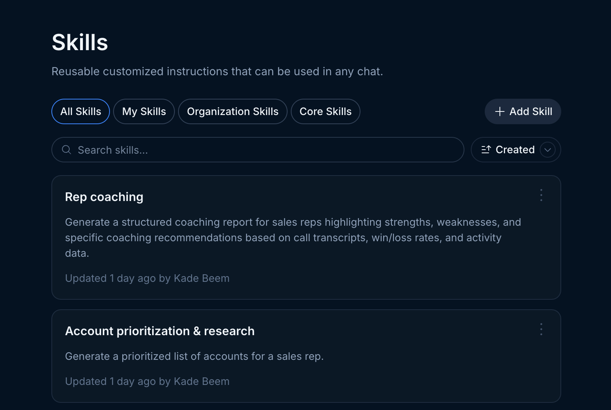
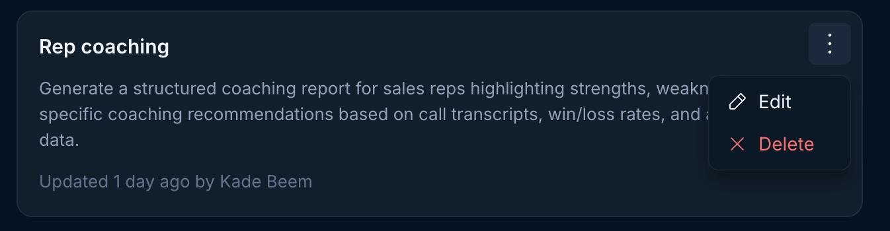

<Tip>
  Want to learn more about writing and structuring skills? Check out our deep
  dive [here](/skills/skills-101).
</Tip>

As an admin you can create global skills that your entire team can access. You manage these global skills in the settings section of Endgame.

<Steps>
  <Step title="Access your skills in settings">
    Navigate to https://app.endgame.io/settings/skills

   <Frame caption="Admin Skills">
        
    </Frame>
  </Step>
  <Step title="Add, edit, delete">
    - Click "Add Skill" (top right of the list) -> Write a Skill to add a new skill
    - Open the overflow menu (three dots) in the top right of any skill to edit or delete it

     <Frame caption="Skill overflow menu">
        
    </Frame>
      <Info>
        Remember, any change you make to a skill in settings such as creating, editing, or deleting applies to your entire organization.
      </Info>

  </Step>
</Steps>
