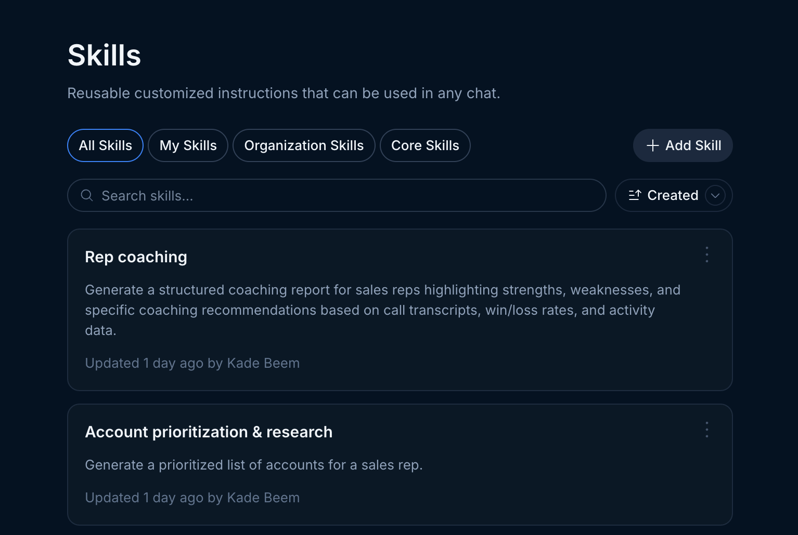
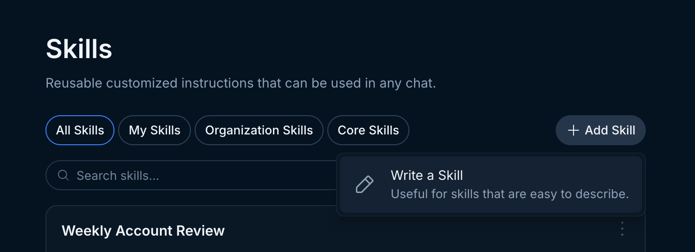
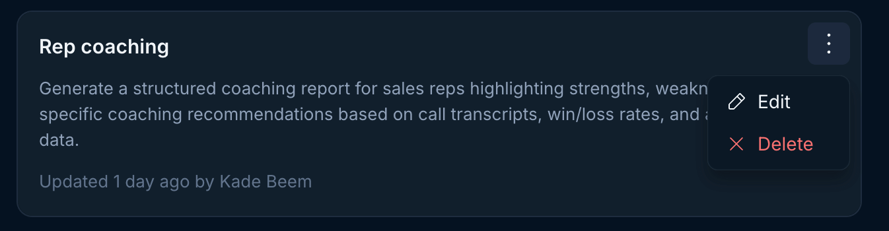

<Tip>
  Want to learn more about writing and structuring skills? Check out our deep
  dive [here](/skills/skills-101).
</Tip>

As an admin you can create global skills that your entire team can access. You manage these global skills in the settings section of Endgame.

<Steps>
  <Step title="Access your skills in settings">
    Navigate to https://app.endgame.io/settings/skills

   <Frame caption="Admin Skills">
        
    </Frame>
  </Step>
  <Step title="Add a Skill">
    Click "Add Skill" (top right of the list) -> Write a Skill to add a new skill

     <Frame caption="Add skill menu">
        
    </Frame>

      **Anatomy of a Skill:**

      - **Title:** The title of your skill, displayed on the skill card.
        _Example:_ `Demo Follow-Up`

      - **Description:** Used under the hood to determine when your skill is applicable. The AI references this to decide if the skill should be used when generating a response.
        _Example:_ `Generates a post-demo follow-up email that thanks the prospect, recaps their key pain points, and outlines a clear next step.`

      - **Example Prompt:** The prompt that pre-populates in the chat input when this skill is selected from the skill grid.
        _Example:_ `Use the Demo Follow-up skill to write a follow-up email for the demo I just completed.`

      - **Context:** The actual instructions that define _what_ your skill does and _how_ it should output content — this is where the real customization lives.
        _Example:_ `Write a concise follow-up email after a sales demo. Open by thanking the prospect for their time. Summarize the 2–3 pain points they mentioned during the call. Close with a single, specific next step (e.g., a follow-up call, trial, or proposal). Keep the tone warm but professional. Do not use filler phrases like "Hope this email finds you well."`

      <Info>
        Remember, any change you make to a skill in settings such as creating, editing, or deleting applies to your entire organization.
      </Info>

  </Step>
  <Step title="Edit or Delete a skill">
    Open the overflow menu (three dots) in the top right of any skill to edit or delete it

     <Frame caption="Skill overflow menu">
        
    </Frame>

  </Step>
</Steps>
