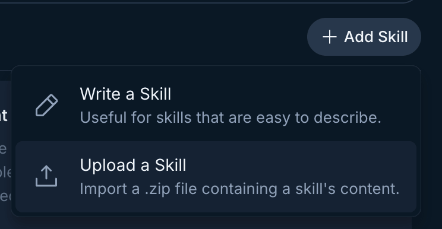
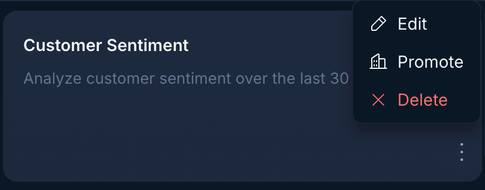
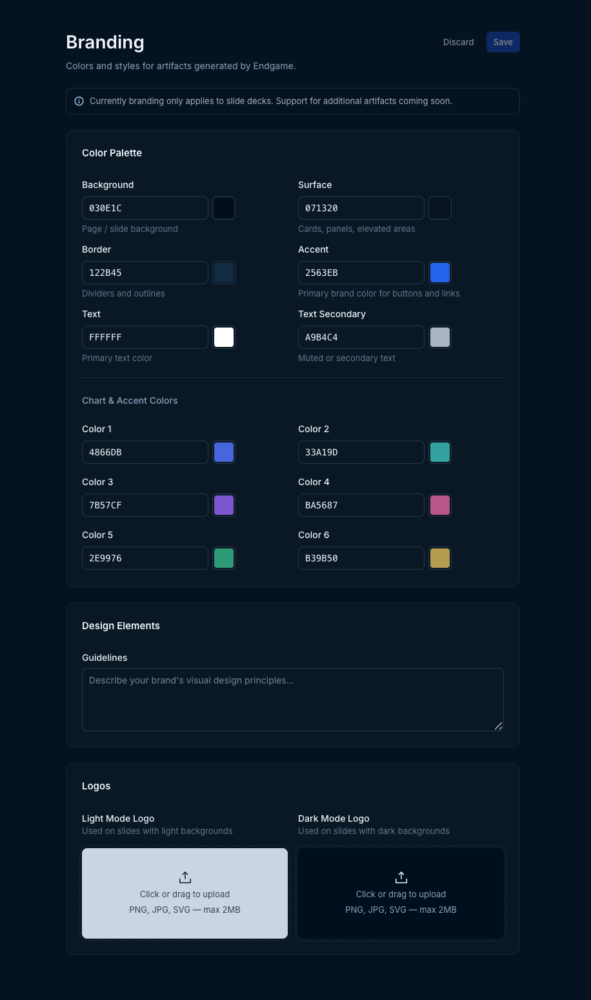

<Tip>
  Want to learn more about writing and structuring skills? Check out our deep
  dive [here](/skills/skills-101).
</Tip>

<div>
As an admin you can create global skills that your entire team can access. You manage these global skills in the settings section of Endgame.

</div>

<Steps>
  <Step title="Access your skills in settings">
    Navigate to https://app.endgame.io/settings/skills

   <Frame caption="Admin Skills">
        
    </Frame>
  </Step>
  <Step title="Add a Skill">
    Click "Add Skill" (top right of the list) -> Write a Skill or Upload a Skill to add a new skill

<Info>
  Remember, any change you make to a skill in settings such as creating,
  editing, or deleting applies to your entire organization.
</Info>

     <Frame caption="Add skill menu">
        
    </Frame>

    **Write a basic skill:** Choose Write a Skill and fill out the skill form, tips below.

      **Anatomy of a Skill:**

      - **Title:** The title of your skill, displayed on the skill card.
        _Example:_ `Demo Follow-Up`

      - **Description:** The description helps you and Endgame understand what a skill does. Include details about when the skill should be used and what it's capable of so Endgame can apply it effectively.
        _Example:_ `Generates a post-demo follow-up email that thanks the prospect, recaps their key pain points, and outlines a clear next step.`

      - **Example Prompt:** The prompt that pre-populates in the chat input when this skill is selected from the skill grid.
        _Example:_ `Use the Demo Follow-up skill to write a follow-up email for the demo I just completed.`

      - **Context:** The actual instructions that define _what_ your skill does and _how_ it should output content — this is where the real customization lives.
        _Example:_ `Write a concise follow-up email after a sales demo. Open by thanking the prospect for their time. Summarize the 2–3 pain points they mentioned during the call. Close with a single, specific next step (e.g., a follow-up call, trial, or proposal). Keep the tone warm but professional. Do not use filler phrases like "Hope this email finds you well."`

    **Upload complex skills:** Choose Upload a Skill. Uploaded skills must be a .zip file that contains a `SKILL.md` file in addition to other optional material that will be used to execute your skill. This is often example or template files to inform the output of your skill and other assets like company logos.

    Skill folders generally contain:

    - SKILL.md (required): Instructions in Markdown - MUST contain a `name` and `description` field which follows this format including the "---":
      ```
      ---
      name: Account Plan Deck

      description: Use when asked to build an account plan or account plan deck.
      ---

      <additional skill instruction here>
      ```
      The description helps you and Endgame understand what a skill does. Include details about when the skill should be used and what it's capable of so Endgame can apply it effectively.

    - scripts/ (optional): Executable code (Python, Bash, etc.)
    - references/ (optional): Documentation loaded as needed
    - assets/ (optional): Templates, fonts, icons used in output

    </Step>

  <Step title="Edit or Delete a skill">
    Open the overflow menu (three dots) in the top right of any skill to edit or delete it

       <Frame caption="Skill overflow menu">
          
      </Frame>

    </Step>

  <Step title="Promote a personal skill to your organization">
    If a team member has built a personal skill that's proven valuable, an admin can promote it to an organization-level skill, no need to recreate it from scratch.

    Open the overflow menu (three dots) on any personal skill you own and select **Promote**. The skill will be converted from a personal skill to an organization skill, making it available to everyone on your team.

    <Frame caption="Promote a skill from the overflow menu">
      
    </Frame>

    <Info>
      Only admins can promote skills, and only skills they personally own. Once promoted, the skill is managed like any other organization skill.
    </Info>

  </Step>

</Steps>

## Configure Your Branding

If your team uses skills that generate slide decks (`.pptx` outputs), you'll want to configure your organization's branding so every deck comes out polished and on-brand. The Branding page controls the colors, logos, and design guidelines applied to deck artifacts.

<Steps>
  <Step title="Open the Branding settings">
    Navigate to [https://app.endgame.io/settings/branding](https://app.endgame.io/settings/branding).

  <Frame caption="Branding settings">
      
  </Frame>
  </Step>
  <Step title="Set your Color Palette">
    Fill in hex values for the core slide colors:

    - **Background** — Page / slide background color
    - **Surface** — Cards, panels, and elevated areas
    - **Border** — Dividers and outlines
    - **Accent** — Primary brand color for buttons and links
    - **Text** — Primary text color
    - **Text Secondary** — Muted or secondary text color

    You can also define up to six **Chart & Accent Colors** used in charts and data visualizations within your decks.

  </Step>
  <Step title="Add Design Elements">
    Use the **Guidelines** field to describe your brand's visual design principles. This gives the AI additional context about your brand's aesthetic when assembling slides, for example, preferred layout styles, spacing preferences, or overall design tone.
  </Step>
  <Step title="Upload your Logos">
    Upload a **Light Mode Logo** (used on slides with light backgrounds) and a **Dark Mode Logo** (used on slides with dark backgrounds). Accepted formats are PNG, JPG, and SVG (max 2MB each).
  </Step>
  <Step title="Save your changes">
    Click **Save** to apply your branding. All future deck outputs across your organization will use these settings.
  </Step>
</Steps>

<Info>Branding currently applies to slide deck outputs only.</Info>
