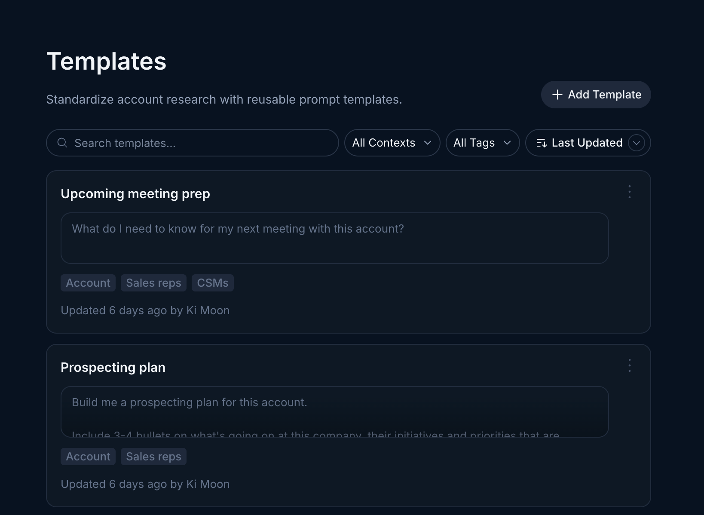
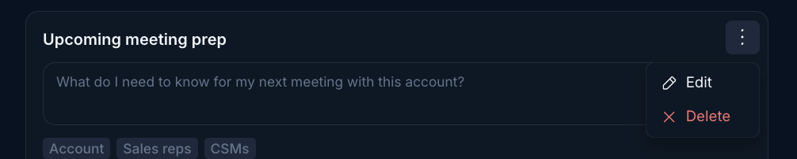
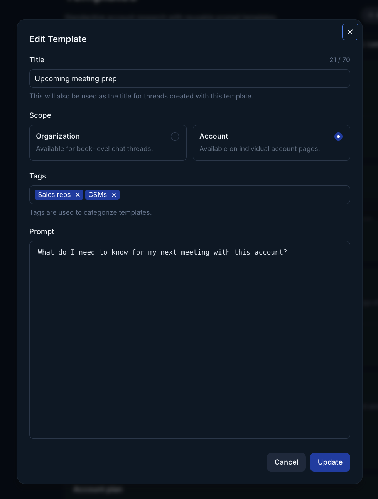

<Tip>
  Want to learn more about writing and structuring templates? Check out our deep dive [here](/templates/templates-101).
</Tip>

As an admin you can create global templates that your entire team can access. You manage these global templates in the settings section of Endgame. Templates are used to enhance the chat experience. Learn more about the fundamentals of chat here.

<Steps>
  <Step title="Access your templates in settings">
    Navigate to https://app.endgame.io/settings/templates

    
  </Step>
  <Step title="Add, edit, delete">
    - Click "Add Template" (top right of the list) to add a new template
    - Open the overflow menu (three dots) in the top right of any template to edit or delete a template

      

      <Info>
        Remember, any change you make to templates in settings such as creating, editing, or deleting templates applies to your entire organization.
      </Info>
  </Step>
  <Step title="Template customizations">
    - <b>Tags:</b> You are able to add tags to a template. Tags help users to categorize templates and filter them in order to select relevant templates more quickly. Create new tags, or select from existing tags. Templates are not required to have a tag, but can have multiple tags. We recommend not using more than two tags per template.
    - <b>Scope:</b> You can designate a "scope" for a template. Selecting "Account" indicates this template is most appropriate as a singlular account prompt, for example, "Build me a stakeholder map for this account". Alternatively you can select "Organization". This is most appropriate for a multiple account prompt, for example, "Summarize all of the important news and external events from the last week for my accounts."

      
  </Step>
</Steps>