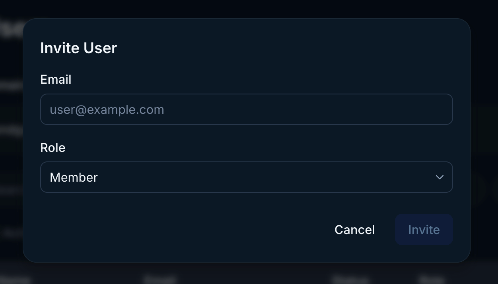
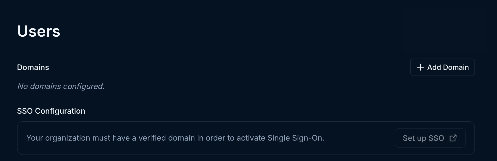
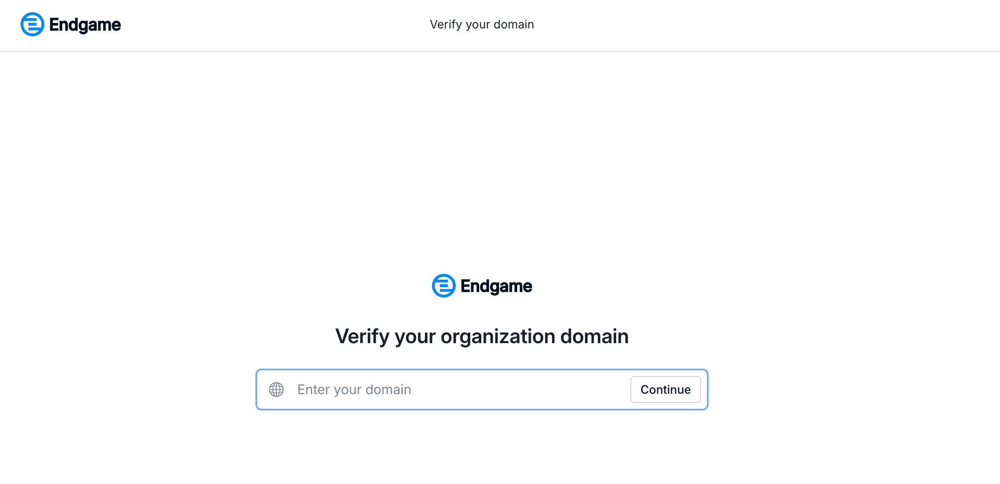
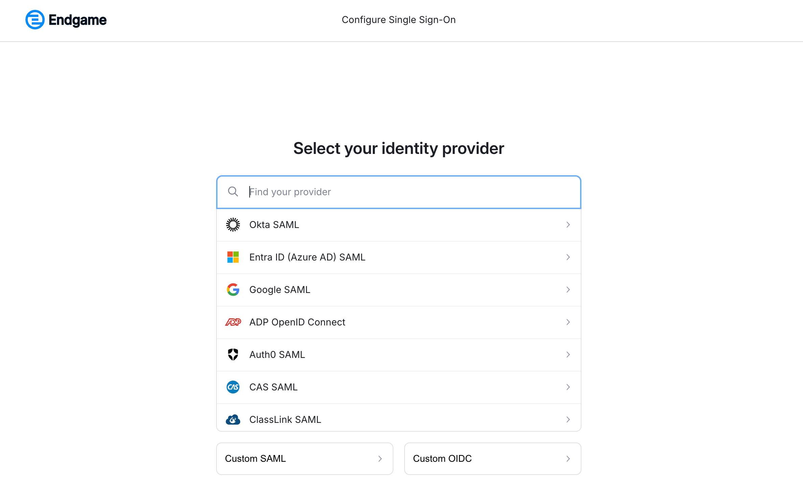

Endgame uses WorkOS to power our authentication flow.

## Manage new users

To manage who can log into Endgame from your organization, go to the [user management](https://app.endgame.io/settings/users) page in settings. Only Admins have access to this page.

You have multiple options for user authentication that can be enabled or configured from this page.

### Invite users

Click Invite User at the top right of the user table and populate emails for users that should receive an invitation. Set the user role for those users you are inviting, the role will apply to all users in this group so do two separate invite groups to invite Admins and Members. You will be able to monitor which users have accepted invitations in this view.

<Frame caption="User invite modal">
  
</Frame>

### Add a verified domains

<Info>
  Admins can prove domain ownership through the creation of DNS TXT records.
</Info>

You have the option to add verified domains which will allow any user attempting to login with that domain access to Endgame. For example if you verify acme.com and sarah@acme.com attempts to login to Endgame using that email address, she will be provisioned as a user for your org and allowed to authenticate.

Click on Add Domain to get started. You will be redirected to the WorkOS interface and guided through the process to add your domain(s).

<Frame caption="User management configuration">
  
</Frame>

<Frame caption="Domain verification in WorkOS">
  
</Frame>

### Single sign on (SSO)

<Warning>
  SSO is not available to all organizations. If you are interested in enabling
  SSO on for your organization contact
  [support@endgame.io](mailto:support@endgame.io)
</Warning>

Some organizations have the ability to enable SSO for their organization, you must first verify your organization domains to complete SSO configuration. Enabling SSO allows users to authenticate and be provisioned automatically based on your configured domains. You will be offered the option to choose your preferred SSO provider during the setup process.

Click on Set up SSO to get started. You will be redirect to the WorkOS interface and guided through the process to set up SSO.

<Frame caption="User management configuration">
  
</Frame>

<Frame caption="SSO setup in WorkOS">
  
</Frame>

## User roles

Endgame currently supports two roles: Admin and Member.

**Admin** 
- access and ability to edit all organization configuration in [settings](https://app.endgame.io/settings) including: integrations, user management, rules, knowledge, skills, and api key generation.
- access to user analytics dashboard
- all standard chat and app interactions and functionality

**Member** 
- access to their own General Settings in [settings](https://app.endgame.io/settings)
- all standard chat and app interactions and functionality

## Viewing users and making updates

Once users have been granted access to Endgame you can update their roles, deactivate access, and view their last sign in.

Use the search or filtering capabilities to view specific users or groups of users. To deactivate a user, click on the three dots for that user row to open the menu and select the Deactivate Member option.

<Frame caption="User table">
  
</Frame>
