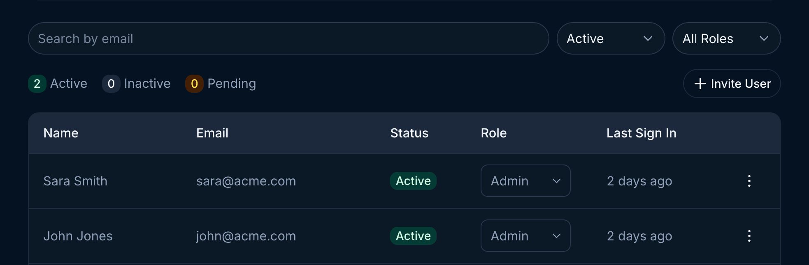

## User roles

Endgame currently supports two roles: Admin and Member.

**Admin**

- access and ability to edit all organization configuration in [settings](https://app.endgame.io/settings) including: integrations, user management, rules, knowledge, skills, and api key generation.
- access to user analytics dashboard
- all standard chat and app interactions and functionality

**Member**

- access to their own General Settings in [settings](https://app.endgame.io/settings)
- all standard chat and app interactions and functionality

## Viewing users and making updates

Once users have been granted access to Endgame you can update their roles, deactivate access, and view their last sign in.

Use the search or filtering capabilities to view specific users or groups of users. To deactivate a user, click on the three dots for that user row to open the menu and select the Deactivate Member option.

<Frame caption="User table">
  
</Frame>

Find more information about inviting users to your organization and setting up authentication options on our [Authentication](https://docs.endgame.io/authentication) page.
