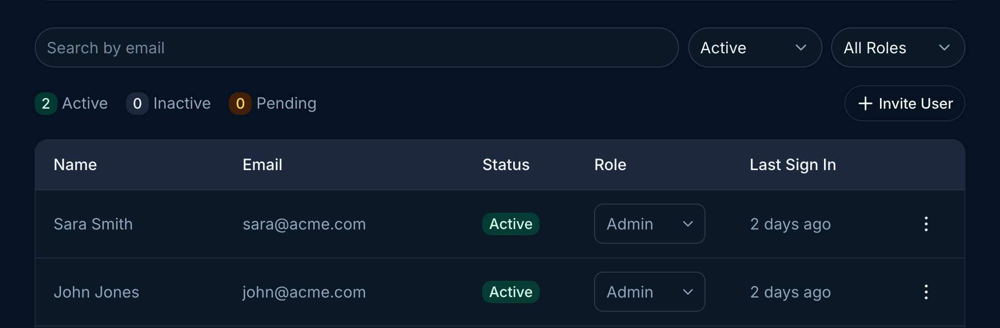
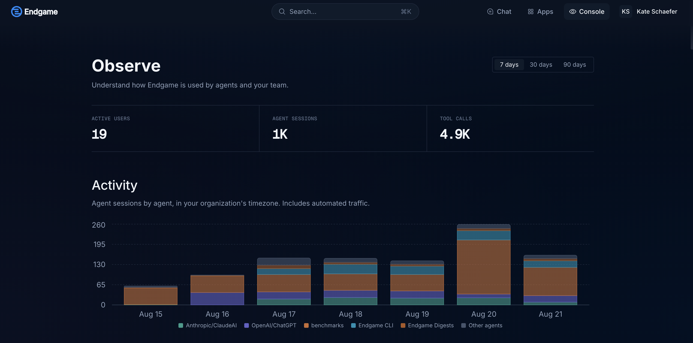
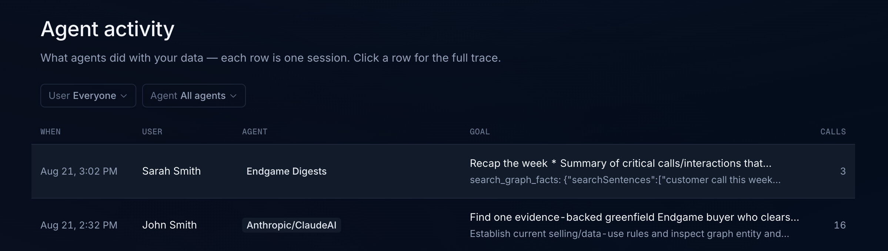

## User roles

Endgame currently supports two roles: Admin and Member.

**Admin**

- access and ability to edit all organization configuration in [settings](https://app.endgame.io/settings) including: integrations, user management, rules, knowledge, skills, and api key generation.
- access to user analytics dashboard
- all standard chat and app interactions and functionality

**Member**

- access to their own General Settings in [settings](https://app.endgame.io/settings)
- all standard chat and app interactions and functionality

## Viewing users and making updates

Once users have been granted access to Endgame you can update their roles, deactivate access, and view their last sign in.

Use the search or filtering capabilities to view specific users or groups of users. To deactivate a user, click on the three dots for that user row to open the menu and select the Deactivate Member option.

<Frame caption="User table">
  
</Frame>

Find more information about inviting users to your organization and setting up authentication options on our [Authentication](https://docs.endgame.io/authentication) page.

## User observability

Admins can see how their team and connected agents are using Endgame from the **Console**. Open it with the **Console** button in the top right of the [homepage](https://app.endgame.io/observe). The button is only visible to Admins.

### Observe

The **Observe** page summarizes usage across your organization over the last 7, 30, or 90 days:

- **Active users** — how many people used Endgame during the selected window
- **Agent sessions** — how many sessions connected agents ran
- **Tool calls** — how many individual tool calls those sessions made

Below the totals, the **Activity** chart breaks agent sessions down by agent for each day, in your organization's timezone, so you can see which surfaces your team relies on — Claude, ChatGPT, the Endgame CLI, Digests, and more. Automated traffic is included in these numbers.

<Frame caption="Observe page in the Console">
  
</Frame>

### Agent activity

The **Agent activity** table records what agents did with your data, with one row per session. Each row shows when the session ran, the user it belonged to, the agent it came from, the goal the agent was pursuing, and how many tool calls it made. Use the **User** and **Agent** filters to narrow the list, and click any row to open the full trace for that session.

<Frame caption="Agent activity table in the Console">
  
</Frame>
