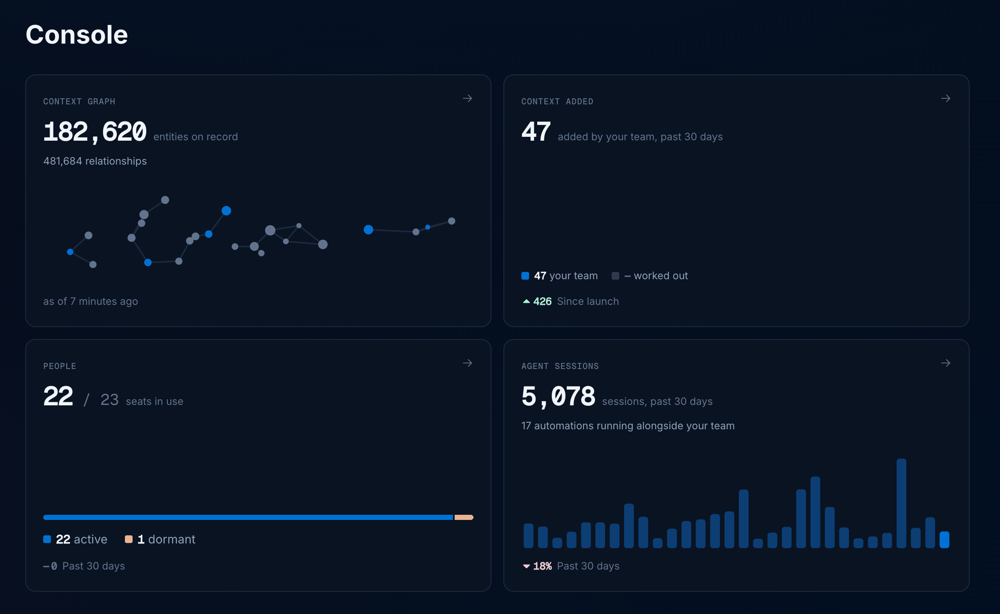
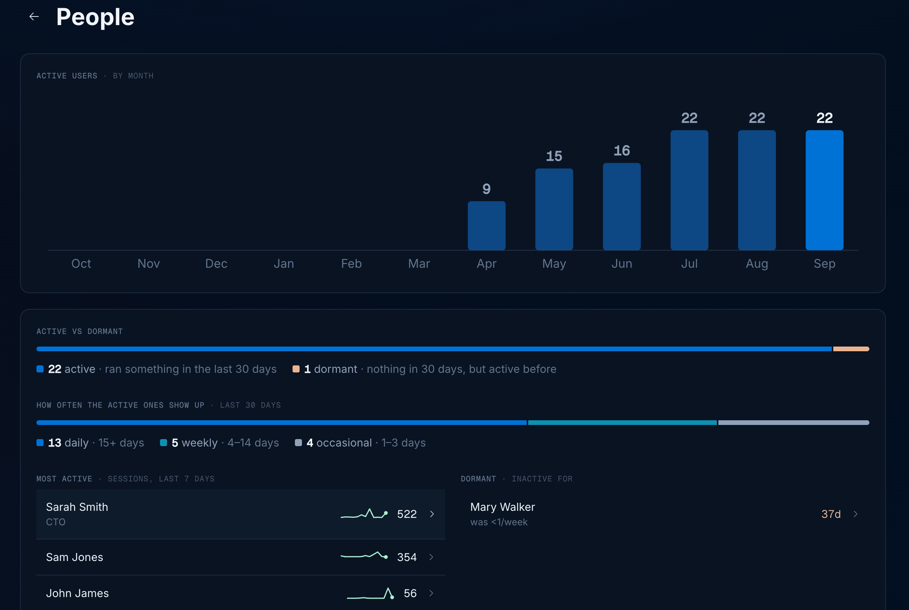
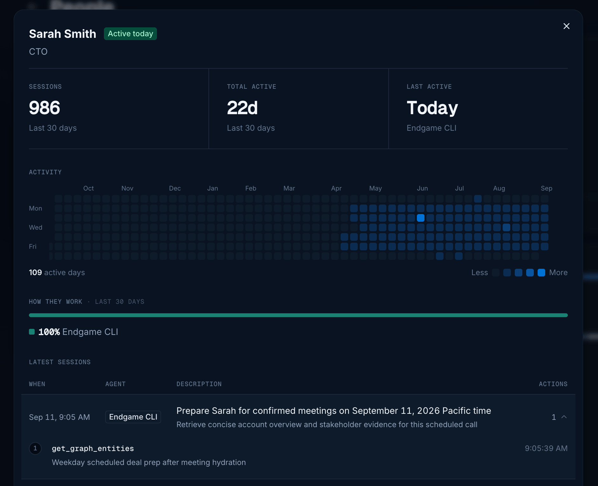
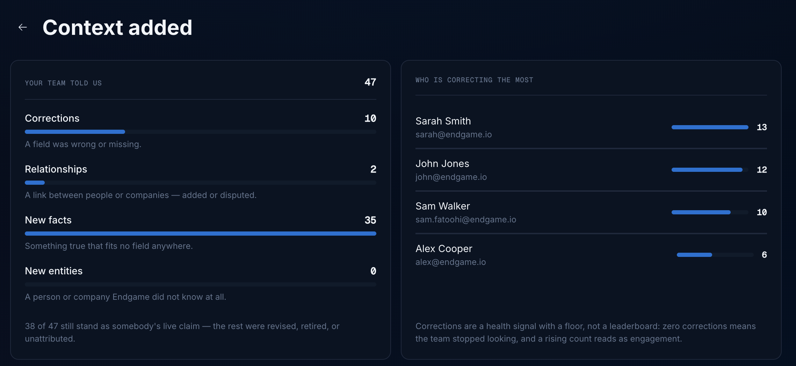

## User roles

Endgame currently supports two roles: Admin and Member.

**Admin**

- access and ability to edit all organization configuration in [settings](https://app.endgame.io/settings) including: integrations, user management, rules, knowledge, skills, and api key generation.
- access to user analytics dashboard
- all standard chat and app interactions and functionality

**Member**

- access to their own General Settings in [settings](https://app.endgame.io/settings)
- all standard chat and app interactions and functionality

## Viewing users and making updates

Once users have been granted access to Endgame you can update their roles, deactivate access, and view their last sign in.

Use the search or filtering capabilities to view specific users or groups of users. To deactivate a user, click on the three dots for that user row to open the menu and select the Deactivate Member option.

<Frame caption="User table">
  
</Frame>

Find more information about inviting users to your organization and setting up authentication options on our [Authentication](https://docs.endgame.io/authentication) page.

## User observability

Admins can see how their team and connected agents are using Endgame from the **Console**. Open it from the the side nav of the [homepage](https://app.endgame.io/observe). The Console is only visible to Admins.

### Console

The **Console** opens on an overview of your organization: what Endgame knows, what your team has added to it, who is using Endgame, and what connected agents are doing. Click on a card to open its full view.

- **Context graph** — entities on record and the relationships between them, with the time of the last refresh
- **Context added** — what your team has contributed back to the graph
- **People** — users split between active and dormant
- **Agent sessions** — sessions run by your team and by any automations running alongside them

<Frame caption="Console overview">
  
</Frame>

### People

The **People** view shows who is actually using Endgame. **Active users by month** tracks how your team's adoption has grown, and **Active vs dormant** splits your users into people who ran something in the last 30 days and people who have gone quiet but were active before.

**How often the active ones show up** groups active users by how many days they showed up in the last 30: daily (15+ days), weekly (4–14 days), and occasional (1–3 days). Below that, **Most active** ranks people by sessions over the last 7 days, and **Dormant** lists who has gone quiet and for how long.

<Frame caption="People view in the Console">
  
</Frame>

Click anyone in either list to open their detail view. It shows their sessions, days active, and last active over the last 30 days, an activity heatmap covering the past year, which surfaces they work through, and their latest sessions with the tool calls each one made.

<Frame caption="Person detail view in the Console">
  
</Frame>

### Context added

The **Context added** view tracks what your team has written back to the context graph. Endgame learns from these contributions and directly makes updates to the graph, so this view is a read on how closely your team is engaging with what Endgame tells them.

- **Corrections** — a field was wrong or missing
- **Relationships** — a link between people or companies, added or disputed
- **New facts** — something true that fits no field anywhere
- **New entities** — a person or company Endgame did not know at all

**Who is correcting the most** ranks the people contributing these updates. Treat it as a health signal rather than a leaderboard: zero corrections usually means the team stopped checking Endgame's work, and a rising count reads as engagement.

<Frame caption="Context added view in the Console">
  
</Frame>

### Agent sessions

The **Agent sessions** view summarizes how your team and its connected agents are using Endgame over the last 7, 30, or 90 days:

- **Active users** — how many people used Endgame during the selected window
- **Agent sessions** — how many sessions connected agents ran
- **Tool calls** — how many individual tool calls those sessions made

Below the totals, the **Activity** chart breaks agent sessions down by agent for each day, in your organization's timezone, so you can see which surfaces your team relies on — Claude, ChatGPT, the Endgame CLI, Digests, and more. Automated traffic is included in these numbers.

<Frame caption="Agent sessions view in the Console">
  
</Frame>

The **Agent activity** table below records what agents did with your data, with one row per session. Each row shows when the session ran, the user it belonged to, the agent it came from, the goal the agent was pursuing, and how many tool calls it made. Use the **User** and **Agent** filters to narrow the list, and click any row to open the full trace for that session.

<Frame caption="Agent activity table in the Console">
  
</Frame>
