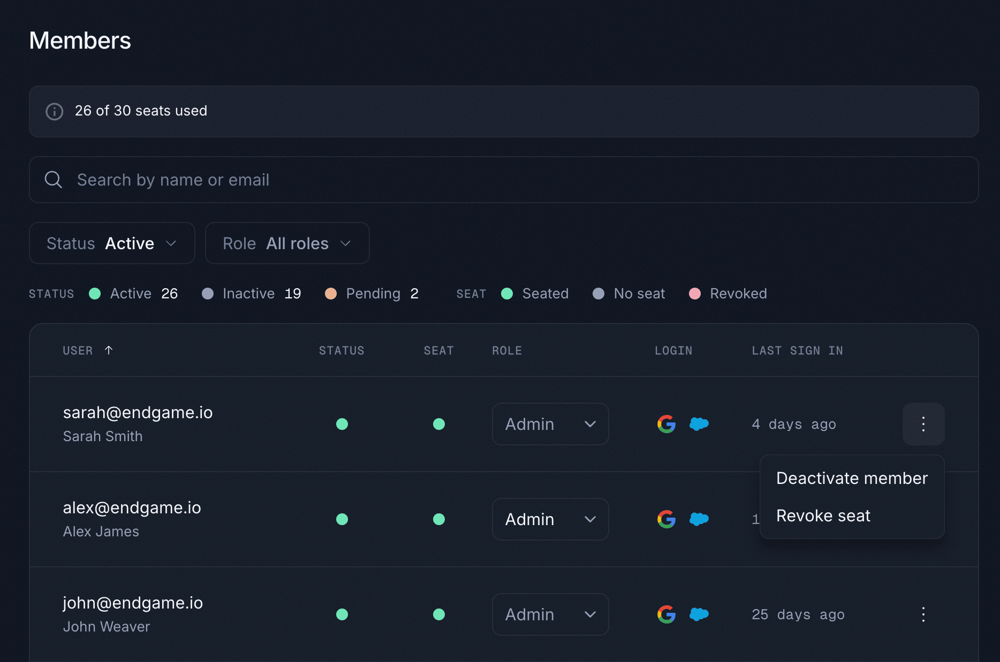

## User roles

Endgame currently supports two roles: Admin and Member.

**Admin**

- access and ability to edit all organization configuration in [settings](https://app.endgame.io/settings) including: integrations, user management, rules, knowledge, skills, and api key generation.
- ability to manage users including seat access
- all standard chat and app interactions and functionality

**Member**

- access to their own General Settings in [settings](https://app.endgame.io/settings)
- all standard chat and app interactions and functionality

## Viewing users and making updates

Once users have been granted access to Endgame you can update their roles, manage their seats, deactivate access, and view their last sign in.

Use the search or the **Status** and **Role** filters to view specific users or groups of users. Each user's row shows their status (active, inactive, or pending) and their seat (seated, no seat, or revoked).

To deactivate a user or revoke their seat, click the three dots on that user's row to open the menu and select the option you need.

<Frame caption="User table">
  
</Frame>

### Seats

Newly added users are automatically given a seat when they first login if one is available. When your organization has a seat cap, the top of the members table shows how many seats are in use.

Not all organizations have a hard seat cap enforced. If yours does, users can't be given a seat once every seat is in use. To free one up, revoke a seat from a user who no longer needs it.

Find more information about inviting users to your organization and setting up authentication options on our [Authentication](https://docs.endgame.io/authentication) page.

To see how your team and connected agents are using Endgame, see [Console](/console-observation).
